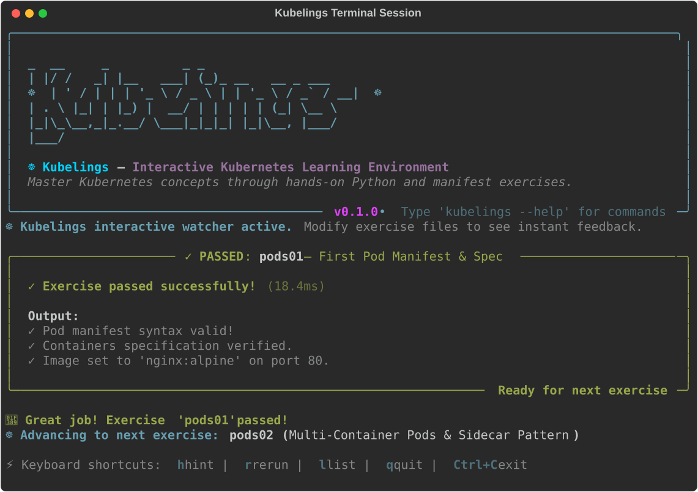

# Kubelings ☸️

[](https://github.com/dnf0/kubelings/actions)
[](LICENSE)
[](https://www.python.org/downloads/)
[](https://github.com/astral-sh/ruff)
[](https://github.com/microsoft/pyright)
[](https://marketplace.visualstudio.com/items?itemName=dnf0.kubelings-vscode)
[](https://dnf0.github.io/kubelings/playground/)

> **Master Kubernetes from scratch through small, interactive, hands-on terminal exercises.**

<p align="center">
  
</p>

Inspired by the pedagogical brilliance of [rustlings](https://github.com/rust-lang/rustlings) and [ziglings](https://codeberg.org/ziglings/exercises), **Kubelings** guides engineers through self-paced, iterative exercises. You will fix broken YAML manifests, construct multi-container sidecars, mount storage volumes, write RBAC authorization rules, solve scheduling constraints, build custom Python Kubernetes operators, and troubleshoot production cluster incidents.

---

## Pedagogical Philosophy

Learning Kubernetes from static documentation or raw copy-pasted Helm charts is difficult because feedback is slow and error messages are cryptic. Kubelings solves this through **guided, test-driven micro-learning**:

1. **Active Debugging & Iteration**: Every exercise starts in a broken or incomplete state with clear `# TODO:` instructions. You read the problem description, inspect the failure, and edit the code until it passes all verification checks.
2. **Instant Feedback Loop & Interactive Hotkeys**: An automated watcher observes file modifications in real time (< 30ms). When an exercise passes, press `n` or `Enter` to advance, `p` to revisit previous exercises, `h` to reveal progressive hints, `r` to force a rerun, `l` to list exercises, or `q` to quit.
3. **Dual-Mode Learning (Offline & Live Cluster)**:
   - **Offline Mode**: Zero cluster setup required. Exercises validate Kubernetes object specs, API constraints, and controller behaviors in-memory.
   - **Live Cluster Mode**: Seamlessly connect to `kind`, `minikube`, `k3d`, or remote clusters. Exercises provision temporary ephemeral namespaces and verify live reconciliations.
4. **Progressive Hints**: When stuck, multi-tiered hints (`kubelings hint`) nudge you in the right direction without spoiling the answer.

---

## Architecture

```
                                  +-----------------------+
                                  |     User Terminal     |
                                  +-----------+-----------+
                                              |
                                              v
                                  +-----------------------+
                                  |  Kubelings CLI (Typer)|
                                  +-----------+-----------+
                                              |
                     +------------------------+------------------------+
                     |                                                 |
                     v                                                 v
         +-----------------------+                         +-----------------------+
         |  File Watcher Engine  |                         | Rich UI & Diagnostics |
         |      (watchfiles)     |                         |    (syntax / tables)  |
         +-----------+-----------+                         +-----------------------+
                     |
                     v
         +-----------------------+
                      |
                      v
          +-----------------------+
          |  Curriculum Manifest  |  (26 Chapters / 114 Exercises)
          +-----------+-----------+
                      |
                      v
          +-----------------------+
          |   Exercise Runner     |
          +-----------+-----------+
                      |
         +------------+------------+
         |                         |
         v                         v
 +----------------+       +-------------------+
 | Offline Schema |       | Live Cluster      |
 | Validator &    |  OR   | Adapter & Ephem.  |
 | Spec Evaluator |       | Namespaces (kind) |
 +----------------+       +-------------------+
```

---

## Quickstart & Installation

### Try in Browser (Zero Installation)

Test Kubelings directly inside your web browser without installing any tools:

👉 **[⚡ Try in Browser](https://dnf0.github.io/kubelings/playground/)** — Run Python 3.12, Monaco Editor, and in-memory schema validation 100% client-side via Pyodide WebAssembly.

### Prerequisites

- Python `>= 3.10`
- [`uv`](https://docs.astral.sh/uv/) (recommended) or `pip`
- *Optional (for live cluster exercises)*: `kubectl` and a local cluster (`kind`, `minikube`, or `k3d`)

### Running Instantly (No Clone Needed)

You can run Kubelings anywhere using [`uvx`](https://docs.astral.sh/uv/) or [`pipx`](https://pipx.pypa.io/stable/):

```bash
# Launch the interactive guided onboarding tour
uvx kubelings tour

# Initialize exercises in your current folder
uvx kubelings init

# Start the interactive watch mode
uvx kubelings watch
```

Or install globally:

```bash
pipx install kubelings
kubelings tour
kubelings init
kubelings watch
```

> 📖 **New to Kubelings?** Check out the [**Complete Onboarding & Learner's Guide**](docs/onboarding-guide.md) for a visual step-by-step tutorial!

### Local Development Installation

Clone the repository and install dependencies in editable mode:

#### Using `uv` (Fastest)

```bash
git clone https://github.com/dnf0/kubelings.git
cd kubelings
uv venv
source .venv/bin/activate
uv pip install -e ".[dev]"
```

#### Using Standard `pip`

```bash
git clone https://github.com/dnf0/kubelings.git
cd kubelings
python3 -m venv .venv
source .venv/bin/activate
pip install -e ".[dev]"
```

Verify your installation:

```bash
kubelings --help
```

---

## Interactive Learning Commands

### 1. Interactive Onboarding Tour (`kubelings tour`)

Launch the rich, 5-step terminal walkthrough with live environment probes, workflow introduction, and guided `pods01` resolution:

```bash
kubelings tour
# or run non-interactively / output json
kubelings tour --non-interactive
kubelings tour --step 4
kubelings tour --json
```

### 2. Watch Mode (`kubelings watch`)

Start the interactive development loop. Whenever you save a file in `exercises/`, Kubelings immediately evaluates your changes.

```bash
kubelings watch
```

> **Interactive Hotkeys**:
> - `n` / `Enter` : Advance to next exercise
> - `p` : Navigate to previous exercise
> - `h` : Reveal progressive hint tier
> - `r` : Force rerun current exercise
> - `l` : List curriculum exercises
> - `q` : Exit watcher

### 3. Interactive Terminal TUI Dashboard (`kubelings tui` / `kubelings dashboard`)

Explore the curriculum, browse code, and trigger evaluations inside a split-pane full-screen terminal interface:

```bash
kubelings tui
# or
kubelings dashboard
```

### 4. Resource Relationship Topology Visualizer (`kubelings tree`)

Render an architectural relationship topology tree of Kubernetes workloads, services, endpoints, volumes, and network policies:

```bash
kubelings tree pods01
# or inspect an external manifest
kubelings tree deployment.yaml
```

### 5. Universal Manifest Linter (`kubelings lint`)

Audit any Kubernetes manifest against security standards, reliability probes, and schema best practices:

```bash
kubelings lint exercises/01_pods/pods01.yaml
# or lint production manifests
kubelings lint manifests/production/
```

### 6. Run a Single Exercise

Execute and evaluate a single exercise directly:

```bash
kubelings run pods01
```

### 7. Progressive Hints

Get step-by-step tips for any exercise:

```bash
kubelings hint pods01
```

### 8. List All Chapters & Exercises

Browse the entire curriculum syllabus, descriptions, and exercise paths:

```bash
kubelings list
```

### 9. Verify Curriculum Progress

Display a rich summary table showing the pass/fail status of all 114 exercises:

```bash
kubelings verify
```

### 10. Test Reference Solutions

Run built-in self-testing across reference solutions:

```bash
kubelings test
```

### 11. Cluster Connectivity Status

Check whether `kubelings` is running in offline validation mode or connected to a live Kubernetes cluster:

```bash
kubelings cluster
```

---

## VS Code & Cursor Extension 💻

Kubelings provides an official extension for **Visual Studio Code** and **Cursor** that turns your editor into a fully integrated Kubernetes learning IDE.

### ✨ Extension Features

- 🗺️ **Interactive Welcome Walkthrough**: Built-in editor walkthrough (`Kubelings: Open Welcome Walkthrough`) guiding you through curriculum navigation, live cluster verification, and first exercise resolution.
- 📚 **Activity Bar Curriculum Tree View**: Browse all 26 chapters and 114 exercises directly from the sidebar with real-time pass/fail status and chapter completion counters.
- 📊 **Status Bar Progress Indicator**: Persistent status bar item showing your total completion percentage, current progress, and next active exercise. Click to jump straight to the exercise.
- ⚡ **On-Save Diagnostics**: Automatic in-editor validation whenever you save an exercise manifest (`exercises/**/*.py`), surfacing schema errors, missing attributes, or assertion failures.
- 💡 **Code Actions & Quick Fixes**: Lightbulb quick fixes directly on errors to:
  - **Reveal Hint**: Display progressive hints in the editor without spoiling the answer.
  - **Compare with Reference Solution**: Instantly open a side-by-side diff comparing your exercise code against the official reference solution.
- 🔍 **Solution Diffing**: Interactive diff viewer (`kubelings.showSolutionDiff`) for visual code comparison.
- 💻 **Integrated Terminal Watch Mode**: Launch `kubelings watch` into a dedicated integrated terminal with a single click.

### 📦 Extension Installation

#### Option 1: Install from VS Code Marketplace (Recommended)

👉 **[Install from VS Code Marketplace](https://marketplace.visualstudio.com/items?itemName=dnf0.kubelings-vscode)**

Or search for `Kubelings` directly inside the Extensions view in VS Code or Cursor (`Ctrl+Shift+X` / `Cmd+Shift+X`).

#### Option 2: Install from VSIX via Command Line

```bash
# For VS Code
code --install-extension dist/kubelings-vscode.vsix

# For Cursor
cursor --install-extension dist/kubelings-vscode.vsix
```

#### Option 3: Install from VSIX via Editor UI

1. Open the Extensions view (`Ctrl+Shift+X` / `Cmd+Shift+X`).
2. Click the **`...`** (Views and More Actions) menu in the top-right corner of the Extensions pane.
3. Select **Install from VSIX...** and choose `dist/kubelings-vscode.vsix` (available from the repository root after `make vscode-package` or downloaded from GitHub Releases).

---

## Curriculum & Syllabus

Kubelings covers 26 structured chapters with **114 practical exercises**:

| Chapter | Title | Topic Overview | Exercises |
| :--- | :--- | :--- | :--- |
| **01** | **Pods & Core Workloads** | Pod specs, multi-container sidecars, init containers, resource requests/limits, Downward API, and Pod Disruption Budgets (PDB). | `pods01` – `pods06` (6) |
| **02** | **Controllers & Replication** | ReplicaSets, label selectors, Deployments, rolling updates, rollbacks, StatefulSets, DaemonSets, and Jobs/CronJobs. | `ctrl01` – `ctrl06` (6) |
| **03** | **Configuration & Secrets** | ConfigMaps, Secrets, environment variable injection, volume mounts, permission modes, and immutable configs. | `config01` – `config05` (5) |
| **04** | **Storage & Persistent Volumes** | Volume types (`emptyDir`, `hostPath`), PVs, PVCs, access modes, reclaim policies, StorageClasses, and volume snapshots. | `storage01` – `storage05` (5) |
| **05** | **Services & Networking** | ClusterIP, Headless services, NodePort, LoadBalancer, CoreDNS resolution, ExternalName, and manual Endpoints. | `net01` – `net05` (5) |
| **06** | **Ingress & Traffic Management** | Ingress path routing, TLS termination, URL rewrite annotations, and ingress class controllers. | `ingress01` – `ingress04` (4) |
| **07** | **Scheduling & Placement** | `nodeSelector`, node affinity (hard/soft), pod affinity/anti-affinity, taints, tolerations, and topology spread constraints. | `sched01` – `sched05` (5) |
| **08** | **Security & RBAC** | ServiceAccounts, token management, Roles, RoleBindings, ClusterRoles, container `securityContext`, and Pod Security Standards (PSS). | `rbac01` – `rbac05` (5) |
| **09** | **Network Policies** | Default Deny isolation, Ingress filtering, Egress filtering, CoreDNS egress rules, named ports, and CIDR IPBlock rules. | `netpol01` – `netpol04` (4) |
| **10** | **Lifecycle & Health Probes** | Liveness probes, readiness probes, startup probes (exec, httpGet, tcpSocket), and container lifecycle shutdown hooks (`preStop`). | `health01` – `health04` (4) |
| **11** | **Workload Autoscaling** | Horizontal Pod Autoscaler (`HPA` v2), custom scale-up/scale-down behaviors, Vertical Pod Autoscaler (`VPA`), and KEDA event autoscaling. | `autoscale01` – `autoscale04` (4) |
| **12** | **CRDs & Custom Operators** | CustomResourceDefinitions (`apiextensions.k8s.io/v1`), status subresources, printer columns, Python operator loops, and admission webhooks. | `crd01` – `crd04` (4) |
| **13** | **Troubleshooting & Incidents** | Diagnosing `CrashLoopBackOff`, OOMKilled, `ImagePullBackOff`, unschedulable pending pods, ResourceQuotas, and ephemeral debug containers. | `troubleshoot01` – `troubleshoot05` (5) |
| **14** | **GitOps & ArgoCD** | ArgoCD Application CRDs, automated sync policies, self-heal drift correction, ApplicationSets, and progressive delivery with Argo Rollouts. | `gitops01` – `gitops04` (4) |
| **15** | **Service Mesh & Cilium** | eBPF Layer 7 HTTP NetworkPolicies, strict mutual TLS (mTLS), clusterwide egress FQDN rules, and Hubble/OpenTelemetry mesh observability. | `mesh01` – `mesh04` (4) |
| **16** | **Policy as Code (Kyverno & Gatekeeper)** | Kyverno ClusterPolicies, mutate & generate rules, OPA Gatekeeper ConstraintTemplates and Rego admission policies. | `policy01` – `policy04` (4) |
| **17** | **Multi-Tenancy & Virtual Clusters** | Hierarchical Namespace Controller (HNC) subnamespaces, ResourceQuota limits, vcluster control planes, and isolation. | `tenant01` – `tenant04` (4) |
| **18** | **Advanced Admission Webhooks** | Dynamic MutatingWebhookConfigurations, ValidatingWebhookConfigurations, sidecar injection, and CRD conversion webhooks. | `webhook01` – `webhook04` (4) |
| **19** | **Package Management with Helm** | Helm `Chart.yaml` v3 metadata, Go templating, `_helpers.tpl`, `values.schema.json` validation, and subchart overrides. | `helm01` – `helm04` (4) |
| **20** | **Declarative Customization with Kustomize** | `kustomization.yaml` bases, `configMapGenerator`, `secretGenerator`, strategic merge patches, and multi-environment overlays. | `kustomize01` – `kustomize04` (4) |
| **21** | **Gateway API & Traffic Routing** | Next-gen Gateway API standard (`GatewayClass`, `Gateway`, `HTTPRoute`), canary traffic splitting, URL rewrite filters, and `ReferenceGrant`. | `gateway01` – `gateway04` (4) |
| **22** | **Infrastructure as Data (Crossplane)** | CompositeResourceDefinitions (`XRD`), Compositions, Managed Resources, and application-level self-service Claims. | `crossplane01` – `crossplane04` (4) |
| **23** | **eBPF Security & Observability (Tetragon)** | Real-time kernel `sys_execve` process tracing, sensitive file access auditing, synchronous `Sigkill` enforcement, and socket connect tracing. | `tetragon01` – `tetragon04` (4) |
| **24** | **Distributed AI & ML (KubeRay)** | RayClusters, GCS/Dashboard config, heterogeneous CPU/GPU worker pools, RayJob batch fine-tuning, and RayService LLM serving. | `ray01` – `ray04` (4) |
| **25** | **AI Batch Scheduling (Kueue & Volcano)** | Kueue ResourceFlavors, ClusterQueues, cohort borrowing, suspended job gating, Volcano gang scheduling (`minAvailable`), and fair-share queues. | `kueue01` – `volcano02` (4) |
| **26** | **Hardware Acceleration & DRA** | NVIDIA MIG slicing (`mig-3g.40gb`), Apple Silicon GPU & Metal MPS acceleration, Dynamic Resource Allocation (DRA), and production vLLM inference server. | `accel01` – `accel04` (4) |

---

## 🌐 The *lings Ecosystem

If you enjoy the hands-on, terminal-driven learning loop of **Kubelings**, explore the other interactive platforms in our `*lings` suite:

- 🏗️ [**Terralings**](https://github.com/dnf0/terralings) – Master Terraform and OpenTofu through interactive infrastructure-as-code exercises.
- 🇪🇸 [**Spanglings**](https://github.com/dnf0/spanglings) – Developer-grade CLI & interactive TUI for learning intermediate-to-advanced Spanish (B1–C1).
- ⚡ [**Raylings**](https://github.com/dnf0/raylings) – Learn distributed AI, Ray Core actors, and scalable clusters through hands-on Python exercises.

> *All projects in the `*lings` suite are deeply inspired by the pioneering terminal-based pedagogy of [Rustlings](https://github.com/rust-lang/rustlings) and [Ziglings](https://codeberg.org/ziglings/exercises).*

---

## Contributing

We welcome contributions, new exercises, bug fixes, and documentation improvements! Please check out [CONTRIBUTING.md](CONTRIBUTING.md) for local development setup, exercise authoring guidelines, and test instructions.

---

## License

Kubelings is distributed under the terms of the [Apache-2.0](LICENSE) license.
