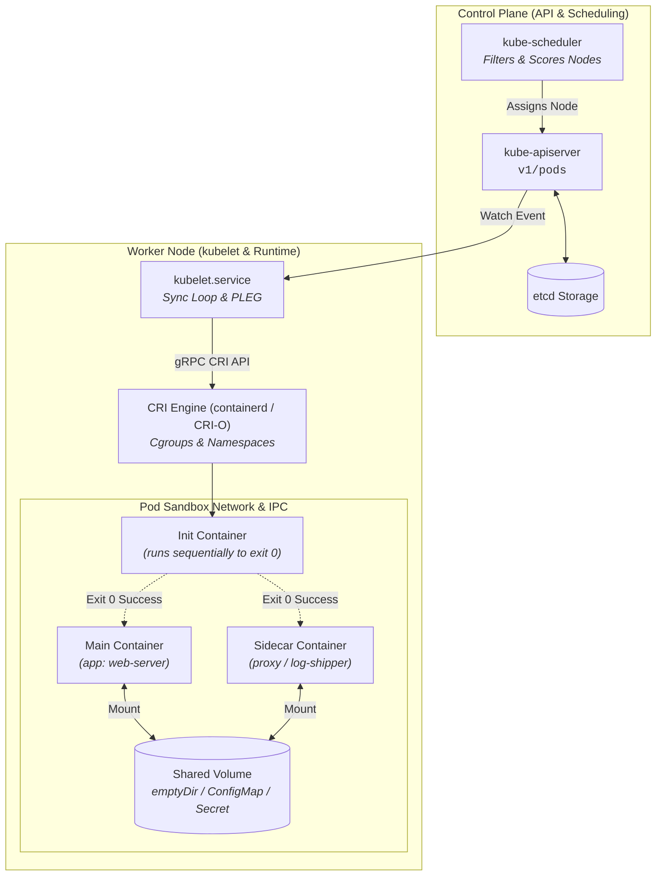

# Chapter 01: Kubernetes Core Workloads & Pods

<div class="grid cards" markdown>

-   :material-school: **Topic Focus** &bull; Pod Specifications, Multi-Container Sidecars, and Lifecycle
-   :material-api: **Primary APIs** &bull; `v1` &bull; `Pod`, `PodDisruptionBudget`
-   :material-rocket-launch: [**Launch Playground in Wasm →**](../playground/index.html?chapter=1){ .md-button .md-button--primary }

</div>

!!! tip "⚡ Interactive Problems in this Chapter (Click to solve in Playground)"
    - [**`pods01`**: First Pod Manifest & Spec →](../playground/index.html?exercise=pods01)
    - [**`pods02`**: Multi-Container Pods & Sidecar Pattern →](../playground/index.html?exercise=pods02)
    - [**`pods03`**: Init Containers for Initialization →](../playground/index.html?exercise=pods03)
    - [**`pods04`**: Resource Requests, Limits & QoS →](../playground/index.html?exercise=pods04)
    - [**`pods05`**: Downward API & Env Variables →](../playground/index.html?exercise=pods05)
    - [**`pods06`**: Pod Disruption Budgets & Static Pods →](../playground/index.html?exercise=pods06)

---

## 1. Architectural Overview & Control Plane Mechanics

In Kubernetes, **Kubernetes Core Workloads & Pods** is reconciled through declarative state loops managed by the control plane and node daemons:



### 1.1 Architectural Flow & Lifecycle Walkthrough

1. **Manifest Ingestion & OpenAPI Deserialization**: The user or CI client submits a YAML Pod manifest via `kubectl apply`. The `kube-apiserver` deserializes the YAML into native Go structs (`v1.Pod`), validates the fields against OpenAPI v3 schemas, and applies admission checks.
2. **Persistence in etcd**: Upon passing validation, `kube-apiserver` encodes the Go struct into a compact **Protobuf binary payload** and executes an atomic MVCC transaction to persist the record at key `/registry/pods/{namespace}/{name}` in `etcd3`.
3. **Scheduling Watch & Node Binding**: `kube-scheduler` maintains an HTTP/2 streaming watch on unassigned Pods (`spec.nodeName == ""`). It filters and scores candidate nodes, selecting the optimal worker node, and writes an asynchronous `Binding` subresource back to the API server.
4. **Kubelet Sync Loop & PLEG**: The target worker node's `kubelet` detects the scheduled Pod via its `PodConfig` channel. The Pod Lifecycle Event Generator (PLEG) detects state divergence and initiates container reconciliation.
5. **CRI gRPC Sandbox Creation**: `kubelet` connects to the Container Runtime Interface (CRI) engine (`containerd` or `CRI-O`) via a local Unix Domain Socket (`/run/containerd/containerd.sock`) over **gRPC**. It issues a `RunPodSandbox` gRPC request, prompting `containerd` to spawn the Linux **pause container** (`CLONE_NEWNET`, `CLONE_NEWUTS`, `CLONE_NEWIPC`).
6. **Sequential Init Container Execution**: `kubelet` invokes `CreateContainer` and `StartContainer` over CRI gRPC for each init container in strict sequential order. Each init container must terminate with exit code 0 before subsequent containers are scheduled.
7. **Main & Sidecar Container Startup**: `kubelet` initiates the application and sidecar containers concurrently within the shared network and IPC namespaces, attaching mounted storage volumes (`emptyDir`, `ConfigMap`, or persistent block mounts).

### 1.2 Serialization, Protocols & Communication Pathways

- **gRPC over Unix Domain Sockets (UDS)**: `kubelet` communicates with `containerd` via `/run/containerd/containerd.sock` using the `runtime.v1.RuntimeService` gRPC interface.
- **Protobuf Serialization**: Data exchanged over CRI gRPC and stored within `etcd3` is serialized using Protocol Buffers (proto3) to eliminate JSON parsing overhead and minimize CPU/memory serialization latency.
- **JSON/YAML Deserialization & Scheme Conversion**: `kubectl` transmits JSON payloads over HTTP/2 with TLS 1.3 to `kube-apiserver`. The API server uses `k8s.io/apimachinery` codec schemes to convert external versions (`v1`) into internal unstructured objects before validation.

### 1.3 Deep-Dive Component Breakdown

- **kube-apiserver**: Stateless HTTP REST gateway providing OpenAPI v3 schema validation, authentication (AuthN), authorization (AuthZ), admission mutation/validation, and `etcd` persistence.
- **kubelet & PLEG**: Node management agent running as a systemd service. PLEG (Pod Lifecycle Event Generator) polls runtime relists and container events to maintain internal active pod caches.
- **Pause Container**: A minimal C program (`pause.c`) that sleeps indefinitely (`pause()`), holding the Linux network (`CLONE_NEWNET`), IPC (`CLONE_NEWIPC`), and UTS namespaces open for all co-located containers in the Pod.
- **Shared Volume Subsystem**: Linux VFS bind-mounts configured by kubelet's Volume Manager, enabling atomic inter-container data exchange via memory-backed `tmpfs` or host filesystem mounts.

### 1.4 Under-The-Hood Mechanics & Failure Modes

- **cgroups v2 Enforcement**: Resource limits translate directly to Linux control group v2 files: `spec.containers[*].resources.limits.cpu` sets `cpu.max` (quota and period in microseconds), while `limits.memory` sets `memory.max` (hard memory ceiling).
- **OOM Killer & `oom_score_adj`**: The Linux kernel Out-Of-Memory (OOM) killer uses `/proc/[pid]/oom_score_adj`. Kubelet assigns `-997` to Guaranteed QoS Pods, while BestEffort Pods receive `1000`, making BestEffort workloads the first candidates for termination under memory exhaustion.
- **Init Container Failure Modes**: If any init container exits with non-zero status and `restartPolicy: Always`, kubelet restarts the failed init container using exponential backoff (10s, 20s, up to 5 minutes), blocking application startup indefinitely.

---

## 2. Annotated Production YAML Anatomy & Field Reference

Below is a production-grade declarative manifest demonstrating field definitions and operational patterns:

```yaml
apiVersion: v1
kind: Pod
metadata:
  name: production-web-service
  namespace: default
  labels:
    app.kubernetes.io/name: web-service
    app.kubernetes.io/component: frontend
    app.kubernetes.io/part-of: e-commerce
spec:
  restartPolicy: Always
  terminationGracePeriodSeconds: 30
  initContainers:
  - name: init-db-check
    image: busybox:1.36
    command: ['sh', '-c', 'echo "Waiting for database ready..."; sleep 2;']
    resources:
      limits:
        cpu: "100m"
        memory: "64Mi"
      requests:
        cpu: "50m"
        memory: "32Mi"
  containers:
  - name: web-app
    image: nginx:1.27-alpine
    ports:
    - name: http
      containerPort: 80
      protocol: TCP
    resources:
      limits:
        cpu: "500m"
        memory: "256Mi"
      requests:
        cpu: "250m"
        memory: "128Mi"
    volumeMounts:
    - name: shared-logs
      mountPath: /var/log/nginx
  - name: log-collector
    image: busybox:1.36
    command: ['sh', '-c', 'tail -F /var/log/nginx/access.log 2>/dev/null || true']
    volumeMounts:
    - name: shared-logs
      mountPath: /var/log/nginx
  volumes:
  - name: shared-logs
    emptyDir: {}
```

### Key Field Schema Reference

| Field | Type | Description |
| :--- | :--- | :--- |
| `spec.initContainers` | `Array` | Containers executed sequentially before app containers start. Must exit with code 0. |
| `spec.containers[*].resources` | `Object` | Compute requests (scheduler quota) and limits (cgroup enforcement). |
| `spec.volumes` | `Array` | Shared storage abstractions mounted into container filesystems. |
| `spec.terminationGracePeriodSeconds` | `Integer (Default: 30)` | Duration given for SIGTERM handling before SIGKILL is dispatched. |

---

## 3. Real-World Architectural Patterns

### Sidecar Logging Pattern

```yaml
apiVersion: v1
kind: Pod
metadata:
  name: sidecar-log-processor
spec:
  containers:
  - name: app
    image: alpine:3.20
    command: ["sh", "-c", "while true; do date >> /logs/app.log; sleep 1; done"]
    volumeMounts:
    - name: log-volume
      mountPath: /logs
  - name: shipper
    image: busybox:1.36
    command: ["sh", "-c", "tail -f /logs/app.log"]
    volumeMounts:
    - name: log-volume
      mountPath: /logs
  volumes:
  - name: log-volume
    emptyDir: {}
```

### Downward API Metadata Injection

```yaml
apiVersion: v1
kind: Pod
metadata:
  name: downward-api-env
  labels:
    tier: frontend
spec:
  containers:
  - name: client
    image: busybox:1.36
    command: ["sh", "-c", "env | grep POD_ && sleep 3600"]
    env:
    - name: POD_NAME
      valueFrom:
        fieldRef:
          fieldPath: metadata.name
    - name: POD_NAMESPACE
      valueFrom:
        fieldRef:
          fieldPath: metadata.namespace
    - name: POD_IP
      valueFrom:
        fieldRef:
          fieldPath: status.podIP
```


---

## 4. Production Hardening & Operational Governance

- Always set both `requests` and `limits` to establish predictable QoS classes (Guaranteed vs Burstable).
- Set `securityContext.runAsNonRoot: true` and `securityContext.readOnlyRootFilesystem: true`.
- Drop all Linux capabilities with `capabilities.drop: ['ALL']` and add back only strictly necessary capabilities (e.g. `NET_BIND_SERVICE`).
- Pair multi-instance workloads with `PodDisruptionBudget` to ensure high availability during node drains.

---

## 5. Failure Modes & Diagnostic Triage Tree

??? failure "`CrashLoopBackOff`"
    **Root Cause:** Container starts and exits immediately with an error code.

    **Diagnostic Triage Sequence:**
    1. Inspect exit code: `kubectl get pod <name> -o jsonpath='{.status.containerStatuses[*].state.terminated}'`
    2. Check previous container logs: `kubectl logs <name> -c <container> --previous`
    3. Verify entrypoint args and required environment variables.

??? failure "`OOMKilled` (Exit Code 137)"
    **Root Cause:** Container exceeded its memory limit cgroup.

    **Diagnostic Triage Sequence:**
    1. Run `kubectl describe pod <name>` and look for `Last State: Terminated / Reason: OOMKilled`.
    2. Increase `resources.limits.memory` or profile application heap memory consumption.

??? failure "`Pending` (Scheduling Failure)"
    **Root Cause:** Scheduler cannot find a node meeting CPU/memory/taint requirements.

    **Diagnostic Triage Sequence:**
    1. Inspect scheduling events: `kubectl describe pod <name>`
    2. Review cluster capacity: `kubectl describe nodes | grep -A 8 'Allocated resources'`.


---

## 6. Interactive Practice Matrix

Practice concepts from this chapter directly in the interactive WebAssembly sandbox:

| Exercise ID | Challenge Description | Direct Link | Action |
| :--- | :--- | :--- | :--- |
| **`pods01`** | First Pod Manifest & Spec | [`../playground/index.html?exercise=pods01`](../playground/index.html?exercise=pods01) | [**⚡ Solve `pods01` in Playground →**](../playground/index.html?exercise=pods01){ .md-button .md-button--primary } |
| **`pods02`** | Multi-Container Pods & Sidecar Pattern | [`../playground/index.html?exercise=pods02`](../playground/index.html?exercise=pods02) | [**⚡ Solve `pods02` in Playground →**](../playground/index.html?exercise=pods02){ .md-button .md-button--primary } |
| **`pods03`** | Init Containers for Initialization | [`../playground/index.html?exercise=pods03`](../playground/index.html?exercise=pods03) | [**⚡ Solve `pods03` in Playground →**](../playground/index.html?exercise=pods03){ .md-button .md-button--primary } |
| **`pods04`** | Resource Requests, Limits & QoS | [`../playground/index.html?exercise=pods04`](../playground/index.html?exercise=pods04) | [**⚡ Solve `pods04` in Playground →**](../playground/index.html?exercise=pods04){ .md-button .md-button--primary } |
| **`pods05`** | Downward API & Env Variables | [`../playground/index.html?exercise=pods05`](../playground/index.html?exercise=pods05) | [**⚡ Solve `pods05` in Playground →**](../playground/index.html?exercise=pods05){ .md-button .md-button--primary } |
| **`pods06`** | Pod Disruption Budgets & Static Pods | [`../playground/index.html?exercise=pods06`](../playground/index.html?exercise=pods06) | [**⚡ Solve `pods06` in Playground →**](../playground/index.html?exercise=pods06){ .md-button .md-button--primary } |
