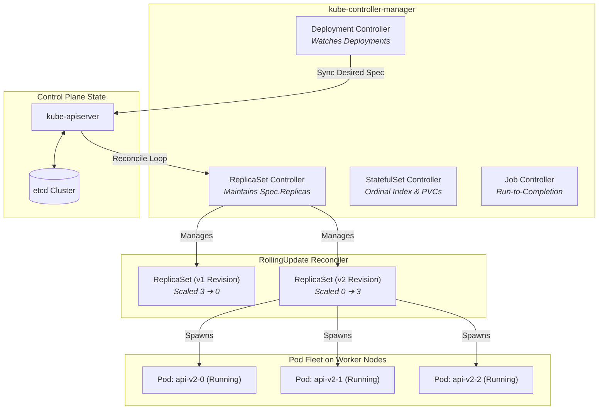

# Chapter 02: Controllers & Replication

<div class="grid cards" markdown>

-   :material-school: **Topic Focus** &bull; ReplicaSets, Deployments, StatefulSets, DaemonSets, and Jobs
-   :material-api: **Primary APIs** &bull; `apps/v1`, `batch/v1` &bull; `Deployment`, `StatefulSet`, `DaemonSet`, `Job`, `CronJob`
-   :material-rocket-launch: [**Launch Playground in Wasm →**](../playground/index.html?chapter=2){ .md-button .md-button--primary }

</div>

!!! tip "⚡ Interactive Problems in this Chapter (Click to solve in Playground)"
    - [**`ctrl01`**: ReplicaSets & Label Selectors →](../playground/index.html?exercise=ctrl01)
    - [**`ctrl02`**: Deployments & Rolling Updates →](../playground/index.html?exercise=ctrl02)
    - [**`ctrl03`**: Deployment Rollbacks & Revision History →](../playground/index.html?exercise=ctrl03)
    - [**`ctrl04`**: StatefulSets & Stable Network IDs →](../playground/index.html?exercise=ctrl04)
    - [**`ctrl05`**: DaemonSets for Node-Level Daemons →](../playground/index.html?exercise=ctrl05)
    - [**`ctrl06`**: Jobs & CronJobs →](../playground/index.html?exercise=ctrl06)

---

## 1. Architectural Overview & Control Plane Mechanics

In Kubernetes, **Controllers & Replication** is reconciled through declarative state loops managed by the control plane and node daemons:



### 1.1 Architectural Flow & Lifecycle Walkthrough

1. **Declarative State Declaration**: A platform operator submits a `Deployment` manifest declaring `spec.replicas: 3` and `spec.strategy.type: RollingUpdate`.
2. **Informer Reflector List-Watch**: The `DeploymentController` inside `kube-controller-manager` runs a `SharedIndexInformer`. The informer's `Reflector` establishes an HTTP/2 chunked List-Watch connection to `kube-apiserver`, streaming delta changes into a thread-safe local `Indexer` FIFO queue.
3. **Reconciliation Loop & WorkQueue**: The controller pops the Deployment key from the `RateLimitingWorkQueue`. It queries the local cache for matching ReplicaSets via label selectors (`matchLabels`).
4. **RollingUpdate Rollout Math**: When `spec.template.spec` changes, the controller creates a new Revision ReplicaSet (`v2`). It calculates `maxSurge` (temporary extra pods allowed above desired count) and `maxUnavailable` (maximum pods allowed in non-ready state), progressively incrementing `spec.replicas` on `v2` while decrementing `v1`.
5. **ReplicaSet Controller Action**: The `ReplicaSetController` observes the updated replica counts, compares desired vs actual live Pod counts, and executes batch HTTP POST requests to `kube-apiserver` to spawn or terminate individual `v1.Pod` objects.
6. **Self-Healing & Drift Convergence**: If a node crashes or a worker process is terminated, the informer receives a `Delete` event, immediately re-enqueuing the Deployment key to recreate replacement Pods until the observed state equals the desired state.

### 1.2 Serialization, Protocols & Communication Pathways

- **HTTP/2 Chunked Streaming (Watch API)**: The API server streams resource change events (`ADDED`, `MODIFIED`, `DELETED`) encoded as JSON or binary Protobuf over long-lived HTTP/2 streams.
- **Optimistic Concurrency Control (OCC)**: State updates use HTTP `PUT` with `metadata.resourceVersion`. If another controller modified the object in `etcd` concurrently, the API server rejects the write with `409 Conflict`, prompting the controller to re-fetch the latest state and retry.
- **Protobuf Internal Wire Protocol**: Inter-component communication between `kube-controller-manager` and `kube-apiserver` utilizes Protobuf encoding to support high-throughput event processing across large clusters.

### 1.3 Deep-Dive Component Breakdown

- **kube-controller-manager**: Monolithic Go binary running a collection of distinct control loops (Deployment, ReplicaSet, StatefulSet, Job, Node) managed by a leader-election lock in `coordination.k8s.io/leases`.
- **SharedIndexInformer & DeltaFIFO**: Caching and event distribution layer that reduces `kube-apiserver` query loads by maintaining an in-memory thread-safe copy of cluster resources indexed by namespace and labels.
- **RateLimitingWorkQueue**: Go workqueue implementation providing exponential backoff, token-bucket rate limiting, and deduplication of concurrent reconciliation keys.
- **ReplicaSet Reconciler**: Dedicated controller responsible exclusively for maintaining the exact number of active, ready Pods matching a given Pod template and selector.

### 1.4 Under-The-Hood Mechanics & Failure Modes

- **Cascading Rollout Stall (`ProgressDeadlineSeconds`)**: If new revision Pods fail startup or readiness checks, the rollout stalls. If the condition persists beyond `progressDeadlineSeconds` (default: 600s), the Deployment controller transitions `.status.conditions[Type=Progressing].status = "False"` with reason `ProgressDeadlineExceeded`.
- **Label Selector Mutability Invariants**: `spec.selector` is immutable after creation. Attempting to modify `matchLabels` requires recreating the Deployment, as selector collisions can lead to orphaned ReplicaSets or split-brain ownership loops.
- **Split-Brain Prevention via Leases**: Only the active leader instance of `kube-controller-manager` executes reconciliation routines. Non-leader instances maintain active informer caches and continuously renew heartbeat leases to take over within 15 seconds upon leader termination.

---

## 2. Annotated Production YAML Anatomy & Field Reference

Below is a production-grade declarative manifest demonstrating field definitions and operational patterns:

```yaml
apiVersion: apps/v1
kind: Deployment
metadata:
  name: api-service
  labels:
    app: api-service
spec:
  replicas: 3
  revisionHistoryLimit: 5
  strategy:
    type: RollingUpdate
    rollingUpdate:
      maxSurge: 1
      maxUnavailable: 0
  selector:
    matchLabels:
      app: api-service
  template:
    metadata:
      labels:
        app: api-service
    spec:
      containers:
      - name: api
        image: nginx:1.27-alpine
        ports:
        - containerPort: 8080
        resources:
          requests:
            cpu: 100m
            memory: 128Mi
          limits:
            cpu: 250m
            memory: 256Mi
```

### Key Field Schema Reference

| Field | Type | Description |
| :--- | :--- | :--- |
| `spec.strategy.rollingUpdate` | `Object` | Controls zero-downtime rollouts via `maxSurge` (surge capacity) and `maxUnavailable` (tolerated disruption). |
| `spec.selector.matchLabels` | `Map` | Immutable label query used by the controller to discover its owned Pods. Must match `spec.template.metadata.labels`. |
| `spec.revisionHistoryLimit` | `Integer (Default: 10)` | Number of historical ReplicaSets retained for instant rollbacks. |

---

## 3. Real-World Architectural Patterns

### StatefulSet with VolumeClaimTemplates

```yaml
apiVersion: apps/v1
kind: StatefulSet
metadata:
  name: redis-cluster
spec:
  serviceName: redis-headless
  replicas: 3
  selector:
    matchLabels:
      app: redis
  template:
    metadata:
      labels:
        app: redis
    spec:
      containers:
      - name: redis
        image: redis:7.2-alpine
        ports:
        - containerPort: 6379
        volumeMounts:
        - name: data
          mountPath: /data
  volumeClaimTemplates:
  - metadata:
      name: data
    spec:
      accessModes: ["ReadWriteOnce"]
      resources:
        requests:
          storage: 5Gi
```

### CronJob with Concurrency Policy

```yaml
apiVersion: batch/v1
kind: CronJob
metadata:
  name: nightly-backup
spec:
  schedule: "0 2 * * *"
  concurrencyPolicy: Forbid
  successfulJobsHistoryLimit: 3
  failedJobsHistoryLimit: 1
  jobTemplate:
    spec:
      backoffLimit: 2
      template:
        spec:
          restartPolicy: OnFailure
          containers:
          - name: backup
            image: busybox:1.36
            command: ["sh", "-c", "echo 'Running DB dump...'; exit 0"]
```


---

## 4. Production Hardening & Operational Governance

- Use `maxUnavailable: 0` during rolling updates to guarantee baseline capacity is never reduced.
- Avoid orphan ReplicaSets by always setting `revisionHistoryLimit`.
- StatefulSets should be paired with headless Services for stable network identities (`$(pod-name).$(service-name).$(namespace).svc.cluster.local`).

---

## 5. Failure Modes & Diagnostic Triage Tree

??? failure "Rollout Stuck / Deployment Blocked"
    **Root Cause:** New ReplicaSet cannot progress due to image pull or readiness probe failures.

    **Diagnostic Triage Sequence:**
    1. View rollout status: `kubectl rollout status deployment/<name>`
    2. Inspect rollout history: `kubectl rollout history deployment/<name>`
    3. Roll back immediately: `kubectl rollout undo deployment/<name>`

??? failure "StatefulSet Pod Stuck Terminating"
    **Root Cause:** Volume detach/attach cycle locked or node unready.

    **Diagnostic Triage Sequence:**
    1. Check PV status: `kubectl get pvc -l app=<name>`
    2. Inspect node status: `kubectl describe node <node>`


---

## 6. Interactive Practice Matrix

Practice concepts from this chapter directly in the interactive WebAssembly sandbox:

| Exercise ID | Challenge Description | Direct Link | Action |
| :--- | :--- | :--- | :--- |
| **`ctrl01`** | ReplicaSets & Label Selectors | [`../playground/index.html?exercise=ctrl01`](../playground/index.html?exercise=ctrl01) | [**⚡ Solve `ctrl01` in Playground →**](../playground/index.html?exercise=ctrl01){ .md-button .md-button--primary } |
| **`ctrl02`** | Deployments & Rolling Updates | [`../playground/index.html?exercise=ctrl02`](../playground/index.html?exercise=ctrl02) | [**⚡ Solve `ctrl02` in Playground →**](../playground/index.html?exercise=ctrl02){ .md-button .md-button--primary } |
| **`ctrl03`** | Deployment Rollbacks & Revision History | [`../playground/index.html?exercise=ctrl03`](../playground/index.html?exercise=ctrl03) | [**⚡ Solve `ctrl03` in Playground →**](../playground/index.html?exercise=ctrl03){ .md-button .md-button--primary } |
| **`ctrl04`** | StatefulSets & Stable Network IDs | [`../playground/index.html?exercise=ctrl04`](../playground/index.html?exercise=ctrl04) | [**⚡ Solve `ctrl04` in Playground →**](../playground/index.html?exercise=ctrl04){ .md-button .md-button--primary } |
| **`ctrl05`** | DaemonSets for Node-Level Daemons | [`../playground/index.html?exercise=ctrl05`](../playground/index.html?exercise=ctrl05) | [**⚡ Solve `ctrl05` in Playground →**](../playground/index.html?exercise=ctrl05){ .md-button .md-button--primary } |
| **`ctrl06`** | Jobs & CronJobs | [`../playground/index.html?exercise=ctrl06`](../playground/index.html?exercise=ctrl06) | [**⚡ Solve `ctrl06` in Playground →**](../playground/index.html?exercise=ctrl06){ .md-button .md-button--primary } |
