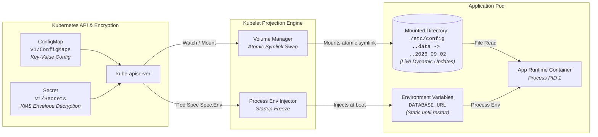

# Chapter 03: Configuration & Secret Management

<div class="grid cards" markdown>

-   :material-school: **Topic Focus** &bull; ConfigMaps, Secrets, In-Memory Mounts, and Immutability
-   :material-api: **Primary APIs** &bull; `v1` &bull; `ConfigMap`, `Secret`
-   :material-rocket-launch: [**Launch Playground in Wasm →**](../playground/index.html?chapter=3){ .md-button .md-button--primary }

</div>

!!! tip "⚡ Interactive Problems in this Chapter (Click to solve in Playground)"
    - [**`config01`**: ConfigMaps as Environment Variables →](../playground/index.html?exercise=config01)
    - [**`config02`**: ConfigMaps Mounted as Volumes →](../playground/index.html?exercise=config02)
    - [**`config03`**: Secrets & Base64 Encoding →](../playground/index.html?exercise=config03)
    - [**`config04`**: Secret Volume Mounts & Permissions →](../playground/index.html?exercise=config04)
    - [**`config05`**: Immutable ConfigMaps and Secrets →](../playground/index.html?exercise=config05)

---

## 1. Architectural Overview & Control Plane Mechanics

In Kubernetes, **Configuration & Secret Management** is reconciled through declarative state loops managed by the control plane and node daemons:



### 1.1 Architectural Flow & Lifecycle Walkthrough

1. **Secret & Config Creation**: Operators submit `v1/ConfigMap` and `v1/Secret` manifests containing key-value configurations and base64-encoded credentials.
2. **KMS Envelope Encryption at Rest**: `kube-apiserver` receives the Secret payload. If configured with a Key Management Service (KMS v2 provider), it generates a local Data Encryption Key (DEK), encrypts the secret data using AES-GCM-256, encrypts the DEK with the remote KMS Key Encryption Key (KEK) via gRPC, and stores the envelope ciphertext in `etcd`.
3. **Kubelet Volume Manager Mounting**: When a Pod referencing the ConfigMap/Secret is scheduled to a node, the local `kubelet` Volume Manager detects the dependency and fetches the plain object via API watch.
4. **Atomic Symlink Projection**: `kubelet` writes the keys as individual files inside a timestamped directory on the host (e.g., `/var/lib/kubelet/pods/<UID>/volumes/kubernetes.io~secret/my-secret/..2026_09_02_12_00_00.123456789`). It atomically swaps a symlink named `..data` to point to the new directory.
5. **Dynamic Updates vs Static Env Injection**:
   - **Mounted Files**: Application containers reading from the mount path automatically see updated file contents whenever the `..data` symlink is swapped, without container restarts.
   - **Environment Variables (`envFrom`)**: Injected into Linux process memory table (`/proc/1/environ`) during `clone()` at container boot; values remain static until the container process is restarted.

### 1.2 Serialization, Protocols & Communication Pathways

- **KMS v2 gRPC Protocol**: `kube-apiserver` communicates with KMS plugins over local Unix domain sockets using `k8s.io/kms/apis/v2` gRPC definitions for `Encrypt` and `Decrypt` remote procedure calls.
- **Base64 RFC 4648 Encoding**: Secrets in YAML/JSON are Base64 encoded for binary data representation across text transports, but this provides zero cryptographic confidentiality without TLS and encryption-at-rest.
- **Protobuf Storage Compression**: `etcd` stores ConfigMaps and Secrets as serialized Protocol Buffer messages under the `/registry/configmaps` and `/registry/secrets` keyspace.

### 1.3 Deep-Dive Component Breakdown

- **kubelet VolumeManager**: Internal loop within kubelet responsible for orchestrating `MountVolume`, `UnmountVolume`, and syncing projected volume payloads against API server state.
- **KMS Plugin Daemon**: Out-of-tree gRPC daemon (supporting AWS KMS, HashiCorp Vault, GCP Cloud KMS, or Azure Key Vault) that handles hardware security module (HSM) cryptographic operations.
- **Atomic Symlink Tree**: File system layout utilizing Linux `symlink()` and `rename()` system calls to prevent race conditions during multi-file configuration updates.
- **Linux `/proc/[pid]/environ`**: Kernel table storing initial process environment variables created during `execve`, isolated per process namespace.

### 1.4 Under-The-Hood Mechanics & Failure Modes

- **Stale Memory Footprints with SubPath Mounts**: Using `volumeMounts.subPath` bypasses the atomic `..data` symlink tree by bind-mounting a single file directly. Consequently, subPath mounted files will **never** receive automatic live updates when ConfigMaps change.
- **KMS Plugin Unavailability**: If the KMS gRPC daemon crashes or network connectivity to the cloud KMS endpoint drops, `kube-apiserver` cannot decrypt Secrets, causing Pod scheduling on new nodes to fail with `CreateContainerConfigError`.
- **Secret Size Limits**: Individual `etcd` key-value pairs are hard-capped at 1.5MB by default, restricting individual ConfigMaps and Secrets to a maximum aggregate payload size of 1MB to prevent etcd transaction log saturation.

---

## 2. Annotated Production YAML Anatomy & Field Reference

Below is a production-grade declarative manifest demonstrating field definitions and operational patterns:

```yaml
apiVersion: v1
kind: ConfigMap
metadata:
  name: app-config
  namespace: default
data:
  APP_ENV: "production"
  LOG_LEVEL: "info"
  nginx.conf: |
    events { worker_connections 1024; }
    http {
      server {
        listen 80;
        location / { return 200 "OK"; }
      }
    }
---
apiVersion: v1
kind: Secret
metadata:
  name: app-secrets
  namespace: default
type: Opaque
stringData:
  DB_PASSWORD: "super-secure-production-password"
  API_KEY: "secret-token-xyz-123"
```

### Key Field Schema Reference

| Field | Type | Description |
| :--- | :--- | :--- |
| `data` vs `stringData` | `Map` | `data` expects base64 encoded strings; `stringData` accepts raw text and is auto-encoded on write. |
| `immutable: true` | `Boolean` | Protects against accidental config modification and reduces kube-apiserver watch load. |
| `envFrom.configMapRef` | `Object` | Exposes all key-value pairs in a ConfigMap as individual container environment variables. |

---

## 3. Real-World Architectural Patterns

### Projected Volume Config Injection

```yaml
apiVersion: v1
kind: Pod
metadata:
  name: projected-config-pod
spec:
  containers:
  - name: app
    image: alpine:3.20
    command: ["sh", "-c", "ls -la /etc/config && sleep 3600"]
    volumeMounts:
    - name: config-bundle
      mountPath: /etc/config
      readOnly: true
  volumes:
  - name: config-bundle
    projected:
      sources:
      - configMap:
          name: app-config
      - secret:
          name: app-secrets
```

### Immutable Configuration Pattern

```yaml
apiVersion: v1
kind: ConfigMap
metadata:
  name: static-routing-table-v1
immutable: true
data:
  routes.json: |
    {"/api/v1": "http://api-v1", "/api/v2": "http://api-v2"}
```


---

## 4. Production Hardening & Operational Governance

- Store sensitive data exclusively in `Secret` resources backed by KMS envelope encryption or external vault integrations (External Secrets Operator).
- Set `immutable: true` on ConfigMaps and Secrets used with immutable deployment pipelines to eliminate drift.
- Always mount Secret volumes with `readOnly: true` to prevent unauthorized in-pod file manipulation.

---

## 5. Failure Modes & Diagnostic Triage Tree

??? failure "`CreateContainerConfigError`"
    **Root Cause:** Referenced ConfigMap or Secret does not exist or key name is misspelled.

    **Diagnostic Triage Sequence:**
    1. Run `kubectl describe pod <name>` and inspect the exact missing key.
    2. Check namespace: `kubectl get configmap,secret -n <namespace>`.

??? failure "Live ConfigMap Update Not Reflected in Pod"
    **Root Cause:** ConfigMaps injected as environment variables are static and require pod restart; volume mounts take up to kubelet sync period (default ~60s).

    **Diagnostic Triage Sequence:**
    1. Trigger rolling restart: `kubectl rollout restart deployment/<name>`.


---

## 6. Interactive Practice Matrix

Practice concepts from this chapter directly in the interactive WebAssembly sandbox:

| Exercise ID | Challenge Description | Direct Link | Action |
| :--- | :--- | :--- | :--- |
| **`config01`** | ConfigMaps as Environment Variables | [`../playground/index.html?exercise=config01`](../playground/index.html?exercise=config01) | [**⚡ Solve `config01` in Playground →**](../playground/index.html?exercise=config01){ .md-button .md-button--primary } |
| **`config02`** | ConfigMaps Mounted as Volumes | [`../playground/index.html?exercise=config02`](../playground/index.html?exercise=config02) | [**⚡ Solve `config02` in Playground →**](../playground/index.html?exercise=config02){ .md-button .md-button--primary } |
| **`config03`** | Secrets & Base64 Encoding | [`../playground/index.html?exercise=config03`](../playground/index.html?exercise=config03) | [**⚡ Solve `config03` in Playground →**](../playground/index.html?exercise=config03){ .md-button .md-button--primary } |
| **`config04`** | Secret Volume Mounts & Permissions | [`../playground/index.html?exercise=config04`](../playground/index.html?exercise=config04) | [**⚡ Solve `config04` in Playground →**](../playground/index.html?exercise=config04){ .md-button .md-button--primary } |
| **`config05`** | Immutable ConfigMaps and Secrets | [`../playground/index.html?exercise=config05`](../playground/index.html?exercise=config05) | [**⚡ Solve `config05` in Playground →**](../playground/index.html?exercise=config05){ .md-button .md-button--primary } |
