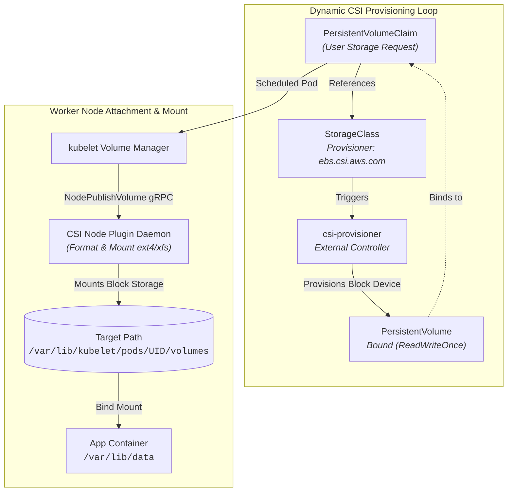

# Chapter 04: Storage & Persistent Volumes

<div class="grid cards" markdown>

-   :material-school: **Topic Focus** &bull; PVs, PVCs, Access Modes, StorageClasses, and Snapshots
-   :material-api: **Primary APIs** &bull; `v1`, `storage.k8s.io/v1` &bull; `PersistentVolume`, `PersistentVolumeClaim`, `StorageClass`
-   :material-rocket-launch: [**Launch Playground in Wasm →**](../playground/index.html?chapter=4){ .md-button .md-button--primary }

</div>

!!! tip "⚡ Interactive Problems in this Chapter (Click to solve in Playground)"
    - [**`storage01`**: Volume Types (emptyDir & hostPath) →](../playground/index.html?exercise=storage01)
    - [**`storage02`**: PersistentVolumes & PersistentVolumeClaims →](../playground/index.html?exercise=storage02)
    - [**`storage03`**: Access Modes & Reclaim Policies →](../playground/index.html?exercise=storage03)
    - [**`storage04`**: StorageClasses & Dynamic Provisioning →](../playground/index.html?exercise=storage04)
    - [**`storage05`**: Volume Snapshots & Volume Expansion →](../playground/index.html?exercise=storage05)

---

## 1. Architectural Overview & Control Plane Mechanics

In Kubernetes, **Storage & Persistent Volumes** is reconciled through declarative state loops managed by the control plane and node daemons:



### 1.1 Architectural Flow & Lifecycle Walkthrough

1. **PVC Creation & StorageClass Matching**: A developer declares a `PersistentVolumeClaim` (PVC) specifying storage requests (e.g., `100Gi`) and `storageClassName: ebs-gp3-sc`.
2. **External Provisioner Detection**: The `csi-provisioner` sidecar watching PVCs detects an unbound claim. If `volumeBindingMode: WaitForFirstConsumer` is set, dynamic provisioning waits until `kube-scheduler` selects an eligible node to ensure volume placement matches compute topology.
3. **Dynamic Volume Provisioning via CSI gRPC**: `csi-provisioner` issues a `CreateVolume` gRPC call to the cloud storage provider plugin (e.g., AWS EBS CSI Controller). The plugin communicates with cloud APIs to allocate the underlying physical EBS volume or SAN LUN.
4. **PV Creation & Two-Way Binding**: `csi-provisioner` writes a corresponding `PersistentVolume` (PV) object to `kube-apiserver`. The `PersistentVolumeController` binds the PVC and PV bidirectionally (`spec.volumeName` and `spec.claimRef`).
5. **Node Attachment (`AttachVolume`)**: The `csi-attacher` controller calls `ControllerPublishVolume` over gRPC, prompting the cloud API to attach the EBS volume block device to the target EC2 worker instance.
6. **Node Formatting & Mount (`NodePublishVolume`)**: The worker node's `kubelet` detects the attached block device (e.g., `/dev/nvme1n1`). It calls the local `csi-node` daemon via gRPC `NodeStageVolume` (formats with `ext4`/`xfs` if unformatted) and `NodePublishVolume` (bind-mounts the filesystem to `/var/lib/kubelet/pods/<UID>/volumes/kubernetes.io~csi/<vol-name>/mount`).
7. **Container Bind-Mount**: The container runtime launches the application container with an explicit Linux bind-mount mapping the host target path to the container's designated mount path (e.g., `/var/lib/data`).

### 1.2 Serialization, Protocols & Communication Pathways

- **Container Storage Interface (CSI v1.x) gRPC**: All storage controller and node communications execute over standard gRPC interfaces defined by `container-storage-interface/spec`.
- **Unix Domain Socket RPC**: Node-level CSI plugins listen on host sockets (such as `/var/lib/kubelet/plugins/ebs.csi.aws.com/csi.sock`) registered with kubelet via the CSI Plugin Registration mechanism.
- **Protobuf Wire Payloads**: Volume capabilities, mount flags, access modes (`ReadWriteOnce`, `ReadWriteMany`), and cloud volume IDs are passed as structured protobuf messages across controller boundaries.

### 1.3 Deep-Dive Component Breakdown

- **csi-provisioner**: Kubernetes SIG sidecar container that watches PVCs and calls CSI `CreateVolume` and `DeleteVolume`.
- **csi-attacher**: Sidecar container that watches `VolumeAttachment` API objects and calls CSI `ControllerPublishVolume` and `ControllerUnpublishVolume`.
- **csi-node Plugin**: DaemonSet running on every node that executes privileged OS operations (formatting filesystems via `mkfs`, creating Linux mount namespaces).
- **kubelet Volume Manager**: Reconciler inside kubelet that verifies volume attachments, invokes local CSI node RPCs, and maintains desired-state mount maps.

### 1.4 Under-The-Hood Mechanics & Failure Modes

- **Multi-Attach Error (`VolumeAttachmentConflict`)**: Cloud block volumes (like AWS EBS or GCP Persistent Disk) with `ReadWriteOnce` (RWO) cannot be attached to multiple physical nodes simultaneously. If a Pod is rescheduled while the old node has not detached the volume, the Pod hangs in `ContainerCreating` with `Multi-Attach error for volume`.
- **Filesystem Corruption on Unclean Unmount**: Sudden node termination without graceful CSI `NodeUnpublishVolume` execution can leave orphan block attachments and stale lock files, requiring manual cloud console detaches or node reboots.
- **Capacity Exhaustion & Inode Depletion**: If an ext4/xfs volume fills to 100% capacity or exhausts available inodes, the application container encounters `No space left on device` (ENOSPC), causing database write stalls and container crashes.

---

## 2. Annotated Production YAML Anatomy & Field Reference

Below is a production-grade declarative manifest demonstrating field definitions and operational patterns:

```yaml
apiVersion: storage.k8s.io/v1
kind: StorageClass
metadata:
  name: fast-nvme
provisioner: kubernetes.io/no-provisioner
volumeBindingMode: WaitForFirstConsumer
reclaimPolicy: Retain
allowVolumeExpansion: true
---
apiVersion: v1
kind: PersistentVolumeClaim
metadata:
  name: postgres-pvc
  namespace: default
spec:
  accessModes:
  - ReadWriteOnce
  storageClassName: fast-nvme
  resources:
    requests:
      storage: 20Gi
```

### Key Field Schema Reference

| Field | Type | Description |
| :--- | :--- | :--- |
| `accessModes` | `Array` | `ReadWriteOnce` (single node), `ReadOnlyMany` (multi-node read), `ReadWriteMany` (multi-node write), `ReadWriteOncePod` (single pod). |
| `volumeBindingMode` | `Enum` | `Immediate` binds immediately; `WaitForFirstConsumer` delays binding until Pod scheduling to respect zone/node constraints. |
| `reclaimPolicy` | `Enum` | `Delete` cleans up underlying physical disk upon PVC deletion; `Retain` preserves data for manual recovery. |

---

## 3. Real-World Architectural Patterns

### Dynamic PVC with StatefulSet Volume Template

```yaml
apiVersion: apps/v1
kind: StatefulSet
metadata:
  name: database
spec:
  serviceName: db
  replicas: 2
  selector:
    matchLabels:
      app: db
  template:
    metadata:
      labels:
        app: db
    spec:
      containers:
      - name: postgres
        image: postgres:16-alpine
        env:
        - name: POSTGRES_PASSWORD
          value: example
        volumeMounts:
        - name: pgdata
          mountPath: /var/lib/postgresql/data
  volumeClaimTemplates:
  - metadata:
      name: pgdata
    spec:
      accessModes: ["ReadWriteOnce"]
      resources:
        requests:
          storage: 10Gi
```

### Local Static PersistentVolume

```yaml
apiVersion: v1
kind: PersistentVolume
metadata:
  name: local-pv-storage
spec:
  capacity:
    storage: 50Gi
  accessModes:
  - ReadWriteOnce
  persistentVolumeReclaimPolicy: Retain
  storageClassName: local-storage
  local:
    path: /mnt/disks/ssd1
  nodeAffinity:
    required:
      nodeSelectorTerms:
      - matchExpressions:
        - key: kubernetes.io/hostname
          operator: In
          values:
          - node-worker-1
```


---

## 4. Production Hardening & Operational Governance

- Always use `volumeBindingMode: WaitForFirstConsumer` for cloud block storage (EBS/GPD/AzureDisk) to avoid multi-zone scheduling deadlocks.
- Enable `allowVolumeExpansion: true` in StorageClasses to facilitate zero-downtime disk resizing.
- Protect production PVCs from accidental deletion by setting `reclaimPolicy: Retain` on mission-critical StorageClasses.

---

## 5. Failure Modes & Diagnostic Triage Tree

??? failure "PVC Stuck in `Pending`"
    **Root Cause:** No PV matches capacity/accessMode, or StorageClass provisioner is failing.

    **Diagnostic Triage Sequence:**
    1. Run `kubectl describe pvc <name>`
    2. Verify StorageClass existence: `kubectl get storageclass`
    3. Check CSI controller logs in `kube-system`.

??? failure "Multi-Attach Error (`VolumeAttachment` Deadlock)"
    **Root Cause:** Previous Pod on another node holds the read-write block lease.

    **Diagnostic Triage Sequence:**
    1. Find attaching pod: `kubectl get volumeattachments`
    2. Verify old pod termination on failing node.


---

## 6. Interactive Practice Matrix

Practice concepts from this chapter directly in the interactive WebAssembly sandbox:

| Exercise ID | Challenge Description | Direct Link | Action |
| :--- | :--- | :--- | :--- |
| **`storage01`** | Volume Types (emptyDir & hostPath) | [`../playground/index.html?exercise=storage01`](../playground/index.html?exercise=storage01) | [**⚡ Solve `storage01` in Playground →**](../playground/index.html?exercise=storage01){ .md-button .md-button--primary } |
| **`storage02`** | PersistentVolumes & PersistentVolumeClaims | [`../playground/index.html?exercise=storage02`](../playground/index.html?exercise=storage02) | [**⚡ Solve `storage02` in Playground →**](../playground/index.html?exercise=storage02){ .md-button .md-button--primary } |
| **`storage03`** | Access Modes & Reclaim Policies | [`../playground/index.html?exercise=storage03`](../playground/index.html?exercise=storage03) | [**⚡ Solve `storage03` in Playground →**](../playground/index.html?exercise=storage03){ .md-button .md-button--primary } |
| **`storage04`** | StorageClasses & Dynamic Provisioning | [`../playground/index.html?exercise=storage04`](../playground/index.html?exercise=storage04) | [**⚡ Solve `storage04` in Playground →**](../playground/index.html?exercise=storage04){ .md-button .md-button--primary } |
| **`storage05`** | Volume Snapshots & Volume Expansion | [`../playground/index.html?exercise=storage05`](../playground/index.html?exercise=storage05) | [**⚡ Solve `storage05` in Playground →**](../playground/index.html?exercise=storage05){ .md-button .md-button--primary } |
