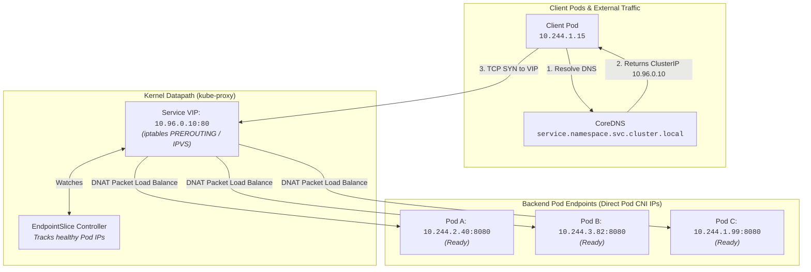

# Chapter 05: Services & Networking

<div class="grid cards" markdown>

-   :material-school: **Topic Focus** &bull; ClusterIP, Headless, NodePort, LoadBalancer, and CoreDNS
-   :material-api: **Primary APIs** &bull; `v1`, `discovery.k8s.io/v1` &bull; `Service`, `EndpointSlice`
-   :material-rocket-launch: [**Launch Playground in Wasm →**](../playground/index.html?chapter=5){ .md-button .md-button--primary }

</div>

!!! tip "⚡ Interactive Problems in this Chapter (Click to solve in Playground)"
    - [**`net01`**: ClusterIP Services & Port Mapping →](../playground/index.html?exercise=net01)
    - [**`net02`**: Headless Services & Stateful Addressing →](../playground/index.html?exercise=net02)
    - [**`net03`**: NodePort & LoadBalancer Service Types →](../playground/index.html?exercise=net03)
    - [**`net04`**: CoreDNS Internal Service Resolution →](../playground/index.html?exercise=net04)
    - [**`net05`**: ExternalName Services & Manual Endpoints →](../playground/index.html?exercise=net05)

---

## 1. Architectural Overview & Control Plane Mechanics

In Kubernetes, **Services & Networking** is reconciled through declarative state loops managed by the control plane:



When resources in this chapter are submitted, the `kube-apiserver` validates the OpenAPI v3 schema, stores state in `etcd`, and triggers the responsible controllers or node daemons to reconcile actual cluster state.

---

## 2. Annotated Production YAML Anatomy & Field Reference

Below is a production-grade declarative manifest demonstrating field definitions and operational patterns:

```yaml
apiVersion: v1
kind: Service
metadata:
  name: backend-service
  namespace: default
  labels:
    app: backend
spec:
  type: ClusterIP
  sessionAffinity: ClientIP
  sessionAffinityConfig:
    clientIP:
      timeoutSeconds: 10800
  selector:
    app: backend
  ports:
  - name: http
    port: 80
    targetPort: 8080
    protocol: TCP
```

### Key Field Schema Reference

| Field | Type | Description |
| :--- | :--- | :--- |
| `spec.type` | `Enum` | `ClusterIP` (internal virtual IP), `NodePort` (dedicated port on all nodes), `LoadBalancer` (cloud provider VIP), `ExternalName` (CNAME redirect). |
| `spec.clusterIP: None` | `String` | Creates a Headless Service; DNS queries return raw Pod IPs directly instead of a virtual VIP. |
| `spec.ports[*].targetPort` | `Integer / String` | The destination port exposed by container processes in matching Pods. |

---

## 3. Real-World Architectural Patterns

### Headless Service for Stateful Workloads

```yaml
apiVersion: v1
kind: Service
metadata:
  name: kafka-headless
spec:
  clusterIP: None
  selector:
    app: kafka
  ports:
  - name: tcp-kafka
    port: 9092
    targetPort: 9092
```

### ExternalName Service for Cloud SaaS Integration

```yaml
apiVersion: v1
kind: Service
metadata:
  name: external-database
spec:
  type: ExternalName
  externalName: db.production.rds.amazonaws.com
```


---

## 4. Production Hardening & Operational Governance

- Use `ClusterIP` as default; avoid exposing services as `NodePort` directly to public networks.
- Configure readiness probes on Pods to guarantee traffic is routed only to warm, healthy endpoints.
- Audit `EndpointSlice` scaling for large workloads (>1,000 pods) to prevent control plane memory pressure.

---

## 5. Failure Modes & Diagnostic Triage Tree

??? failure "Service Has No Endpoints (`503` / Connection Refused)"
    **Root Cause:** Service selector does not match any Pod labels, or Pod readiness probes are failing.

    **Diagnostic Triage Sequence:**
    1. Check matching endpoints: `kubectl get endpoints <service-name>`
    2. Verify Pod labels: `kubectl get pods --show-labels`
    3. Verify container port binding: `kubectl get pods -o jsonpath='{.items[*].spec.containers[*].ports}'`

??? failure "CoreDNS Name Resolution Failure"
    **Root Cause:** DNS lookup fails for `service.namespace.svc.cluster.local`.

    **Diagnostic Triage Sequence:**
    1. Test from inside cluster: `kubectl run curl --rm -it --image=curlimages/curl -- nslookup <service-name>`
    2. Check CoreDNS pods: `kubectl get pods -n kube-system -l k8s-app=kube-dns`.


---

## 6. Interactive Practice Matrix

Practice concepts from this chapter directly in the interactive WebAssembly sandbox:

| Exercise ID | Challenge Description | Direct Link | Action |
| :--- | :--- | :--- | :--- |
| **`net01`** | ClusterIP Services & Port Mapping | [`../playground/index.html?exercise=net01`](../playground/index.html?exercise=net01) | [**⚡ Solve `net01` in Playground →**](../playground/index.html?exercise=net01){ .md-button .md-button--primary } |
| **`net02`** | Headless Services & Stateful Addressing | [`../playground/index.html?exercise=net02`](../playground/index.html?exercise=net02) | [**⚡ Solve `net02` in Playground →**](../playground/index.html?exercise=net02){ .md-button .md-button--primary } |
| **`net03`** | NodePort & LoadBalancer Service Types | [`../playground/index.html?exercise=net03`](../playground/index.html?exercise=net03) | [**⚡ Solve `net03` in Playground →**](../playground/index.html?exercise=net03){ .md-button .md-button--primary } |
| **`net04`** | CoreDNS Internal Service Resolution | [`../playground/index.html?exercise=net04`](../playground/index.html?exercise=net04) | [**⚡ Solve `net04` in Playground →**](../playground/index.html?exercise=net04){ .md-button .md-button--primary } |
| **`net05`** | ExternalName Services & Manual Endpoints | [`../playground/index.html?exercise=net05`](../playground/index.html?exercise=net05) | [**⚡ Solve `net05` in Playground →**](../playground/index.html?exercise=net05){ .md-button .md-button--primary } |
