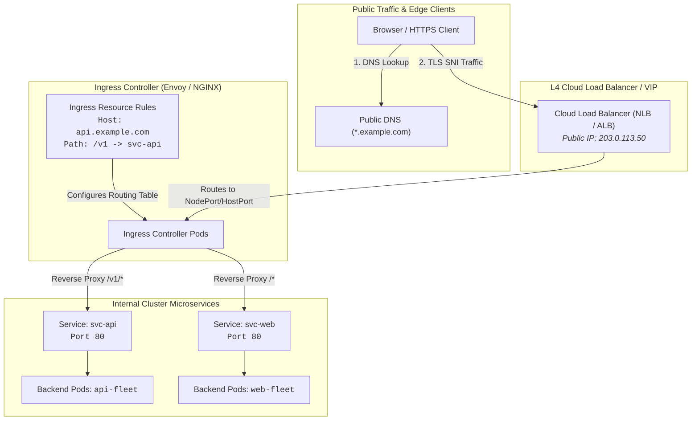

# Chapter 06: Ingress & Gateway API

<div class="grid cards" markdown>

-   :material-school: **Topic Focus** &bull; Ingress Controllers, Path Routing, TLS, and Gateway API
-   :material-api: **Primary APIs** &bull; `networking.k8s.io/v1` &bull; `Ingress`, `IngressClass`
-   :material-rocket-launch: [**Launch Playground in Wasm →**](../playground/index.html?chapter=6){ .md-button .md-button--primary }

</div>

!!! tip "⚡ Interactive Problems in this Chapter (Click to solve in Playground)"
    - [**`ingress01`**: Ingress Host & Path Routing →](../playground/index.html?exercise=ingress01)
    - [**`ingress02`**: Ingress TLS Termination →](../playground/index.html?exercise=ingress02)
    - [**`ingress03`**: Ingress Annotations & Rewrites →](../playground/index.html?exercise=ingress03)
    - [**`ingress04`**: Gateway API Fundamentals →](../playground/index.html?exercise=ingress04)

---

## 1. Architectural Overview & Control Plane Mechanics

In Kubernetes, **Ingress & Gateway API** is reconciled through declarative state loops managed by the control plane and node daemons:



### 1.1 Architectural Flow & Lifecycle Walkthrough

1. **Public DNS Resolution**: An external internet client queries public DNS for `api.example.com`. DNS resolves to the public IPv4/IPv6 Elastic IP of the cloud infrastructure Load Balancer (AWS NLB, GCP Cloud LB, or Azure LB).
2. **Layer 4 Load Balancer Distribution**: The Cloud Load Balancer terminates or passes through TCP/TLS connections and distributes raw Layer 4 traffic across the cluster worker nodes hosting the Ingress Controller daemon.
3. **Ingress Controller Proxying**: The Ingress Controller (Envoy Proxy, NGINX, or Traefik) receives the TCP stream. It performs TLS termination using the X.509 certificate stored in a Kubernetes `Secret` (`tls.crt`/`tls.key`).
4. **Dynamic Routing Table Evaluation**: The proxy inspects the HTTP/1.1 `Host` header or HTTP/2 `:authority` pseudo-header and the URL path (e.g. `/v1/checkout`). It matches these against the compiled Ingress rules (`spec.rules[*].http.paths`).
5. **Direct Pod Reverse-Proxying**: The Ingress Controller bypasses intermediate `kube-proxy` ClusterIP hops by directly querying `EndpointSlice` IPs. It opens an upstream HTTP keep-alive connection directly to the selected application Pod (`10.244.2.40:8080`), streaming the HTTP request and piping the response back to the client.

### 1.2 Serialization, Protocols & Communication Pathways

- **Envoy Dynamic xDS gRPC APIs**: Modern ingress controllers use Envoy's Discovery Services (`LDS` for Listeners, `RDS` for Routes, `CDS` for Clusters, `EDS` for Endpoints) streaming Protobuf payloads over bidirectional gRPC over HTTP/2.
- **HTTP/1.1, HTTP/2 & gRPC Upstream Wire Protocols**: The ingress edge terminates external client protocols and negotiates ALPN (`h2`, `http/1.1`), forwarding requests upstream over persistent TCP connection pools.
- **OpenSSL / BoringSSL TLS Handshake**: Server Name Indication (SNI) routing and TLS certificate verification executed during client cryptographic session establishment.

### 1.3 Deep-Dive Component Breakdown

- **Cloud Load Balancer (NLB/ALB)**: Layer 4 high-throughput load balancer provisioned by the cloud controller manager in response to `Service.spec.type: LoadBalancer`.
- **Ingress Controller**: Software reverse proxy running inside the cluster that continuously reconciles `networking.k8s.io/v1 Ingress` resources into low-level proxy configuration files or in-memory xDS trees.
- **TLS Secret Subsystem**: PEM-encoded X.509 certificate chains and RSA/ECDSA private keys injected into proxy memory for dynamic SNI certificate matching.
- **Direct Upstream Endpoint Pool**: In-memory proxy routing table maintained by subscribing to Kubernetes EndpointSlice changes to enable sub-millisecond route convergence.

### 1.4 Under-The-Hood Mechanics & Failure Modes

- **NGINX Reload Latency Spikes**: Legacy Ingress controllers write text `nginx.conf` files and trigger `nginx -s reload` on every endpoint change. In high-churn clusters, frequent reloads exhaust worker process file descriptors and drop active client TCP connections.
- **Path Precedence Misconfigurations**: Ingress paths default to `pathType: Prefix`. If a generic catch-all path (`/`) is evaluated ahead of a specific subpath (`/v1/checkout`), traffic may route to unintended default backends unless exact ordering and longest-prefix-match rules are applied.
- **Client IP Masking (SNAT)**: When external traffic routes through intermediate NodePort hops, the node executes Source NAT (SNAT), replacing the client's public IP with the node's internal IP. Setting `service.spec.externalTrafficPolicy: Local` preserves the original client IP and avoids unnecessary cross-node hops.

---

## 2. Annotated Production YAML Anatomy & Field Reference

Below is a production-grade declarative manifest demonstrating field definitions and operational patterns:

```yaml
apiVersion: networking.k8s.io/v1
kind: Ingress
metadata:
  name: production-ingress
  namespace: default
  annotations:
    nginx.ingress.kubernetes.io/ssl-redirect: "true"
    nginx.ingress.kubernetes.io/proxy-body-size: "10m"
spec:
  ingressClassName: nginx
  tls:
  - hosts:
    - api.example.com
    secretName: api-example-tls
  rules:
  - host: api.example.com
    http:
      paths:
      - path: /v1
        pathType: Prefix
        backend:
          service:
            name: api-v1-service
            port:
              number: 80
      - path: /v2
        pathType: Prefix
        backend:
          service:
            name: api-v2-service
            port:
              number: 80
```

### Key Field Schema Reference

| Field | Type | Description |
| :--- | :--- | :--- |
| `spec.ingressClassName` | `String` | Selects the Ingress controller implementation responsible for parsing this resource. |
| `spec.rules[*].http.paths[*].pathType` | `Enum` | `Prefix` (matches URI prefix), `Exact` (exact URI match), `ImplementationSpecific`. |
| `spec.tls[*].secretName` | `String` | TLS Certificate secret containing `tls.crt` and `tls.key` keys. |

---

## 3. Real-World Architectural Patterns

### Host-Based Virtual Hosting Routing

```yaml
apiVersion: networking.k8s.io/v1
kind: Ingress
metadata:
  name: multi-tenant-ingress
spec:
  ingressClassName: nginx
  rules:
  - host: app1.example.com
    http:
      paths:
      - path: /
        pathType: Prefix
        backend:
          service:
            name: app1-service
            port:
              number: 80
  - host: app2.example.com
    http:
      paths:
      - path: /
        pathType: Prefix
        backend:
          service:
            name: app2-service
            port:
              number: 80
```

### Canary Traffic Splitting via Ingress Annotations

```yaml
apiVersion: networking.k8s.io/v1
kind: Ingress
metadata:
  name: api-canary
  annotations:
    nginx.ingress.kubernetes.io/canary: "true"
    nginx.ingress.kubernetes.io/canary-weight: "20"
spec:
  ingressClassName: nginx
  rules:
  - host: api.example.com
    http:
      paths:
      - path: /
        pathType: Prefix
        backend:
          service:
            name: api-canary-service
            port:
              number: 80
```


---

## 4. Production Hardening & Operational Governance

- Enforce TLS 1.3 and automatic HTTP-to-HTTPS redirects across all public routes.
- Integrate `cert-manager` for automated Let's Encrypt TLS certificate lifecycle and renewal.
- Implement rate-limiting and request size restrictions via Ingress controller annotations.

---

## 5. Failure Modes & Diagnostic Triage Tree

??? failure "Ingress `404 Not Found`"
    **Root Cause:** Path prefix or hostname does not match Ingress rule definitions.

    **Diagnostic Triage Sequence:**
    1. Verify Ingress rules: `kubectl describe ingress <name>`
    2. Verify Ingress Controller logs: `kubectl logs -n ingress-nginx -l app.kubernetes.io/name=ingress-nginx`

??? failure "Ingress `502 Bad Gateway`"
    **Root Cause:** Target backend Service or Pod is offline or failing health probes.

    **Diagnostic Triage Sequence:**
    1. Verify backend Service endpoints: `kubectl get endpoints <service-name>`


---

## 6. Interactive Practice Matrix

Practice concepts from this chapter directly in the interactive WebAssembly sandbox:

| Exercise ID | Challenge Description | Direct Link | Action |
| :--- | :--- | :--- | :--- |
| **`ingress01`** | Ingress Host & Path Routing | [`../playground/index.html?exercise=ingress01`](../playground/index.html?exercise=ingress01) | [**⚡ Solve `ingress01` in Playground →**](../playground/index.html?exercise=ingress01){ .md-button .md-button--primary } |
| **`ingress02`** | Ingress TLS Termination | [`../playground/index.html?exercise=ingress02`](../playground/index.html?exercise=ingress02) | [**⚡ Solve `ingress02` in Playground →**](../playground/index.html?exercise=ingress02){ .md-button .md-button--primary } |
| **`ingress03`** | Ingress Annotations & Rewrites | [`../playground/index.html?exercise=ingress03`](../playground/index.html?exercise=ingress03) | [**⚡ Solve `ingress03` in Playground →**](../playground/index.html?exercise=ingress03){ .md-button .md-button--primary } |
| **`ingress04`** | Gateway API Fundamentals | [`../playground/index.html?exercise=ingress04`](../playground/index.html?exercise=ingress04) | [**⚡ Solve `ingress04` in Playground →**](../playground/index.html?exercise=ingress04){ .md-button .md-button--primary } |
