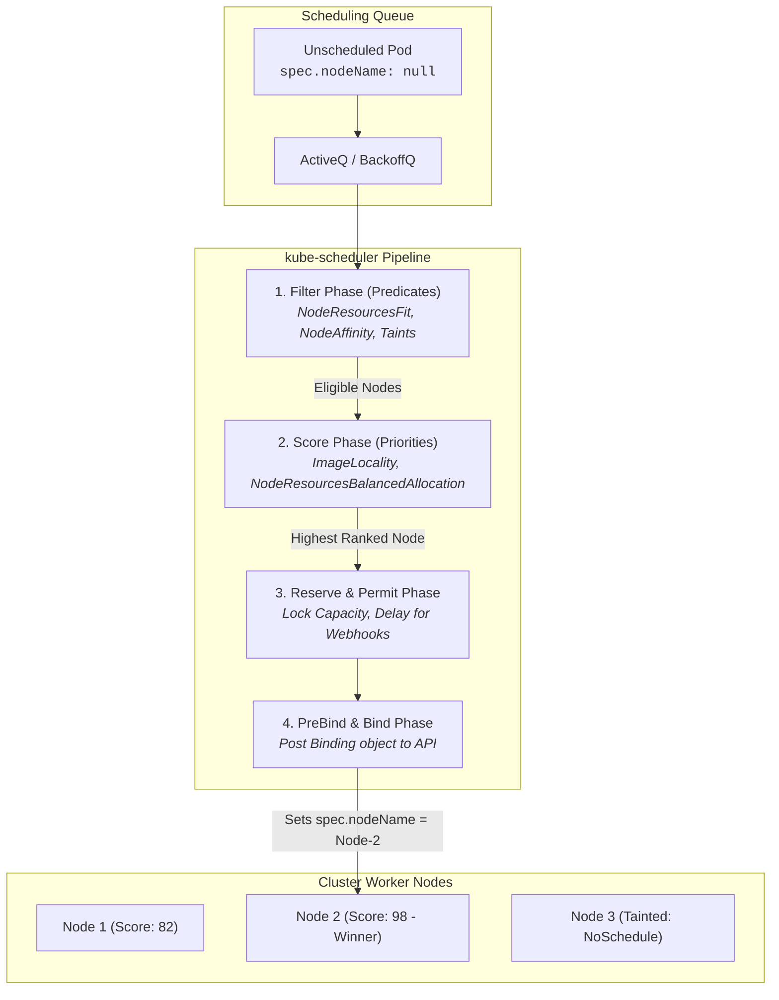

# Chapter 07: Scheduling, Affinity & Advanced Placement

<div class="grid cards" markdown>

-   :material-school: **Topic Focus** &bull; Node Placement, Affinity, Taints, Tolerations, and Topology Spread
-   :material-api: **Primary APIs** &bull; `v1` &bull; `Pod`, `Node`
-   :material-rocket-launch: [**Launch Playground in Wasm →**](../playground/index.html?chapter=7){ .md-button .md-button--primary }

</div>

!!! tip "⚡ Interactive Problems in this Chapter (Click to solve in Playground)"
    - [**`sched01`**: Node Placement (nodeName & nodeSelector) →](../playground/index.html?exercise=sched01)
    - [**`sched02`**: Node Affinity & Constraints →](../playground/index.html?exercise=sched02)
    - [**`sched03`**: Pod Affinity & Pod Anti-Affinity →](../playground/index.html?exercise=sched03)
    - [**`sched04`**: Taints and Tolerations →](../playground/index.html?exercise=sched04)
    - [**`sched05`**: Topology Spread Constraints →](../playground/index.html?exercise=sched05)

---

## 1. Architectural Overview & Control Plane Mechanics

In Kubernetes, **Scheduling, Affinity & Advanced Placement** is reconciled through declarative state loops managed by the control plane and node daemons:



### 1.1 Architectural Flow & Lifecycle Walkthrough

1. **Pod Enqueueing into Scheduling Queue**: When a Pod with `spec.nodeName == ""` is created, `kube-scheduler` places the Pod into its internal three-tiered scheduling queue: `ActiveQ` (ready for evaluation), `BackoffQ` (backoff timer after unschedulable attempt), or `UnschedulablePods` pool.
2. **Phase 1: Filter (Predicates)**: The scheduler evaluates all candidate nodes in parallel across active filter plugins:
   - `NodeResourcesFit`: Verifies that node allocatable CPU, memory, and ephemeral storage satisfy `spec.containers[*].resources.requests`.
   - `NodeName` & `NodePorts`: Verifies explicit node pinning and host port availability.
   - `NodeAffinity`: Evaluates `requiredDuringSchedulingIgnoredDuringExecution` label selectors.
   - `TaintToleration`: Verifies that the Pod possesses tolerations for all node taints with `NoSchedule` or `NoExecute` effects.
3. **Phase 2: Score (Priorities)**: Surviving nodes are ranked from 0 to 100 across scoring plugins:
   - `NodeResourcesBalancedAllocation`: Scores nodes higher when CPU and memory allocations maintain proportional balance.
   - `ImageLocality`: Awards bonus points to nodes that have already pulled the container image layers to minimize startup latency.
   - `PodTopologySpread`: Penalizes nodes that would violate failure domain distribution rules across availability zones.
4. **Phase 3: Reserve & Permit**: The scheduler selects the highest-scoring node and calls the `Reserve` plugin, locking memory/CPU allocations in local scheduler memory to prevent race conditions with concurrent scheduling threads. `Permit` plugins can pause binding (e.g. for gang scheduling).
5. **Phase 4: PreBind & Bind**: The scheduler executes `PreBind` (e.g., dynamic network/storage claim attachment) and issues an asynchronous HTTP POST `Binding` request to `kube-apiserver`, setting `spec.nodeName` on the target Pod in `etcd`.

### 1.2 Serialization, Protocols & Communication Pathways

- **Scheduling Framework Go Plugin Interfaces**: Internal scheduler extensions execute in-process via Go interface function calls (`Filter()`, `Score()`, `Reserve()`, `Bind()`) with zero network serialization overhead.
- **HTTP REST / JSON Binding Subresource**: The scheduler posts a `v1.Binding` object (`{ "target": { "name": "node-2" } }`) to `/api/v1/namespaces/{ns}/pods/{name}/binding` over TLS HTTP/2.
- **Leader Election Lease Protocol**: Multiple scheduler replicas coordinate active leadership using `coordination.k8s.io/v1 Lease` objects with atomic renewal heartbeats.

### 1.3 Deep-Dive Component Breakdown

- **kube-scheduler**: Centralized, multi-threaded control plane binary responsible for optimal placement of unscheduled workloads across cluster nodes.
- **Scheduling Queue (ActiveQ & BackoffQ)**: Priority queue data structure sorting Pods by priority (`spec.priority`) and creation timestamp.
- **Scheduling Framework**: Extensible architecture defining extension points (QueueSort, PreFilter, Filter, PostFilter, PreScore, Score, Reserve, Permit, PreBind, Bind, PostBind).
- **Node Allocatable Subsystem**: Node capacity model subtracting system reservations (`kube-reserved`, `system-reserved`, `eviction-threshold`) from raw physical hardware capacity.

### 1.4 Under-The-Hood Mechanics & Failure Modes

- **Deadlock via Unbounded Preemption**: When a high-priority Pod preempts lower-priority Pods to free capacity, frequent preemption churn can cause lower-priority workloads to thrash in infinite restart loops if cluster capacity remains structurally deficient.
- **Scheduler Cache Desynchronization**: If the scheduler's local in-memory snapshot of node resource allocations falls out of sync with `kube-apiserver` events, it may attempt to bind Pods to nodes with insufficient capacity, triggering `UnexpectedAdmissionError` on the worker kubelet.
- **Affinity Topology Calculation Bottlenecks**: Heavy utilization of `podAffinity` and `podAntiAffinity` requires $O(N 	imes M)$ cross-pod topology comparisons across every node, causing scheduling throughput to degrade significantly on large clusters (>1,000 nodes).

---

## 2. Annotated Production YAML Anatomy & Field Reference

Below is a production-grade declarative manifest demonstrating field definitions and operational patterns:

```yaml
apiVersion: apps/v1
kind: Deployment
metadata:
  name: ha-workload
spec:
  replicas: 4
  selector:
    matchLabels:
      app: ha-app
  template:
    metadata:
      labels:
        app: ha-app
    spec:
      topologySpreadConstraints:
      - maxSkew: 1
        topologyKey: topology.kubernetes.io/zone
        whenUnsatisfiable: DoNotSchedule
        labelSelector:
          matchLabels:
            app: ha-app
      affinity:
        nodeAffinity:
          requiredDuringSchedulingIgnoredDuringExecution:
            nodeSelectorTerms:
            - matchExpressions:
              - key: node-role.kubernetes.io/worker
                operator: Exists
        podAntiAffinity:
          preferredDuringSchedulingIgnoredDuringExecution:
          - weight: 100
            podAffinityTerm:
              labelSelector:
                matchLabels:
                  app: ha-app
              topologyKey: kubernetes.io/hostname
      tolerations:
      - key: "dedicated"
        operator: "Equal"
        value: "compute"
        effect: "NoSchedule"
      containers:
      - name: app
        image: nginx:1.27-alpine
```

### Key Field Schema Reference

| Field | Type | Description |
| :--- | :--- | :--- |
| `topologySpreadConstraints` | `Array` | Distributes Pods evenly across zones/nodes to prevent single-zone outages (`maxSkew: 1`). |
| `affinity.nodeAffinity` | `Object` | Directs Pod placement onto nodes matching specific hardware/architectural labels. |
| `tolerations` | `Array` | Permits Pods to be scheduled on nodes tainted with `NoSchedule` or `NoExecute`. |

---

## 3. Real-World Architectural Patterns

### GPU Node Taint & Toleration Placement

```yaml
apiVersion: v1
kind: Pod
metadata:
  name: ml-inference-task
spec:
  tolerations:
  - key: "nvidia.com/gpu"
    operator: "Exists"
    effect: "NoSchedule"
  nodeSelector:
    accelerator: nvidia-a100
  containers:
  - name: inference
    image: python:3.12-slim
    command: ["python", "-c", "print('Inference worker running...')"]
```

### Pod Anti-Affinity for Zero Co-location

```yaml
apiVersion: apps/v1
kind: Deployment
metadata:
  name: singleton-per-node
spec:
  replicas: 3
  selector:
    matchLabels:
      app: singleton
  template:
    metadata:
      labels:
        app: singleton
    spec:
      affinity:
        podAntiAffinity:
          requiredDuringSchedulingIgnoredDuringExecution:
          - labelSelector:
              matchLabels:
                app: singleton
            topologyKey: kubernetes.io/hostname
      containers:
      - name: app
        image: nginx:alpine
```


---

## 4. Production Hardening & Operational Governance

- Use `topologySpreadConstraints` with `topologyKey: topology.kubernetes.io/zone` for multi-AZ clusters.
- Use `preferredDuringScheduling` when soft affinity is desired to prevent unschedulable pod deadlocks.
- Reserve specialized nodes (GPU, high-memory) using node taints to prevent general workloads from consuming expensive compute.

---

## 5. Failure Modes & Diagnostic Triage Tree

??? failure "Pod Stuck in `Pending` (`0/10 nodes available`)"
    **Root Cause:** Tolerations, affinity rules, or resource requests cannot be satisfied.

    **Diagnostic Triage Sequence:**
    1. Inspect scheduling failures: `kubectl describe pod <name>`
    2. Review node taints: `kubectl get nodes -o custom-columns=NAME:.metadata.name,TAINTS:.spec.taints`
    3. Review node labels: `kubectl get nodes --show-labels`


---

## 6. Interactive Practice Matrix

Practice concepts from this chapter directly in the interactive WebAssembly sandbox:

| Exercise ID | Challenge Description | Direct Link | Action |
| :--- | :--- | :--- | :--- |
| **`sched01`** | Node Placement (nodeName & nodeSelector) | [`../playground/index.html?exercise=sched01`](../playground/index.html?exercise=sched01) | [**⚡ Solve `sched01` in Playground →**](../playground/index.html?exercise=sched01){ .md-button .md-button--primary } |
| **`sched02`** | Node Affinity & Constraints | [`../playground/index.html?exercise=sched02`](../playground/index.html?exercise=sched02) | [**⚡ Solve `sched02` in Playground →**](../playground/index.html?exercise=sched02){ .md-button .md-button--primary } |
| **`sched03`** | Pod Affinity & Pod Anti-Affinity | [`../playground/index.html?exercise=sched03`](../playground/index.html?exercise=sched03) | [**⚡ Solve `sched03` in Playground →**](../playground/index.html?exercise=sched03){ .md-button .md-button--primary } |
| **`sched04`** | Taints and Tolerations | [`../playground/index.html?exercise=sched04`](../playground/index.html?exercise=sched04) | [**⚡ Solve `sched04` in Playground →**](../playground/index.html?exercise=sched04){ .md-button .md-button--primary } |
| **`sched05`** | Topology Spread Constraints | [`../playground/index.html?exercise=sched05`](../playground/index.html?exercise=sched05) | [**⚡ Solve `sched05` in Playground →**](../playground/index.html?exercise=sched05){ .md-button .md-button--primary } |
