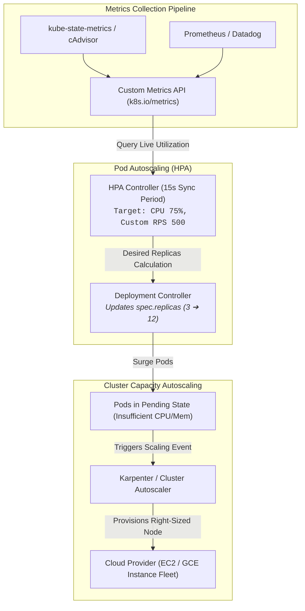

# Chapter 11: Autoscaling (HPA, VPA, KEDA)

<div class="grid cards" markdown>

-   :material-school: **Topic Focus** &bull; Horizontal, Vertical, and Event-Driven Workload Autoscaling
-   :material-api: **Primary APIs** &bull; `autoscaling/v2`, `keda.sh/v1alpha1` &bull; `HorizontalPodAutoscaler`, `ScaledObject`
-   :material-rocket-launch: [**Launch Playground in Wasm →**](../playground/index.html?chapter=11){ .md-button .md-button--primary }

</div>

!!! tip "⚡ Interactive Problems in this Chapter (Click to solve in Playground)"
    - [**`autoscale01`**: Horizontal Pod Autoscaler (HPA v2) →](../playground/index.html?exercise=autoscale01)
    - [**`autoscale02`**: HPA Custom Scaling Behavior →](../playground/index.html?exercise=autoscale02)
    - [**`autoscale03`**: Vertical Pod Autoscaler (VPA) →](../playground/index.html?exercise=autoscale03)
    - [**`autoscale04`**: Event-Driven Autoscaling (KEDA) →](../playground/index.html?exercise=autoscale04)

---

## 1. Architectural Overview & Control Plane Mechanics

In Kubernetes, **Autoscaling (HPA, VPA, KEDA)** is reconciled through declarative state loops managed by the control plane and node daemons:



### 1.1 Architectural Flow & Lifecycle Walkthrough

1. **Metrics Collection Pipeline**: `cAdvisor` (embedded inside `kubelet`) continuously collects Linux cgroup CPU and memory metrics, while external collectors (Prometheus, Datadog) scrape custom application metrics. `metrics-server` aggregates these and exposes them via the `metrics.k8s.io` subresource.
2. **HPA Reconciler Evaluation**: The Horizontal Pod Autoscaler (HPA) controller inside `kube-controller-manager` queries the Metrics API on a periodic sync loop (default: every 15 seconds). It calculates the desired replica count using the standard formula:
   $$\text{DesiredReplicas} = \left\lceil \text{CurrentReplicas} \times \left( \frac{\text{CurrentMetricValue}}{\text{TargetMetricValue}} \right) \right\rceil$$
3. **Scale Subresource Mutation**: The HPA controller issues an HTTP `PATCH` request to the target Deployment or StatefulSet's `/scale` subresource, updating `spec.replicas`.
4. **Surge Pod Creation & Pending Capacity**: The Deployment controller spins up new Pods. If the existing cluster worker nodes lack available CPU/memory allocatable capacity, the newly created Pods remain in `Pending` state with `PodReasonUnschedulable`.
5. **Cluster Capacity Scaling (Karpenter / Cluster Autoscaler)**:
   - **Karpenter**: Subscribes directly to unschedulable Pod events via API watch, determines the optimal instance type (e.g. AWS `c6i.2xlarge` or Spot instance) by evaluating Pod resource requests and topology spread constraints, and calls the cloud Fleet API to launch a right-sized node in under 45 seconds.
   - **Cluster Autoscaler**: Identifies pending pods, maps them to existing Node Groups / Auto Scaling Groups (ASGs), and increments the ASG desired capacity count.

### 1.2 Serialization, Protocols & Communication Pathways

- **Prometheus OpenMetrics Exposition Format**: Metrics scraped by Prometheus use plain-text or Protobuf-encoded OpenMetrics schemas over HTTP/1.1.
- **Custom Metrics API Aggregator**: The API server aggregates custom metric providers via the API Aggregator layer (`apiregistration.k8s.io/v1`), proxying requests over TLS HTTP/2 to Prometheus Adapter or KEDA metrics servers.
- **Cloud Provider Fleet APIs**: Karpenter and Cluster Autoscaler communicate with cloud compute APIs (AWS EC2 `CreateFleet`, GCP Compute Engine API) using signed HTTPS JSON/REST calls.

### 1.3 Deep-Dive Component Breakdown

- **cAdvisor (Container Advisor)**: Daemon embedded inside `kubelet` that reads raw Linux kernel cgroups (`/sys/fs/cgroup/cpu`, `/sys/fs/cgroup/memory`) to expose container resource telemetry.
- **Horizontal Pod Autoscaler (HPA)**: Control loop calculating dynamic replica scaling based on CPU, memory, or custom Prometheus metrics with configurable stabilization windows.
- **Vertical Pod Autoscaler (VPA)**: Controller that adjusts container `requests` and `limits` in-place or by recreating Pods to right-size long-term resource allocations.
- **Karpenter / Cluster Autoscaler**: Infrastructure-level controllers that provision physical or virtual cloud worker instances in response to pending unschedulable workloads.

### 1.4 Under-The-Hood Mechanics & Failure Modes

- **Autoscaling Thrashing & Flapping**: Rapid spikes in traffic can cause HPA to aggressively scale replicas up and immediately down, destabilizing backend systems. Configuring `behavior.scaleDown.stabilizationWindowSeconds: 300` enforces a cool-down buffer to prevent thrashing.
- **Missing Resource Requests**: HPA utilization targets (e.g., `averageUtilization: 70%`) calculate percentage utilization strictly relative to `spec.containers[*].resources.requests`. If a container lacks resource requests, HPA cannot calculate the ratio and fails to scale.
- **HPA and VPA Mutual Conflict**: Running HPA on CPU/memory targets concurrently with VPA on the same Deployment causes the two controllers to fight in a feedback loop (HPA scales replicas while VPA scales container sizes). Use VPA in `recommendationMode` or run HPA on custom application metrics (e.g. RPS) when combining both.

---

## 2. Annotated Production YAML Anatomy & Field Reference

Below is a production-grade declarative manifest demonstrating field definitions and operational patterns:

```yaml
apiVersion: autoscaling/v2
kind: HorizontalPodAutoscaler
metadata:
  name: api-hpa
  namespace: default
spec:
  scaleTargetRef:
    apiVersion: apps/v1
    kind: Deployment
    name: api-service
  minReplicas: 2
  maxReplicas: 10
  metrics:
  - type: Resource
    resource:
      name: cpu
      target:
        type: Utilization
        averageUtilization: 75
  - type: Resource
    resource:
      name: memory
      target:
        type: AverageValue
        averageValue: 200Mi
  behavior:
    scaleUp:
      stabilizationWindowSeconds: 0
      policies:
      - type: Percent
        value: 100
        periodSeconds: 15
    scaleDown:
      stabilizationWindowSeconds: 300
      policies:
      - type: Percent
        value: 10
        periodSeconds: 60
```

### Key Field Schema Reference

| Field | Type | Description |
| :--- | :--- | :--- |
| `scaleTargetRef` | `Object` | Target controller to scale (`Deployment`, `ReplicaSet`, `StatefulSet`). |
| `metrics[*].type` | `Enum` | `Resource` (CPU/Memory via metrics-server), `Pods` (custom pod metrics), `External` (cloud queues/Prometheus). |
| `behavior.scaleDown.stabilizationWindowSeconds` | `Integer` | Prevents thrashing (flapping) by damping scale-down operations for specified duration. |

---

## 3. Real-World Architectural Patterns

### KEDA Event-Driven SQS Queue Scaler

```yaml
apiVersion: keda.sh/v1alpha1
kind: ScaledObject
metadata:
  name: sqs-worker-scaler
  namespace: default
spec:
  scaleTargetRef:
    name: queue-worker
  minReplicaCount: 1
  maxReplicaCount: 20
  triggers:
  - type: aws-sqs-queue
    metadata:
      queueURL: https://sqs.us-east-1.amazonaws.com/123456789012/order-processing
      queueLength: "10"
      awsRegion: "us-east-1"
```

### Custom Prometheus Metric HPA

```yaml
apiVersion: autoscaling/v2
kind: HorizontalPodAutoscaler
metadata:
  name: http-requests-hpa
spec:
  scaleTargetRef:
    apiVersion: apps/v1
    kind: Deployment
    name: web-frontend
  minReplicas: 3
  maxReplicas: 15
  metrics:
  - type: Pods
    pods:
      metric:
        name: http_requests_per_second
      target:
        type: AverageValue
        averageValue: 1k
```


---

## 4. Production Hardening & Operational Governance

- All scaled containers MUST define explicit `resources.requests.cpu` and `resources.requests.memory`; HPA cannot calculate percentages without requests.
- Use `behavior.scaleDown.stabilizationWindowSeconds: 300` to prevent premature scale-down during bursty traffic.
- Avoid running HPA and VPA (Vertical Pod Autoscaler) on the same CPU/memory metrics simultaneously to prevent scaling contention.

---

## 5. Failure Modes & Diagnostic Triage Tree

??? failure "HPA Status `<unknown>/75%`"
    **Root Cause:** Metrics Server is not installed or Pods lack CPU requests.

    **Diagnostic Triage Sequence:**
    1. Verify Metrics Server: `kubectl get apiservices | grep metrics`
    2. Verify Pod metrics: `kubectl top pods`
    3. Check HPA conditions: `kubectl describe hpa <name>`


---

## 6. Interactive Practice Matrix

Practice concepts from this chapter directly in the interactive WebAssembly sandbox:

| Exercise ID | Challenge Description | Direct Link | Action |
| :--- | :--- | :--- | :--- |
| **`autoscale01`** | Horizontal Pod Autoscaler (HPA v2) | [`../playground/index.html?exercise=autoscale01`](../playground/index.html?exercise=autoscale01) | [**⚡ Solve `autoscale01` in Playground →**](../playground/index.html?exercise=autoscale01){ .md-button .md-button--primary } |
| **`autoscale02`** | HPA Custom Scaling Behavior | [`../playground/index.html?exercise=autoscale02`](../playground/index.html?exercise=autoscale02) | [**⚡ Solve `autoscale02` in Playground →**](../playground/index.html?exercise=autoscale02){ .md-button .md-button--primary } |
| **`autoscale03`** | Vertical Pod Autoscaler (VPA) | [`../playground/index.html?exercise=autoscale03`](../playground/index.html?exercise=autoscale03) | [**⚡ Solve `autoscale03` in Playground →**](../playground/index.html?exercise=autoscale03){ .md-button .md-button--primary } |
| **`autoscale04`** | Event-Driven Autoscaling (KEDA) | [`../playground/index.html?exercise=autoscale04`](../playground/index.html?exercise=autoscale04) | [**⚡ Solve `autoscale04` in Playground →**](../playground/index.html?exercise=autoscale04){ .md-button .md-button--primary } |
