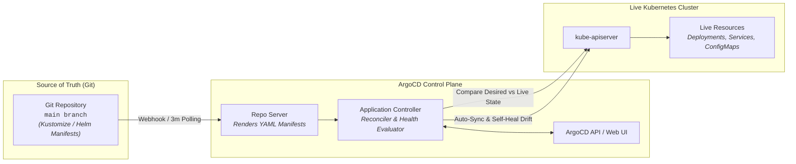

# Chapter 14: GitOps Continuous Delivery with ArgoCD

<div class="grid cards" markdown>

-   :material-school: **Topic Focus** &bull; Application CRDs, ApplicationSets, Sync Policies, and Progressive Delivery Rollouts
-   :material-api: **Primary APIs** &bull; `argoproj.io/v1alpha1` &bull; `Application`, `ApplicationSet`, `Rollout`
-   :material-rocket-launch: [**Launch Playground in Wasm →**](../playground/index.html?chapter=14){ .md-button .md-button--primary }

</div>

!!! tip "⚡ Interactive Problems in this Chapter (Click to solve in Playground)"
    - [**`gitops01`**: ArgoCD Application CRD & Sync Policies →](../playground/index.html?exercise=gitops01)
    - [**`gitops02`**: ArgoCD ApplicationSet Matrix Generator →](../playground/index.html?exercise=gitops02)
    - [**`gitops03`**: Sync Windows, ServerSideApply & Retry Backoff →](../playground/index.html?exercise=gitops03)
    - [**`gitops04`**: Progressive Delivery with Argo Rollouts →](../playground/index.html?exercise=gitops04)

---

## 1. Architectural Overview & Control Plane Mechanics

In Kubernetes, **GitOps Continuous Delivery with ArgoCD** is reconciled through declarative state loops managed by the control plane and node daemons:



### 1.1 Architectural Flow & Lifecycle Walkthrough

1. **Git Commit as Single Source of Truth**: A developer pushes a Git commit updating declarative manifests (Helm, Kustomize, or raw YAML) in the repository's `main` branch.
2. **GitOps Ingestion & Webhook Trigger**: The `argocd-repo-server` detects the commit via an immediate Git webhook (GitHub/GitLab) or during its standard 3-minute polling loop.
3. **Manifest Rendering**: The `argocd-repo-server` executes `kustomize build` or `helm template` in a sandboxed environment to render complete, concrete Kubernetes YAML manifests representing the **Desired State**.
4. **Live Cluster State Comparison**: The `argocd-application-controller` queries `kube-apiserver` for the **Live State** of resources in the target cluster, using local `SharedIndexInformer` caches.
5. **Diff Evaluation & Sync Status**: The controller computes a three-way structural diff between the Desired State (Git), the Live State (Cluster), and the previously applied state. If drift is detected, the Application transitions to `OutOfSync`.
6. **Reconciliation & Self-Healing (Auto-Sync)**: If `automated: { prune: true, selfHeal: true }` is enabled, the controller issues Server-Side Apply `PATCH` requests to `kube-apiserver` to reconcile drift. If unauthorized manual edits were made directly via `kubectl`, ArgoCD automatically overwrites them to enforce Git state.

### 1.2 Serialization, Protocols & Communication Pathways

- **Git Smart HTTP / SSH Protocol**: `argocd-repo-server` clones and fetches Git repositories over TLS-encrypted Git Smart HTTP or SSH public-key authentication.
- **gRPC Inter-Service Communication**: ArgoCD microservices (`argocd-server`, `argocd-repo-server`, `argocd-application-controller`) communicate internally via high-throughput gRPC connections.
- **Server-Side Apply (SSA) Patch Format**: Manifest synchronization utilizes YAML/JSON SSA requests (`application/apply-patch+yaml`) to manage fine-grained field ownership.

### 1.3 Deep-Dive Component Breakdown

- **argocd-repo-server**: Stateless worker that clones Git repositories, generates manifests via Helm/Kustomize, and returns rendered YAML streams over gRPC.
- **argocd-application-controller**: Core reconciliation daemon comparing desired vs live state, ordering resource sync waves, and enforcing self-healing policies.
- **argocd-server**: API and UI server exposing REST and gRPC endpoints for web dashboard access, CLI commands, and RBAC enforcement.
- **Sync Waves & Hooks**: Annotations (`argocd.argoproj.io/sync-wave: "1"`) dictating exact execution ordering (e.g. run database migration Job in Wave 0, deploy API in Wave 1).

### 1.4 Under-The-Hood Mechanics & Failure Modes

- **CRD / Manifest Prune Destructive Deletion**: If a manifest is removed from Git and `prune: true` is enabled, ArgoCD deletes the resource from the live cluster. If a StatefulSet or CRD is pruned without orphan finalizers, underlying data stores may be permanently deleted.
- **Repository Server OOM on Large Helm Charts**: Rendering large Helm charts or recursive Kustomize overlays in parallel can exhaust `argocd-repo-server` memory limits, causing sync timeouts and `rpc error: code = ResourceExhausted`.
- **Live State Mutation Loops (Mutating Webhooks Conflict)**: If an in-cluster mutating webhook alters default fields (e.g. injecting sidecars or modifying replica counts) that are not declared in Git, ArgoCD marks the application perpetually `OutOfSync` unless `ignoreDifferences` rules are explicitly configured.

---

## 2. Annotated Production YAML Anatomy & Field Reference

Below is a production-grade declarative manifest demonstrating field definitions and operational patterns:

```yaml
apiVersion: argoproj.io/v1alpha1
kind: Application
metadata:
  name: production-microservices
  namespace: argocd
  finalizers:
  - resources-finalizer.argocd.argoproj.io
spec:
  project: default
  source:
    repoURL: https://github.com/example-org/k8s-manifests.git
    targetRevision: main
    path: environments/production
  destination:
    server: https://kubernetes.default.svc
    namespace: production
  syncPolicy:
    automated:
      prune: true
      selfHeal: true
    syncOptions:
    - CreateNamespace=true
    - ApplyOutOfSyncOnly=true
```

### Key Field Schema Reference

| Field | Type | Description |
| :--- | :--- | :--- |
| `spec.source` | `Object` | Git repository URL, branch/tag (`targetRevision`), and directory path containing manifests/Helm/Kustomize. |
| `spec.syncPolicy.automated.prune` | `Boolean` | Deletes cluster resources when their YAML manifests are removed from Git. |
| `spec.syncPolicy.automated.selfHeal` | `Boolean` | Reverts manual out-of-band `kubectl` mutations back to Git state within seconds. |

---

## 3. Real-World Architectural Patterns

### Argo Rollouts Canary with AnalysisTemplate

```yaml
apiVersion: argoproj.io/v1alpha1
kind: Rollout
metadata:
  name: web-rollout
spec:
  replicas: 5
  strategy:
    canary:
      steps:
      - setWeight: 20
      - pause: {duration: 5m}
      - setWeight: 50
      - pause: {duration: 10m}
  selector:
    matchLabels:
      app: web
  template:
    metadata:
      labels:
        app: web
    spec:
      containers:
      - name: web
        image: nginx:1.27-alpine
```

### ApplicationSet Matrix Generator

```yaml
apiVersion: argoproj.io/v1alpha1
kind: ApplicationSet
metadata:
  name: cluster-addons
  namespace: argocd
spec:
  generators:
  - list:
      elements:
      - cluster: dev-cluster
        url: https://dev-k8s.example.com
      - cluster: prod-cluster
        url: https://prod-k8s.example.com
  template:
    metadata:
      name: "{{cluster}}-addons"
    spec:
      project: default
      source:
        repoURL: https://github.com/example/addons.git
        targetRevision: HEAD
        path: "clusters/{{cluster}}"
      destination:
        server: "{{url}}"
        namespace: kube-addons
```


---

## 4. Production Hardening & Operational Governance

- Always enable `prune: true` and `selfHeal: true` in production GitOps pipelines to enforce true declarative reconciliation.
- Use `resources-finalizer.argocd.argoproj.io` to ensure all child resources are cleaned up if an Application is deleted.
- Protect production clusters using ArgoCD AppProjects with restricted destination namespaces and allowed source repositories.

---

## 5. Failure Modes & Diagnostic Triage Tree

??? failure "Application `OutOfSync` / Degraded"
    **Root Cause:** Manifest syntax error or immutable field modification.

    **Diagnostic Triage Sequence:**
    1. Inspect sync status in ArgoCD CLI: `argocd app get <app-name>`
    2. Trigger manual sync with diff: `argocd app sync <app-name> --dry-run`
    3. Check controller logs: `kubectl logs -n argocd -l app.kubernetes.io/name=argocd-application-controller`


---

## 6. Interactive Practice Matrix

Practice concepts from this chapter directly in the interactive WebAssembly sandbox:

| Exercise ID | Challenge Description | Direct Link | Action |
| :--- | :--- | :--- | :--- |
| **`gitops01`** | ArgoCD Application CRD & Sync Policies | [`../playground/index.html?exercise=gitops01`](../playground/index.html?exercise=gitops01) | [**⚡ Solve `gitops01` in Playground →**](../playground/index.html?exercise=gitops01){ .md-button .md-button--primary } |
| **`gitops02`** | ArgoCD ApplicationSet Matrix Generator | [`../playground/index.html?exercise=gitops02`](../playground/index.html?exercise=gitops02) | [**⚡ Solve `gitops02` in Playground →**](../playground/index.html?exercise=gitops02){ .md-button .md-button--primary } |
| **`gitops03`** | Sync Windows, ServerSideApply & Retry Backoff | [`../playground/index.html?exercise=gitops03`](../playground/index.html?exercise=gitops03) | [**⚡ Solve `gitops03` in Playground →**](../playground/index.html?exercise=gitops03){ .md-button .md-button--primary } |
| **`gitops04`** | Progressive Delivery with Argo Rollouts | [`../playground/index.html?exercise=gitops04`](../playground/index.html?exercise=gitops04) | [**⚡ Solve `gitops04` in Playground →**](../playground/index.html?exercise=gitops04){ .md-button .md-button--primary } |
