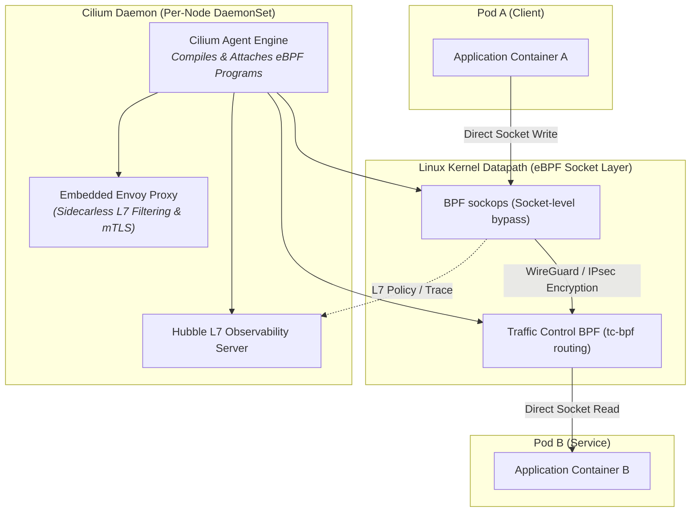

# Chapter 15: Service Mesh, eBPF & Cilium

<div class="grid cards" markdown>

-   :material-school: **Topic Focus** &bull; CiliumNetworkPolicies, L7 HTTP Routing, Mutual TLS, and Hubble Observability
-   :material-api: **Primary APIs** &bull; `cilium.io/v2` &bull; `CiliumNetworkPolicy`, `CiliumClusterwideNetworkPolicy`
-   :material-rocket-launch: [**Launch Playground in Wasm →**](../playground/index.html?chapter=15){ .md-button .md-button--primary }

</div>

!!! tip "⚡ Interactive Problems in this Chapter (Click to solve in Playground)"
    - [**`mesh01`**: Cilium L7 HTTP Filtering & Routing →](../playground/index.html?exercise=mesh01)
    - [**`mesh02`**: Strict Mutual TLS & PeerAuthentication →](../playground/index.html?exercise=mesh02)
    - [**`mesh03`**: CiliumClusterwideNetworkPolicy with DNS FQDN Egress →](../playground/index.html?exercise=mesh03)
    - [**`mesh04`**: Hubble Observability & OpenTelemetry Tracing →](../playground/index.html?exercise=mesh04)

---

## 1. Architectural Overview & Control Plane Mechanics

In Kubernetes, **Service Mesh, eBPF & Cilium** is reconciled through declarative state loops managed by the control plane:



When resources in this chapter are submitted, the `kube-apiserver` validates the OpenAPI v3 schema, stores state in `etcd`, and triggers the responsible controllers or node daemons to reconcile actual cluster state.

---

## 2. Annotated Production YAML Anatomy & Field Reference

Below is a production-grade declarative manifest demonstrating field definitions and operational patterns:

```yaml
apiVersion: cilium.io/v2
kind: CiliumNetworkPolicy
metadata:
  name: secure-payment-l7
  namespace: finance
spec:
  endpointSelector:
    matchLabels:
      app: payment-processor
  ingress:
  - fromEndpoints:
    - matchLabels:
        app: checkout-api
    toPorts:
    - ports:
      - port: "8080"
        protocol: TCP
      rules:
        http:
        - method: POST
          path: "/v1/charge"
  egress:
  - toFQDNs:
    - matchName: "api.stripe.com"
    toPorts:
    - ports:
      - port: "443"
        protocol: TCP
```

### Key Field Schema Reference

| Field | Type | Description |
| :--- | :--- | :--- |
| `endpointSelector` | `Object` | Selects Cilium endpoints (Pods) using identity-based labels rather than volatile IP addresses. |
| `ingress[*].toPorts[*].rules.http` | `Array` | L7 application-layer policy (methods, exact URI paths, regex matching). |
| `egress[*].toFQDNs` | `Array` | DNS-aware egress security policy allowlisting specific external hostnames. |

---

## 3. Real-World Architectural Patterns

### Clusterwide L7 Kafka Security Policy

```yaml
apiVersion: cilium.io/v2
kind: CiliumClusterwideNetworkPolicy
metadata:
  name: kafka-topic-isolation
spec:
  endpointSelector:
    matchLabels:
      app: kafka
  ingress:
  - fromEndpoints:
    - matchLabels:
        role: telemetry-producer
    toPorts:
    - ports:
      - port: "9092"
        protocol: TCP
      rules:
        kafka:
        - role: produce
          topic: "sensor-telemetry"
```

### Mutual TLS (mTLS) Strict Authentication

```yaml
apiVersion: cilium.io/v2
kind: CiliumNetworkPolicy
metadata:
  name: enforce-mtls
  namespace: secure
spec:
  endpointSelector:
    matchLabels:
      app: vault
  ingress:
  - fromEndpoints:
    - matchLabels:
        app: client
    authentication:
      mode: required
```


---

## 4. Production Hardening & Operational Governance

- Use Cilium eBPF host routing (`bpf.masquerade=true`, `kube-proxy-replacement=true`) for line-rate packet processing without iptables overhead.
- Enforce strict egress FQDN allowlisting to protect against data exfiltration and supply chain attacks.
- Enable Hubble metrics and network flow logs for complete audit visibility.

---

## 5. Failure Modes & Diagnostic Triage Tree

??? failure "Hubble Flow Inspection"
    **Root Cause:** Diagnose dropped packets and L7 authorization rejections in real time.

    **Diagnostic Triage Sequence:**
    ```bash
    # Stream live drops in namespace
    hubble observe --namespace finance --verdict DROPPED
    
    # Trace HTTP status codes
    hubble observe --namespace finance --protocol http
    ```


---

## 6. Interactive Practice Matrix

Practice concepts from this chapter directly in the interactive WebAssembly sandbox:

| Exercise ID | Challenge Description | Direct Link | Action |
| :--- | :--- | :--- | :--- |
| **`mesh01`** | Cilium L7 HTTP Filtering & Routing | [`../playground/index.html?exercise=mesh01`](../playground/index.html?exercise=mesh01) | [**⚡ Solve `mesh01` in Playground →**](../playground/index.html?exercise=mesh01){ .md-button .md-button--primary } |
| **`mesh02`** | Strict Mutual TLS & PeerAuthentication | [`../playground/index.html?exercise=mesh02`](../playground/index.html?exercise=mesh02) | [**⚡ Solve `mesh02` in Playground →**](../playground/index.html?exercise=mesh02){ .md-button .md-button--primary } |
| **`mesh03`** | CiliumClusterwideNetworkPolicy with DNS FQDN Egress | [`../playground/index.html?exercise=mesh03`](../playground/index.html?exercise=mesh03) | [**⚡ Solve `mesh03` in Playground →**](../playground/index.html?exercise=mesh03){ .md-button .md-button--primary } |
| **`mesh04`** | Hubble Observability & OpenTelemetry Tracing | [`../playground/index.html?exercise=mesh04`](../playground/index.html?exercise=mesh04) | [**⚡ Solve `mesh04` in Playground →**](../playground/index.html?exercise=mesh04){ .md-button .md-button--primary } |
