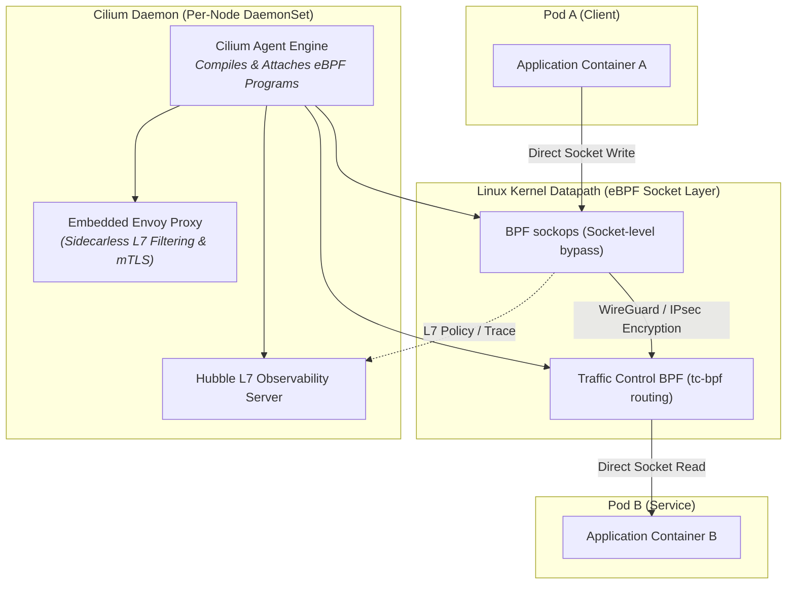

# Chapter 15: Service Mesh, eBPF & Cilium

<div class="grid cards" markdown>

-   :material-school: **Topic Focus** &bull; CiliumNetworkPolicies, L7 HTTP Routing, Mutual TLS, and Hubble Observability
-   :material-api: **Primary APIs** &bull; `cilium.io/v2` &bull; `CiliumNetworkPolicy`, `CiliumClusterwideNetworkPolicy`
-   :material-rocket-launch: [**Launch Playground in Wasm →**](../playground/index.html?chapter=15){ .md-button .md-button--primary }

</div>

!!! tip "⚡ Interactive Problems in this Chapter (Click to solve in Playground)"
    - [**`mesh01`**: Cilium L7 HTTP Filtering & Routing →](../playground/index.html?exercise=mesh01)
    - [**`mesh02`**: Strict Mutual TLS & PeerAuthentication →](../playground/index.html?exercise=mesh02)
    - [**`mesh03`**: CiliumClusterwideNetworkPolicy with DNS FQDN Egress →](../playground/index.html?exercise=mesh03)
    - [**`mesh04`**: Hubble Observability & OpenTelemetry Tracing →](../playground/index.html?exercise=mesh04)

---

## 1. Architectural Overview & Control Plane Mechanics

In Kubernetes, **Service Mesh, eBPF & Cilium** is reconciled through declarative state loops managed by the control plane and node daemons:



### 1.1 Architectural Flow & Lifecycle Walkthrough

1. **Cilium Agent Initialization & eBPF Program Loading**: The `cilium-agent` DaemonSet boots on every worker node, mounts the BPF virtual filesystem (`/sys/fs/bpf`), and compiles modular C programs into eBPF bytecode using LLVM/Clang.
2. **Socket Layer Attachment (`sockops`)**: Cilium attaches eBPF programs to the Linux socket layer (`BPF_PROG_TYPE_SOCK_OPS`) and socket message filtering (`BPF_PROG_TYPE_SK_MSG`).
3. **Short-Circuit Socket-to-Socket Datapath**: When Pod A initiates an HTTP request to Pod B on the same node:
   - Cilium's `sockops` eBPF program intercepts the `tcp_connect` system call.
   - It records the socket tuple in an in-kernel BPF map (`cilium_sock_ops`).
   - The outbound packet payload is redirected **directly** from Pod A's socket buffer (`sk_buff`) to Pod B's socket buffer in kernel memory, completely bypassing the TCP/IP stack, iptables, and virtual ethernet device (`veth`) packet processing overhead.
4. **Cross-Node Encryption (WireGuard / IPsec)**: If Pod B resides on a remote worker node, the kernel encapsulates the packet using in-kernel WireGuard or IPsec, encrypting the payload before transmission across the physical network.
5. **Sidecarless L7 Proxying & Hubble Observability**: For Layer 7 policy enforcement (HTTP method/path filtering) or mTLS, Cilium redirects selected flows to an embedded, high-performance Envoy instance via eBPF. Hubble captures flow telemetry directly from kernel eBPF ring buffers without injecting sidecar containers.

### 1.2 Serialization, Protocols & Communication Pathways

- **eBPF Kernel Ring Buffers (`BPF_MAP_TYPE_RINGBUF`)**: Lockless, high-throughput memory-mapped ring buffers streaming network flow events from Linux kernel space to user-space Hubble daemons with zero memory copying.
- **WireGuard Protocol (Noise Protocol Framework)**: Cryptographic UDP encapsulation operating over port 51871 utilizing Curve25519, ChaCha20-Poly1305, and BLAKE2s.
- **Envoy Go Extension APIs**: High-speed IPC between Cilium C Go runtime and embedded Envoy proxies for L7 filtering.

### 1.3 Deep-Dive Component Breakdown

- **cilium-agent**: Per-node daemon responsible for watching Kubernetes resources, compiling BPF programs, managing BPF maps, and driving local datapath routing.
- **cilium-operator**: Cluster-wide controller managing IPAM (IP Address Management), CRD synchronization, and garbage collecting stale node allocations.
- **Hubble**: Distributed networking and security observability platform providing L3/L4 and L7 real-time traffic flow visualization and metrics.
- **eBPF Maps (`/sys/fs/bpf/tc/globals/`)**: In-kernel key-value data structures storing policy rules, connection tracking state, and endpoint routing tables.

### 1.4 Under-The-Hood Mechanics & Failure Modes

- **Kernel Version Incompatibility**: Advanced eBPF features (like socket layer redirection and BPF LSM hooks) require Linux kernel 5.10+ or 6.1+. Running on older enterprise kernels (e.g. RHEL 7 / Linux 4.x) forces Cilium into fallback modes with reduced performance.
- **BPF Map Size Exhaustion**: High-scale clusters with millions of concurrent TCP flows can exceed default `bpf-ct-global-any-max` limits, causing new connections to fail with `BPF map full`.
- **MTU Misconfiguration in Encapsulated Overlays**: When using VXLAN/Geneve overlay tunneling without jumbo frames, failing to reduce the interface MTU by the encapsulation header size (50 bytes for VXLAN) leads to packet fragmentation and silent TCP timeouts for large HTTP payloads.

---

## 2. Annotated Production YAML Anatomy & Field Reference

Below is a production-grade declarative manifest demonstrating field definitions and operational patterns:

```yaml
apiVersion: cilium.io/v2
kind: CiliumNetworkPolicy
metadata:
  name: secure-payment-l7
  namespace: finance
spec:
  endpointSelector:
    matchLabels:
      app: payment-processor
  ingress:
  - fromEndpoints:
    - matchLabels:
        app: checkout-api
    toPorts:
    - ports:
      - port: "8080"
        protocol: TCP
      rules:
        http:
        - method: POST
          path: "/v1/charge"
  egress:
  - toFQDNs:
    - matchName: "api.stripe.com"
    toPorts:
    - ports:
      - port: "443"
        protocol: TCP
```

### Key Field Schema Reference

| Field | Type | Description |
| :--- | :--- | :--- |
| `endpointSelector` | `Object` | Selects Cilium endpoints (Pods) using identity-based labels rather than volatile IP addresses. |
| `ingress[*].toPorts[*].rules.http` | `Array` | L7 application-layer policy (methods, exact URI paths, regex matching). |
| `egress[*].toFQDNs` | `Array` | DNS-aware egress security policy allowlisting specific external hostnames. |

---

## 3. Real-World Architectural Patterns

### Clusterwide L7 Kafka Security Policy

```yaml
apiVersion: cilium.io/v2
kind: CiliumClusterwideNetworkPolicy
metadata:
  name: kafka-topic-isolation
spec:
  endpointSelector:
    matchLabels:
      app: kafka
  ingress:
  - fromEndpoints:
    - matchLabels:
        role: telemetry-producer
    toPorts:
    - ports:
      - port: "9092"
        protocol: TCP
      rules:
        kafka:
        - role: produce
          topic: "sensor-telemetry"
```

### Mutual TLS (mTLS) Strict Authentication

```yaml
apiVersion: cilium.io/v2
kind: CiliumNetworkPolicy
metadata:
  name: enforce-mtls
  namespace: secure
spec:
  endpointSelector:
    matchLabels:
      app: vault
  ingress:
  - fromEndpoints:
    - matchLabels:
        app: client
    authentication:
      mode: required
```


---

## 4. Production Hardening & Operational Governance

- Use Cilium eBPF host routing (`bpf.masquerade=true`, `kube-proxy-replacement=true`) for line-rate packet processing without iptables overhead.
- Enforce strict egress FQDN allowlisting to protect against data exfiltration and supply chain attacks.
- Enable Hubble metrics and network flow logs for complete audit visibility.

---

## 5. Failure Modes & Diagnostic Triage Tree

??? failure "Hubble Flow Inspection"
    **Root Cause:** Diagnose dropped packets and L7 authorization rejections in real time.

    **Diagnostic Triage Sequence:**
    ```bash
    # Stream live drops in namespace
    hubble observe --namespace finance --verdict DROPPED
    
    # Trace HTTP status codes
    hubble observe --namespace finance --protocol http
    ```


---

## 6. Interactive Practice Matrix

Practice concepts from this chapter directly in the interactive WebAssembly sandbox:

| Exercise ID | Challenge Description | Direct Link | Action |
| :--- | :--- | :--- | :--- |
| **`mesh01`** | Cilium L7 HTTP Filtering & Routing | [`../playground/index.html?exercise=mesh01`](../playground/index.html?exercise=mesh01) | [**⚡ Solve `mesh01` in Playground →**](../playground/index.html?exercise=mesh01){ .md-button .md-button--primary } |
| **`mesh02`** | Strict Mutual TLS & PeerAuthentication | [`../playground/index.html?exercise=mesh02`](../playground/index.html?exercise=mesh02) | [**⚡ Solve `mesh02` in Playground →**](../playground/index.html?exercise=mesh02){ .md-button .md-button--primary } |
| **`mesh03`** | CiliumClusterwideNetworkPolicy with DNS FQDN Egress | [`../playground/index.html?exercise=mesh03`](../playground/index.html?exercise=mesh03) | [**⚡ Solve `mesh03` in Playground →**](../playground/index.html?exercise=mesh03){ .md-button .md-button--primary } |
| **`mesh04`** | Hubble Observability & OpenTelemetry Tracing | [`../playground/index.html?exercise=mesh04`](../playground/index.html?exercise=mesh04) | [**⚡ Solve `mesh04` in Playground →**](../playground/index.html?exercise=mesh04){ .md-button .md-button--primary } |
