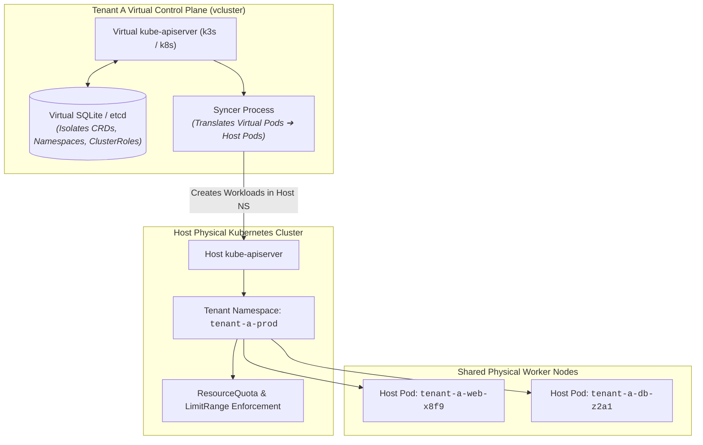

# Chapter 17: Multi-Tenancy & Virtual Clusters

<div class="grid cards" markdown>

-   :material-school: **Topic Focus** &bull; Hierarchical Namespace Controller (HNC), Quotas, vcluster, and Tenant Isolation
-   :material-api: **Primary APIs** &bull; `v1`, `hnc.x-k8s.io/v1alpha2` &bull; `ResourceQuota`, `LimitRange`, `HierarchyConfiguration`
-   :material-rocket-launch: [**Launch Playground in Wasm →**](../playground/index.html?chapter=17){ .md-button .md-button--primary }

</div>

!!! tip "⚡ Interactive Problems in this Chapter (Click to solve in Playground)"
    - [**`tenant01`**: HNC Hierarchical Subnamespace Anchor →](../playground/index.html?exercise=tenant01)
    - [**`tenant02`**: Tenant ResourceQuotas and LimitRanges →](../playground/index.html?exercise=tenant02)
    - [**`tenant03`**: Virtual Cluster (vcluster) Control Plane →](../playground/index.html?exercise=tenant03)
    - [**`tenant04`**: Multi-Tenant Network Isolation & Egress Filtering →](../playground/index.html?exercise=tenant04)

---

## 1. Architectural Overview & Control Plane Mechanics

In Kubernetes, **Multi-Tenancy & Virtual Clusters** is reconciled through declarative state loops managed by the control plane and node daemons:



### 1.1 Architectural Flow & Lifecycle Walkthrough

1. **Virtual Control Plane Boot**: A tenant deploys a `vcluster` instance inside a single designated namespace (e.g., `tenant-a-prod`) on a shared physical host Kubernetes cluster. `vcluster` launches a lightweight control plane binary (k3s or pure Kubernetes API server + SQLite/etcd) within a single StatefulSet Pod.
2. **Virtual API Interaction**: The tenant connects `kubectl` directly to the `vcluster` API endpoint. The tenant operates with full cluster-admin privileges inside their virtual control plane, freely creating CustomResourceDefinitions (CRDs), Namespaces, and ClusterRoles without impacting the host cluster or other tenants.
3. **State Persistence in Virtual Storage**: Virtual objects (CRDs, Namespaces, RoleBindings) are persisted strictly inside the tenant's virtual SQLite/etcd database.
4. **Syncer Resource Translation**: The `vcluster` Syncer daemon runs a bidirectional reconciliation loop:
   - Watches virtual Pods and Services created in the virtual API server.
   - Translates and creates corresponding physical Pods in the host cluster's `tenant-a-prod` namespace, rewriting names with a unique tenant prefix (e.g. `web-app-x-default-x-tenant-a`).
   - Copies status changes, IP addresses, and container events from the physical host Pods back into the virtual control plane.
5. **Host Physical Execution & Quota Enforcement**: The host cluster's `kube-scheduler` schedules the translated Pods onto shared physical worker nodes. Host `ResourceQuota`, `LimitRange`, and `NetworkPolicy` objects applied to `tenant-a-prod` strictly govern the aggregate compute and network boundaries of the tenant.

### 1.2 Serialization, Protocols & Communication Pathways

- **gRPC / SQLite Database Serialization**: k3s-backed vclusters use SQLite with Write-Ahead Logging (WAL) or kine (SQL translation for etcd v3 API), storing virtual state with minimal memory footprint.
- **Bidirectional Kubernetes Client-Go Informer Sync**: The syncer maintains two distinct client-go informer sets (one connected to the virtual API, one to the host API) over HTTPS TLS 1.3 streams.
- **Token Exchange & Impersonation**: The syncer uses Kubernetes API token authentication and service account impersonation to interact safely with the host control plane.

### 1.3 Deep-Dive Component Breakdown

- **vcluster Control Plane Pod**: Lightweight single-pod control plane running the virtual API server, controller-manager, and storage engine.
- **Syncer Process**: Intelligent proxy daemon translating low-level execution resources (Pods, Services, PVCs, ConfigMaps, Secrets) between virtual and host namespaces while keeping high-level abstractions (CRDs, Namespaces) isolated.
- **Host Namespace Boundary**: Physical security envelope enforcing Linux cgroup resource limits, NetworkPolicies, and Pod Security Standards across all tenant pods.
- **Host Worker Node Fleet**: Shared physical hardware executing container processes in isolated Linux namespaces.

### 1.4 Under-The-Hood Mechanics & Failure Modes

- **Host ResourceQuota Exhaustion**: If a tenant creates virtual Pods that exceed the host namespace's `ResourceQuota`, the syncer fails to create physical pods on the host. The virtual Pod remains stuck in `Pending` state with syncer error events.
- **StorageClass Mapping Mismatches**: If virtual PVCs reference StorageClasses that do not exist or are not mapped in the syncer configuration, dynamic volume provisioning on the host cluster fails.
- **Syncer Desynchronization on Host Deletions**: If an administrator deletes a physical tenant pod directly on the host cluster via `kubectl`, the syncer detects the divergence and immediately recreates the physical pod to match the virtual desired state.

---

## 2. Annotated Production YAML Anatomy & Field Reference

Below is a production-grade declarative manifest demonstrating field definitions and operational patterns:

```yaml
apiVersion: v1
kind: ResourceQuota
metadata:
  name: tenant-quota
  namespace: team-alpha
spec:
  hard:
    requests.cpu: "4"
    requests.memory: 8Gi
    limits.cpu: "8"
    limits.memory: 16Gi
    pods: "20"
    services.loadbalancers: "1"
---
apiVersion: v1
kind: LimitRange
metadata:
  name: tenant-limit-range
  namespace: team-alpha
spec:
  limits:
  - default:
      cpu: "500m"
      memory: "512Mi"
    defaultRequest:
      cpu: "100m"
      memory: "128Mi"
    type: Container
```

### Key Field Schema Reference

| Field | Type | Description |
| :--- | :--- | :--- |
| `ResourceQuota` | `Hard ceiling` | Bounds aggregate compute resources, storage allocations, and object counts across a namespace. |
| `LimitRange` | `Defaults & Bounds` | Injects default resource requests/limits for bare pods and enforces min/max container size constraints. |
| `vcluster` | `Virtual Cluster` | Runs a lightweight, dedicated control plane inside a namespace for full multi-tenant CRD and cluster-admin isolation. |

---

## 3. Real-World Architectural Patterns

### Hierarchical Namespaces (HNC) Tree

```yaml
apiVersion: hnc.x-k8s.io/v1alpha2
kind: HierarchyConfiguration
metadata:
  name: hierarchy
  namespace: team-alpha-staging
spec:
  parent: team-alpha-root
```

### vcluster Helm Values Configuration

```yaml
# vcluster helm configuration for lightweight k3s tenant
syncer:
  extraArgs:
  - --sync-nodes=false
  - --sync-all-secrets=false
isolation:
  enabled: true
  podSecurityStandard: restricted
  resourceQuota:
    enabled: true
    quota:
      requests.cpu: "2"
      requests.memory: 4Gi
```


---

## 4. Production Hardening & Operational Governance

- Combine `ResourceQuota` with `LimitRange` in every tenant namespace to prevent unconstrained pod scheduling from saturating quotas.
- Use `vcluster` when tenants require custom CRDs, independent API versions, or cluster-scoped role simulations.
- Enforce NetworkPolicies between tenant namespaces to eliminate cross-tenant lateral movement.

---

## 5. Failure Modes & Diagnostic Triage Tree

??? failure "`exceeded quota: ... requested: ..., used: ..., limited: ...`"
    **Root Cause:** Tenant namespace has exhausted its ResourceQuota ceiling.

    **Diagnostic Triage Sequence:**
    1. Inspect quota usage: `kubectl describe resourcequota -n <tenant-namespace>`
    2. Delete orphaned pods or scale down unused deployments.


---

## 6. Interactive Practice Matrix

Practice concepts from this chapter directly in the interactive WebAssembly sandbox:

| Exercise ID | Challenge Description | Direct Link | Action |
| :--- | :--- | :--- | :--- |
| **`tenant01`** | HNC Hierarchical Subnamespace Anchor | [`../playground/index.html?exercise=tenant01`](../playground/index.html?exercise=tenant01) | [**⚡ Solve `tenant01` in Playground →**](../playground/index.html?exercise=tenant01){ .md-button .md-button--primary } |
| **`tenant02`** | Tenant ResourceQuotas and LimitRanges | [`../playground/index.html?exercise=tenant02`](../playground/index.html?exercise=tenant02) | [**⚡ Solve `tenant02` in Playground →**](../playground/index.html?exercise=tenant02){ .md-button .md-button--primary } |
| **`tenant03`** | Virtual Cluster (vcluster) Control Plane | [`../playground/index.html?exercise=tenant03`](../playground/index.html?exercise=tenant03) | [**⚡ Solve `tenant03` in Playground →**](../playground/index.html?exercise=tenant03){ .md-button .md-button--primary } |
| **`tenant04`** | Multi-Tenant Network Isolation & Egress Filtering | [`../playground/index.html?exercise=tenant04`](../playground/index.html?exercise=tenant04) | [**⚡ Solve `tenant04` in Playground →**](../playground/index.html?exercise=tenant04){ .md-button .md-button--primary } |
