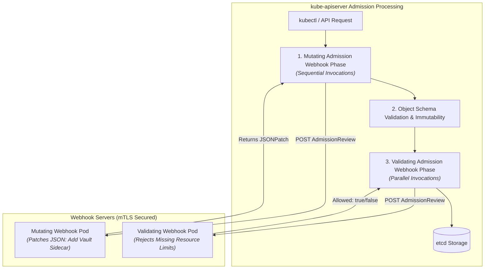

# Chapter 18: Advanced Admission Webhooks

<div class="grid cards" markdown>

-   :material-school: **Topic Focus** &bull; Mutating & Validating Webhooks, Sidecar Injection, and CRD Conversion
-   :material-api: **Primary APIs** &bull; `admissionregistration.k8s.io/v1` &bull; `MutatingWebhookConfiguration`, `ValidatingWebhookConfiguration`
-   :material-rocket-launch: [**Launch Playground in Wasm →**](../playground/index.html?chapter=18){ .md-button .md-button--primary }

</div>

!!! tip "⚡ Interactive Problems in this Chapter (Click to solve in Playground)"
    - [**`webhook01`**: MutatingWebhookConfiguration Manifest →](../playground/index.html?exercise=webhook01)
    - [**`webhook02`**: ValidatingWebhookConfiguration Manifest →](../playground/index.html?exercise=webhook02)
    - [**`webhook03`**: Dynamic Sidecar Injection AdmissionReview Response →](../playground/index.html?exercise=webhook03)
    - [**`webhook04`**: CRD Webhook Conversion Strategy →](../playground/index.html?exercise=webhook04)

---

## 1. Architectural Overview & Control Plane Mechanics

In Kubernetes, **Advanced Admission Webhooks** is reconciled through declarative state loops managed by the control plane and node daemons:



### 1.1 Architectural Flow & Lifecycle Walkthrough

1. **Client API Request**: A client sends an HTTP POST/PUT/DELETE request to `kube-apiserver`. The request is authenticated (AuthN) and authorized (AuthZ).
2. **Phase 1: Mutating Admission Webhook Execution**:
   - The API server queries `MutatingWebhookConfiguration` objects matching the resource rule selectors.
   - Webhooks are executed in **sequential order** over HTTPS mTLS connections.
   - Each webhook service processes the `AdmissionReview` request and returns a `JSONPatch` (RFC 6902) document.
   - The API server applies the patch, modifying the in-memory object (e.g. injecting sidecar containers, adding default storage annotations).
3. **Phase 2: Schema Validation & Immutability**: The mutated object is validated against the OpenAPI v3 schema. Any mutations that introduce invalid fields or violate schema constraints fail immediately.
4. **Phase 3: Validating Admission Webhook Execution**:
   - The API server queries `ValidatingWebhookConfiguration` objects.
   - Webhooks are executed in **parallel** across all registered validating services to minimize latency.
   - Each service evaluates business logic (e.g. verifying security context or checking resource quotas).
   - If any validating webhook returns `allowed: false`, the entire API operation is aborted, and the failure message is returned to the client.
5. **Persistence in etcd**: If all mutating and validating hooks pass, the API server executes the atomic write transaction to `etcd`.

### 1.2 Serialization, Protocols & Communication Pathways

- **AdmissionReview v1 JSON Envelope**: HTTPS POST payload containing `request.uid`, `request.object`, `request.oldObject`, `request.userInfo`, and `request.dryRun`.
- **JSONPatch RFC 6902 Protocol**: Mutating webhooks return a base64-encoded array of JSONPatch operations (`add`, `remove`, `replace`) executed sequentially on the target object document.
- **mTLS with CA Bundle Verification**: `kube-apiserver` verifies the webhook server's TLS certificate against the PEM-encoded `caBundle` specified in the webhook configuration.

### 1.3 Deep-Dive Component Breakdown

- **kube-apiserver Admission Controller Manager**: Internal pipeline orchestrating Mutating and Validating webhook phases with configurable timeouts and failure policies.
- **Webhook Server Daemon**: Out-of-tree HTTPS microservice running inside or outside the cluster handling `AdmissionReview` JSON RPC requests.
- **CABundle Trust Store**: Base64-encoded X.509 Certificate Authority string embedded directly into the webhook configuration to establish mutual TLS trust.
- **Webhook Rule Selectors**: Object, namespace (`namespaceSelector`), and object label (`objectSelector`) filters determining which API operations trigger webhook invocations.

### 1.4 Under-The-Hood Mechanics & Failure Modes

- **Cluster Lockout via `failurePolicy: Fail`**: If a webhook server becomes unreachable (due to node crash, DNS failure, or certificate expiration) and `failurePolicy: Fail` is configured, all matching API requests fail with `Internal error: failed calling webhook`.
- **Webhook Request Timeout Degradation**: Default webhook timeouts (10s) can cause client `kubectl` requests to hang and timeout if webhook pods experience high latency under load. Webhook timeouts should be tuned to $\le 3$ seconds.
- **Infinite Mutation Cycles**: If two mutating webhooks make conflicting modifications to the same field, the API server reinvokes webhooks up to a maximum limit (default: 8 reinvocations) before aborting with `mutation recursion limit exceeded`.

---

## 2. Annotated Production YAML Anatomy & Field Reference

Below is a production-grade declarative manifest demonstrating field definitions and operational patterns:

```yaml
apiVersion: admissionregistration.k8s.io/v1
kind: ValidatingWebhookConfiguration
metadata:
  name: strict-image-validator
webhooks:
- name: image-validator.security.example.com
  rules:
  - apiGroups: [""]
    apiVersions: ["v1"]
    operations: ["CREATE", "UPDATE"]
    resources: ["pods"]
    scope: "Namespaced"
  clientConfig:
    service:
      name: webhook-service
      namespace: security-system
      path: "/validate-images"
      port: 443
    caBundle: "LS0tLS1CRUdJTiBDRVJUSUZJQ0FURS0tLS0tCg=="
  admissionReviewVersions: ["v1"]
  sideEffects: None
  timeoutSeconds: 3
  failurePolicy: Fail
```

### Key Field Schema Reference

| Field | Type | Description |
| :--- | :--- | :--- |
| `failurePolicy` | `Enum` | `Fail` (rejects API request if webhook times out or crashes) or `Ignore` (allows request through upon failure). |
| `clientConfig.caBundle` | `Base64` | PEM-encoded CA certificate used by API Server to verify the webhook server TLS certificate. |
| `sideEffects: None` | `Enum` | Guarantees the webhook has no out-of-band side effects on dry-run requests. |

---

## 3. Real-World Architectural Patterns

### Mutating Webhook for Sidecar Injection

```yaml
apiVersion: admissionregistration.k8s.io/v1
kind: MutatingWebhookConfiguration
metadata:
  name: sidecar-injector
webhooks:
- name: sidecar.inject.example.com
  rules:
  - apiGroups: [""]
    apiVersions: ["v1"]
    operations: ["CREATE"]
    resources: ["pods"]
  clientConfig:
    service:
      name: injector-service
      namespace: default
      path: "/mutate"
  admissionReviewVersions: ["v1"]
  sideEffects: None
  failurePolicy: Ignore
```

### Namespace Exclusion Selector

```yaml
# Webhook configuration with namespaceSelector to exclude system components
apiVersion: admissionregistration.k8s.io/v1
kind: ValidatingWebhookConfiguration
metadata:
  name: app-validator
webhooks:
- name: validator.example.com
  rules:
  - apiGroups: ["apps"]
    apiVersions: ["v1"]
    operations: ["CREATE"]
    resources: ["deployments"]
  namespaceSelector:
    matchExpressions:
    - key: kubernetes.io/metadata.name
      operator: NotIn
      values: ["kube-system", "kube-public"]
  clientConfig:
    service:
      name: validator-svc
      namespace: default
      path: "/validate"
  admissionReviewVersions: ["v1"]
  sideEffects: None
```


---

## 4. Production Hardening & Operational Governance

- Always set `namespaceSelector` to exclude `kube-system` from webhooks to prevent circular bricking of control plane restarts.
- Use `timeoutSeconds: 3` (or less) to prevent slow webhooks from stalling kube-apiserver admission pipelines.
- Use `cert-manager` CA injector to automatically maintain `caBundle` synchronization.

---

## 5. Failure Modes & Diagnostic Triage Tree

??? failure "`Internal error occurred: failed calling webhook ... connection refused`"
    **Root Cause:** Webhook server pod is dead or unreachable over TLS.

    **Diagnostic Triage Sequence:**
    1. Inspect webhook server logs: `kubectl logs -n <namespace> -l app=<webhook-name>`
    2. Temporarily switch `failurePolicy: Ignore` to restore cluster operations during emergencies.


---

## 6. Interactive Practice Matrix

Practice concepts from this chapter directly in the interactive WebAssembly sandbox:

| Exercise ID | Challenge Description | Direct Link | Action |
| :--- | :--- | :--- | :--- |
| **`webhook01`** | MutatingWebhookConfiguration Manifest | [`../playground/index.html?exercise=webhook01`](../playground/index.html?exercise=webhook01) | [**⚡ Solve `webhook01` in Playground →**](../playground/index.html?exercise=webhook01){ .md-button .md-button--primary } |
| **`webhook02`** | ValidatingWebhookConfiguration Manifest | [`../playground/index.html?exercise=webhook02`](../playground/index.html?exercise=webhook02) | [**⚡ Solve `webhook02` in Playground →**](../playground/index.html?exercise=webhook02){ .md-button .md-button--primary } |
| **`webhook03`** | Dynamic Sidecar Injection AdmissionReview Response | [`../playground/index.html?exercise=webhook03`](../playground/index.html?exercise=webhook03) | [**⚡ Solve `webhook03` in Playground →**](../playground/index.html?exercise=webhook03){ .md-button .md-button--primary } |
| **`webhook04`** | CRD Webhook Conversion Strategy | [`../playground/index.html?exercise=webhook04`](../playground/index.html?exercise=webhook04) | [**⚡ Solve `webhook04` in Playground →**](../playground/index.html?exercise=webhook04){ .md-button .md-button--primary } |
