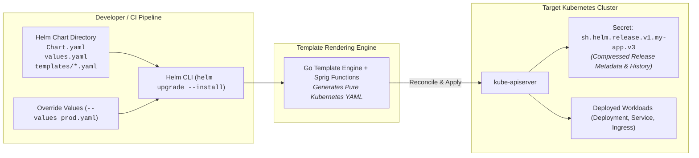

# Chapter 19: Package Management with Helm

<div class="grid cards" markdown>

-   :material-school: **Topic Focus** &bull; Chart Specifications, Go Templating, Values Schemas, and Subcharts
-   :material-api: **Primary APIs** &bull; `helm.sh` &bull; `Chart.yaml`, `values.yaml`, `templates/*.yaml`
-   :material-rocket-launch: [**Launch Playground in Wasm →**](../playground/index.html?chapter=19){ .md-button .md-button--primary }

</div>

!!! tip "⚡ Interactive Problems in this Chapter (Click to solve in Playground)"
    - [**`helm01`**: Helm Chart.yaml Metadata & Dependencies →](../playground/index.html?exercise=helm01)
    - [**`helm02`**: Helm Go Templating & Named Helpers (_helpers.tpl) →](../playground/index.html?exercise=helm02)
    - [**`helm03`**: Helm values.schema.json Validation Schema →](../playground/index.html?exercise=helm03)
    - [**`helm04`**: Helm Subcharts & Global Values →](../playground/index.html?exercise=helm04)

---

## 1. Architectural Overview & Control Plane Mechanics

In Kubernetes, **Package Management with Helm** is reconciled through declarative state loops managed by the control plane and node daemons:



### 1.1 Architectural Flow & Lifecycle Walkthrough

1. **Chart Loading & Values Resolution**: The developer runs `helm upgrade --install my-app ./chart --values prod-values.yaml`. The Helm CLI client reads the `Chart.yaml` metadata, loads default values from `values.yaml`, and merges override values according to strict precedence rules (Default `values.yaml` $\rightarrow$ Parent Chart Values $\rightarrow$ `--values` files $\rightarrow$ `--set` CLI flags).
2. **Go Template Rendering**: The Helm client executes the internal Go template engine augmented with Sprig functions (cryptographic hashing, string manipulation, dictionary lookups). It renders all template files in `templates/*.yaml` into concrete, valid Kubernetes YAML manifests.
3. **Dry-Run & OpenAPI Validation**: If `--dry-run` or client-side validation is active, Helm validates the rendered manifests against the Kubernetes OpenAPI v3 schema via `kube-apiserver`.
4. **Release Manifest Transmission**: Helm calculates the three-way merge patch between the currently deployed release, the new desired manifests, and live cluster state. It issues HTTP/2 REST requests to `kube-apiserver` to create, update, or delete workloads.
5. **Release History Persistence in Secrets**: Helm compresses the complete release metadata (including raw chart, values, rendered manifest, and release status) using Gzip, encodes it in Base64, and writes a Kubernetes Secret named `sh.helm.release.v1.<release-name>.v<revision>` in the release namespace.

### 1.2 Serialization, Protocols & Communication Pathways

- **Go Template Engine (`text/template`)**: In-memory template evaluation engine executing control structures (`if/else`, `range`, `with`) and pipeline functions.
- **YAML / JSON Encoding & Decoding**: Chart structures and values files parsed via `gopkg.in/yaml.v3`.
- **Gzip Compressed Base64 Storage**: Release history records compressed via Gzip and stored within `v1.Secret` payloads under `data.release` to stay well within etcd's 1.5MB key size boundary.

### 1.3 Deep-Dive Component Breakdown

- **Helm CLI Binary**: Client-side Go application responsible for chart dependency management, template rendering, and release lifecycle orchestration.
- **Sprig Function Library**: Collection of over 100 template functions (regex, crypto, date formatting, list operations) embedded in Helm's rendering engine.
- **Release Secret Subsystem**: Versioned Kubernetes Secrets tracking immutable release history, enabling atomic rollbacks (`helm rollback <release> <revision>`).
- **Helm Lifecycle Hooks**: Annotations (`helm.sh/hook: pre-install, post-upgrade`) orchestrating pre-deployment database migrations or post-deployment integration tests.

### 1.4 Under-The-Hood Mechanics & Failure Modes

- **Release State Lockout (`Pending-Install` / `Pending-Upgrade`)**: If a Helm deployment is interrupted or times out while waiting for pods to become ready, the release status remains locked in `pending-upgrade`. Subsequent Helm commands fail with `another operation (install/upgrade/rollback) is in progress`. Resolving this requires manually deleting the pending release secret.
- **Type Coercion Template Rendering Crashes**: YAML values parsed without explicit type definitions can cause Go template runtime nil-pointer exceptions (e.g., evaluating `{{ .Values.service.port | int }}` when `port` is missing or passed as a string).
- **Orphaned Resources on Unmanaged Manifest Changes**: Resources created outside Helm's template tree (or resources whose template filenames changed without proper ownership labels) will not be tracked or pruned by Helm during upgrades, resulting in resource leaks.

---

## 2. Annotated Production YAML Anatomy & Field Reference

Below is a production-grade declarative manifest demonstrating field definitions and operational patterns:

```yaml
# Chart.yaml
apiVersion: v2
name: enterprise-web-app
description: Production-grade Helm chart for microservice web workloads
type: application
version: 1.4.0
appVersion: "2.18.0"
maintainers:
- name: SRE Platform Team
  email: platform@example.com
dependencies:
- name: redis
  version: 18.0.0
  repository: https://charts.bitnami.com/bitnami
  condition: redis.enabled
```

### Key Field Schema Reference

| Field | Type | Description |
| :--- | :--- | :--- |
| `apiVersion: v2` | `String` | Standard for Helm 3 charts; supports declarative chart dependencies. |
| `version` vs `appVersion` | `SemVer` | `version` is the chart version; `appVersion` reflects the packaged application version. |
| `dependencies` | `Array` | Subcharts managed and bundled via `helm dependency update`. |

---

## 3. Real-World Architectural Patterns

### Production values.yaml Structure

```yaml
# values.yaml
replicaCount: 3

image:
  repository: nginx
  tag: 1.27-alpine
  pullPolicy: IfNotPresent

service:
  type: ClusterIP
  port: 80

resources:
  limits:
    cpu: 250m
    memory: 256Mi
  requests:
    cpu: 100m
    memory: 128Mi

redis:
  enabled: true
  auth:
    enabled: true
```

### Rendered Helm Template Deployment Manifest

```yaml
apiVersion: apps/v1
kind: Deployment
metadata:
  name: release-enterprise-web-app
  labels:
    helm.sh/chart: enterprise-web-app-1.4.0
    app.kubernetes.io/name: enterprise-web-app
    app.kubernetes.io/instance: release
spec:
  replicas: 3
  selector:
    matchLabels:
      app.kubernetes.io/name: enterprise-web-app
  template:
    metadata:
      labels:
        app.kubernetes.io/name: enterprise-web-app
    spec:
      containers:
      - name: web
        image: nginx:1.27-alpine
        ports:
        - containerPort: 80
```


---

## 4. Production Hardening & Operational Governance

- Create a strict `values.schema.json` to catch invalid data types during `helm lint` and CI.
- Always quote string variables in templates (e.g. `{{ .Values.tag | quote }}`) to avoid YAML type coercion issues.
- Use `helm template --debug` and `helm lint` in pull request workflows to validate charts before publishing.

---

## 5. Failure Modes & Diagnostic Triage Tree

??? failure "Helm Template Rendering Error (`nil pointer evaluating interface`)"
    **Root Cause:** Referenced value key does not exist in `values.yaml`.

    **Diagnostic Triage Sequence:**
    1. Run template debug: `helm template my-release ./my-chart --debug`
    2. Use `default` or `required` filters to handle optional fields safely.


---

## 6. Interactive Practice Matrix

Practice concepts from this chapter directly in the interactive WebAssembly sandbox:

| Exercise ID | Challenge Description | Direct Link | Action |
| :--- | :--- | :--- | :--- |
| **`helm01`** | Helm Chart.yaml Metadata & Dependencies | [`../playground/index.html?exercise=helm01`](../playground/index.html?exercise=helm01) | [**⚡ Solve `helm01` in Playground →**](../playground/index.html?exercise=helm01){ .md-button .md-button--primary } |
| **`helm02`** | Helm Go Templating & Named Helpers (_helpers.tpl) | [`../playground/index.html?exercise=helm02`](../playground/index.html?exercise=helm02) | [**⚡ Solve `helm02` in Playground →**](../playground/index.html?exercise=helm02){ .md-button .md-button--primary } |
| **`helm03`** | Helm values.schema.json Validation Schema | [`../playground/index.html?exercise=helm03`](../playground/index.html?exercise=helm03) | [**⚡ Solve `helm03` in Playground →**](../playground/index.html?exercise=helm03){ .md-button .md-button--primary } |
| **`helm04`** | Helm Subcharts & Global Values | [`../playground/index.html?exercise=helm04`](../playground/index.html?exercise=helm04) | [**⚡ Solve `helm04` in Playground →**](../playground/index.html?exercise=helm04){ .md-button .md-button--primary } |
