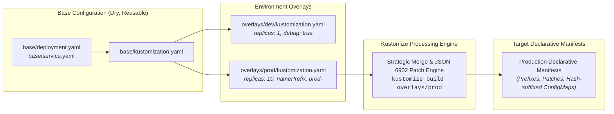

# Chapter 20: Declarative Customization with Kustomize

<div class="grid cards" markdown>

-   :material-school: **Topic Focus** &bull; Base Manifests, ConfigMap/Secret Generators, Patches, and Multi-Environment Overlays
-   :material-api: **Primary APIs** &bull; `kustomize.config.k8s.io/v1beta1` &bull; `Kustomization`
-   :material-rocket-launch: [**Launch Playground in Wasm →**](../playground/index.html?chapter=20){ .md-button .md-button--primary }

</div>

!!! tip "⚡ Interactive Problems in this Chapter (Click to solve in Playground)"
    - [**`kustomize01`**: Kustomize Base Manifests & Metadata Transformations →](../playground/index.html?exercise=kustomize01)
    - [**`kustomize02`**: Kustomize ConfigMap & Secret Generators →](../playground/index.html?exercise=kustomize02)
    - [**`kustomize03`**: Kustomize Strategic Merge & JSON6902 Target Patches →](../playground/index.html?exercise=kustomize03)
    - [**`kustomize04`**: Kustomize Multi-Environment Overlays & Image Transforms →](../playground/index.html?exercise=kustomize04)

---

## 1. Architectural Overview & Control Plane Mechanics

In Kubernetes, **Declarative Customization with Kustomize** is reconciled through declarative state loops managed by the control plane and node daemons:



### 1.1 Architectural Flow & Lifecycle Walkthrough

1. **Base Configuration Parsing**: Kustomize reads `base/kustomization.yaml` and loads the declarative source manifests (`deployment.yaml`, `service.yaml`). The base represents DRY, reusable, environment-agnostic infrastructure definitions.
2. **Overlay Target Selection**: The developer or CI pipeline targets a specific environment overlay directory (e.g. `kustomize build overlays/production`).
3. **Strategic Merge & JSON 6902 Patch Evaluation**: Kustomize evaluates the overlay's `kustomization.yaml`:
   - **Strategic Merge Patches**: Merges partial YAML snippets based on Kubernetes struct tags (e.g., updating `spec.replicas: 10` or modifying container memory limits while preserving all other base fields).
   - **JSON 6902 Patches**: Applies precise RFC 6902 JSON mutation operations (`add`, `replace`, `remove`) targeting specific array indices or nested keys.
4. **Cross-Cutting Transformer Execution**:
   - `namePrefix` & `nameSuffix`: Prepends/appends environment identifiers (e.g., `prod-web-service`).
   - `commonLabels` & `commonAnnotations`: Injects standardized telemetry, ownership, and Git commit metadata across all output resources and selectors.
   - `namespace`: Overrides target namespaces across all resources.
5. **ConfigMap & Secret Hash Generation**: For resources declared under `configMapGenerator` or `secretGenerator`, Kustomize appends a deterministic content-hash suffix to the resource name (e.g. `app-config-8f9h2k4m5b`). It automatically updates all `Pod.spec.volumes[*].configMap.name` references to match, triggering zero-downtime rolling updates whenever configuration changes.

### 1.2 Serialization, Protocols & Communication Pathways

- **Strategic Merge Patch (SMP) Algorithm**: Kubernetes-aware YAML patching engine that utilizes Go struct tags (`patchStrategy: merge`, `patchMergeKey: name`) to intelligently merge slices of objects (like container lists) by key instead of replacing the entire array.
- **JSON 6902 Patch Protocol**: Standardized JSON patch specifications executed in-memory against YAML node trees.
- **SHA-256 Content Hashing**: Cryptographic hash calculation executed on serialized ConfigMap/Secret key-value pairs to generate immutable 10-character resource suffixes.

### 1.3 Deep-Dive Component Breakdown

- **Kustomize Engine**: Pure declarative configuration engine built into `kubectl` (`kubectl apply -k .`) and available as a standalone CLI.
- **Resource Accumulator**: In-memory tree structure tracking all loaded resources, overlays, components, and transformers.
- **ConfigMapGenerator / SecretGenerator**: Built-in generators creating versioned, immutable configuration objects with automatic reference rewriting.
- **Kustomize Transformers**: Pipeline plugins executing cross-cutting modifications (Labels, Annotations, Namespaces, NamePrefix, Images).

### 1.4 Under-The-Hood Mechanics & Failure Modes

- **Strategic Merge vs JSON Patch Collisions**: Custom Resource Definitions (CRDs) lack native Kubernetes Go struct merge tags; applying a Strategic Merge Patch to a CRD array replaces the entire array instead of merging items. CRD modifications must use explicit JSON 6902 patches.
- **Stale ConfigMap Garbage Accumulation**: Generating hash-suffixed ConfigMaps on every commit creates new ConfigMap objects on the cluster. Unless automated pruning (via ArgoCD or `kubectl apply --prune`) is configured, obsolete ConfigMaps accumulate indefinitely in `etcd`.
- **Selector Immutability Violations with `commonLabels`**: Changing `commonLabels` in an overlay modifies `spec.selector.matchLabels` on Deployments. Because Kubernetes Deployment selectors are immutable after creation, applying the modified overlay fails with `field is immutable` until the Deployment is deleted and recreated.

---

## 2. Annotated Production YAML Anatomy & Field Reference

Below is a production-grade declarative manifest demonstrating field definitions and operational patterns:

```yaml
apiVersion: kustomize.config.k8s.io/v1beta1
kind: Kustomization
namespace: production
namePrefix: prod-
commonLabels:
  environment: production
  managed-by: kustomize
resources:
- ../../base
patches:
- target:
    kind: Deployment
    name: web-app
  patch: |-
    - op: replace
      path: /spec/replicas
      value: 10
configMapGenerator:
- name: app-env
  behavior: merge
  literals:
  - LOG_LEVEL=warn
  - CACHE_TTL=3600
```

### Key Field Schema Reference

| Field | Type | Description |
| :--- | :--- | :--- |
| `resources` | `Array` | Relative paths to bases, other overlays, or remote Git URLs. |
| `patches` | `Array` | Targeted JSON 6902 patches or Strategic Merge Patches modifying specific fields without duplicating manifests. |
| `configMapGenerator` | `Array` | Generates ConfigMaps with automatic content-hash suffixes for zero-downtime rolling updates. |

---

## 3. Real-World Architectural Patterns

### Base Kustomization Definition

```yaml
apiVersion: kustomize.config.k8s.io/v1beta1
kind: Kustomization
resources:
- deployment.yaml
- service.yaml
```

### Strategic Merge Patch for Resource Limits

```yaml
apiVersion: apps/v1
kind: Deployment
metadata:
  name: web-app
spec:
  template:
    spec:
      containers:
      - name: app
        resources:
          limits:
            cpu: "2"
            memory: "4Gi"
```


---

## 4. Production Hardening & Operational Governance

- Use `configMapGenerator` with hash suffixes so configuration updates trigger automated rolling restarts.
- Keep `base/` minimal and purely structural; push environment-specific configurations into `overlays/`.
- Validate Kustomize builds in CI with `kubectl kustomize overlays/production --dry-run=client`.

---

## 5. Failure Modes & Diagnostic Triage Tree

??? failure "`patch target not found`"
    **Root Cause:** Patch target `kind` or `name` does not match any resource generated in the base.

    **Diagnostic Triage Sequence:**
    1. Review base build output: `kubectl kustomize base`
    2. Verify `namePrefix` or `nameSuffix` has not modified the target name prior to patching.


---

## 6. Interactive Practice Matrix

Practice concepts from this chapter directly in the interactive WebAssembly sandbox:

| Exercise ID | Challenge Description | Direct Link | Action |
| :--- | :--- | :--- | :--- |
| **`kustomize01`** | Kustomize Base Manifests & Metadata Transformations | [`../playground/index.html?exercise=kustomize01`](../playground/index.html?exercise=kustomize01) | [**⚡ Solve `kustomize01` in Playground →**](../playground/index.html?exercise=kustomize01){ .md-button .md-button--primary } |
| **`kustomize02`** | Kustomize ConfigMap & Secret Generators | [`../playground/index.html?exercise=kustomize02`](../playground/index.html?exercise=kustomize02) | [**⚡ Solve `kustomize02` in Playground →**](../playground/index.html?exercise=kustomize02){ .md-button .md-button--primary } |
| **`kustomize03`** | Kustomize Strategic Merge & JSON6902 Target Patches | [`../playground/index.html?exercise=kustomize03`](../playground/index.html?exercise=kustomize03) | [**⚡ Solve `kustomize03` in Playground →**](../playground/index.html?exercise=kustomize03){ .md-button .md-button--primary } |
| **`kustomize04`** | Kustomize Multi-Environment Overlays & Image Transforms | [`../playground/index.html?exercise=kustomize04`](../playground/index.html?exercise=kustomize04) | [**⚡ Solve `kustomize04` in Playground →**](../playground/index.html?exercise=kustomize04){ .md-button .md-button--primary } |
