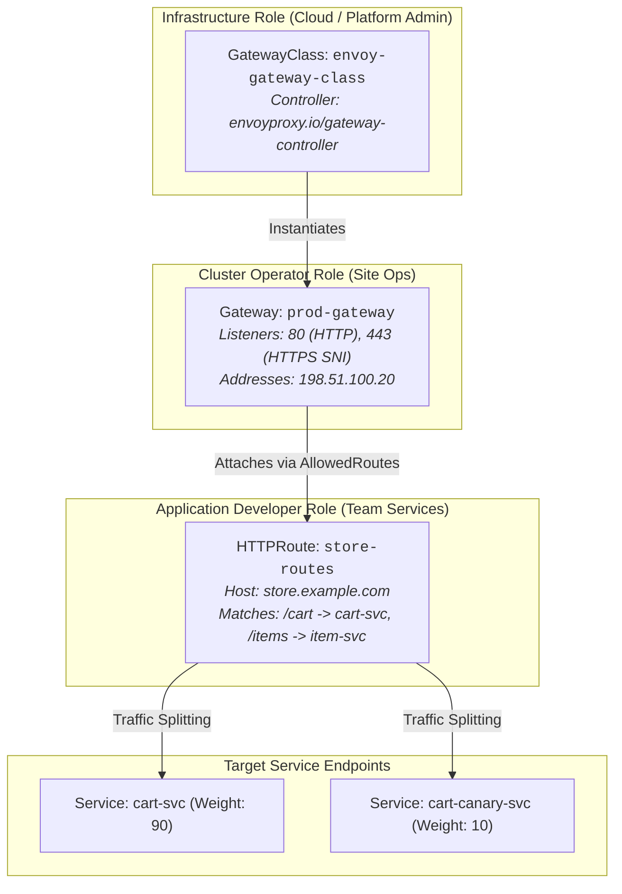

# Chapter 21: Next-Gen Traffic Routing with Kubernetes Gateway API

<div class="grid cards" markdown>

-   :material-school: **Topic Focus** &bull; GatewayClass, Gateway Listeners, HTTPRoute, Canary Traffic Splitting, and ReferenceGrant
-   :material-api: **Primary APIs** &bull; `gateway.networking.k8s.io/v1` &bull; `GatewayClass`, `Gateway`, `HTTPRoute`, `ReferenceGrant`
-   :material-rocket-launch: [**Launch Playground in Wasm →**](../playground/index.html?chapter=21){ .md-button .md-button--primary }

</div>

!!! tip "⚡ Interactive Problems in this Chapter (Click to solve in Playground)"
    - [**`gateway01`**: GatewayClass and Gateway Declaration →](../playground/index.html?exercise=gateway01)
    - [**`gateway02`**: HTTPRoute Path & Header-Based Routing →](../playground/index.html?exercise=gateway02)
    - [**`gateway03`**: Canary Traffic Splitting & URL Rewriting →](../playground/index.html?exercise=gateway03)
    - [**`gateway04`**: Cross-Namespace Security with ReferenceGrant →](../playground/index.html?exercise=gateway04)

---

## 1. Architectural Overview & Control Plane Mechanics

In Kubernetes, **Next-Gen Traffic Routing with Kubernetes Gateway API** is reconciled through declarative state loops managed by the control plane and node daemons:



### 1.1 Architectural Flow & Lifecycle Walkthrough

1. **Role-Oriented Resource Separation**:
   - **Infrastructure Admin**: Deploys the Gateway Controller (e.g., Envoy Gateway, Cilium Gateway, or GKE Gateway) and defines a `GatewayClass` (`gateway.networking.k8s.io/v1`) specifying the underlying proxy controller implementation.
   - **Cluster Operator**: Defines a `Gateway` resource declaring physical listeners (e.g., port 80 HTTP, port 443 HTTPS with SNI TLS certificates) and allocated IP addresses.
   - **Application Developer**: Authors isolated `HTTPRoute` or `GRPCRoute` objects attached to the Gateway via `spec.parentRefs`, defining fine-grained path matching, header routing, and traffic splitting rules.
2. **Dynamic Control Plane Translation (Envoy xDS Streaming)**: The Gateway Controller watches `Gateway`, `GatewayClass`, and `HTTPRoute` resources via Kubernetes API informers. It compiles these declarative routing graphs into Envoy **xDS Discovery Services** (Listener Discovery `LDS`, Route Discovery `RDS`, Cluster Discovery `CDS`, and Endpoint Discovery `EDS`).
3. **xDS gRPC Streaming**: The controller streams compiled xDS protobuf configurations over bidirectional HTTP/2 gRPC connections to the data plane Envoy proxy instances.
4. **Client Request Routing**: An external client connects to the Gateway listener IP:
   - Envoy performs TLS termination and matches the hostname (`store.example.com`).
   - Evaluates `HTTPRoute` rules (e.g., `/cart` $\rightarrow$ `cart-svc`).
   - Executes weighted traffic splitting (e.g., 90% to stable `cart-svc`, 10% to canary `cart-canary-svc`).
5. **Direct Upstream Stream**: Envoy opens an upstream HTTP/2 or HTTP/1.1 connection directly to the selected application Pod IP, streaming the request and returning the response.

### 1.2 Serialization, Protocols & Communication Pathways

- **Envoy Dynamic xDS (v3) gRPC Protocol**: Control plane streaming of `envoy.config.listener.v3`, `envoy.config.route.v3`, and `envoy.config.cluster.v3` protobuf payloads over HTTP/2.
- **ALPN Protocol Negotiation**: Automatic negotiation of Application-Layer Protocol Negotiation (`h2`, `http/1.1`) during TLS handshake.
- **Common Expression Language (CEL) Route Matching**: Gateway API uses CEL for complex header and query parameter matching rules evaluated in-memory.

### 1.3 Deep-Dive Component Breakdown

- **GatewayClass**: Cluster-scoped template defining the controller implementation and default infrastructure parameters.
- **Gateway**: Point of network traffic entry defining network endpoints, listener ports, TLS configurations, and allowed route namespaces (`allowedRoutes`).
- **HTTPRoute / GRPCRoute**: Protocol-specific routing rules specifying match conditions (path, method, headers), filters (request redirect, header mutation), and backend service refs.
- **Envoy Data Plane Proxy**: High-performance C++ proxy executing L7 routing, connection pooling, and circuit breaking.

### 1.4 Under-The-Hood Mechanics & Failure Modes

- **Cross-Namespace Route Attachment Blocks**: If an `HTTPRoute` in namespace `team-a` references a `Gateway` in namespace `infra-gateway`, the route attachment is rejected unless the Gateway's `listeners[*].allowedRoutes.namespaces.from` is configured to `All` or `Selector`.
- **Status Condition Degradation (`Accepted: False` / `Programmed: False`)**: Gateway API status conditions strictly indicate whether routes are syntactically accepted and successfully programmed into the proxy data plane. Inspect `kubectl describe httproute <name>` to diagnose unattached routes.
- **Port Collision on Shared Gateways**: Two independent teams attempting to bind conflicting Hostname/Port combinations on the same Gateway without distinct SNI certificates will trigger validation errors, leaving one route unprogrammed.

---

## 2. Annotated Production YAML Anatomy & Field Reference

Below is a production-grade declarative manifest demonstrating field definitions and operational patterns:

```yaml
apiVersion: gateway.networking.k8s.io/v1
kind: Gateway
metadata:
  name: external-gateway
  namespace: infra
spec:
  gatewayClassName: envoy-gateway
  listeners:
  - name: https
    protocol: HTTPS
    port: 443
    tls:
      mode: Terminate
      certificateRefs:
      - name: tls-cert-example
    allowedRoutes:
      namespaces:
        from: All
---
apiVersion: gateway.networking.k8s.io/v1
kind: HTTPRoute
metadata:
  name: api-traffic-split
  namespace: apps
spec:
  parentRefs:
  - name: external-gateway
    namespace: infra
  hostnames:
  - "api.example.com"
  rules:
  - matches:
    - path:
        type: PathPrefix
        value: /v2
    backendRefs:
    - name: api-v2-service
      port: 8080
      weight: 90
    - name: api-v2-canary
      port: 8080
      weight: 10
```

### Key Field Schema Reference

| Field | Type | Description |
| :--- | :--- | :--- |
| `GatewayClass` | `Infrastructure` | Defines the controller implementation (e.g. Envoy Gateway, Cilium, Istio). Managed by Cluster Admins. |
| `Gateway` | `Entrypoint` | Defines network listeners, TLS termination, and allowed route namespaces. |
| `HTTPRoute.spec.rules[*].backendRefs` | `Array` | Defines weighted traffic routing, request header modifications, and url rewriting. |

---

## 3. Real-World Architectural Patterns

### Cross-Namespace ReferenceGrant for TLS Security

```yaml
apiVersion: gateway.networking.k8s.io/v1beta1
kind: ReferenceGrant
metadata:
  name: allow-gateway-tls
  namespace: secrets-vault
spec:
  from:
  - group: gateway.networking.k8s.io
    kind: Gateway
    namespace: infra
  to:
  - group: ""
    kind: Secret
    name: wildcard-tls
```

### Header-Based Canary Route

```yaml
apiVersion: gateway.networking.k8s.io/v1
kind: HTTPRoute
metadata:
  name: beta-testers-route
  namespace: apps
spec:
  parentRefs:
  - name: external-gateway
    namespace: infra
  rules:
  - matches:
    - headers:
      - name: X-Beta-Tester
        value: "true"
    backendRefs:
    - name: api-beta-svc
      port: 8080
```


---

## 4. Production Hardening & Operational Governance

- Use `allowedRoutes.namespaces` to restrict which namespaces can attach routes to shared Gateway listeners.
- Enforce `ReferenceGrant` when routes or gateways bind to resources in external namespaces.
- Standardize on Gateway API as the next-generation successor to Kubernetes Ingress.

---

## 5. Failure Modes & Diagnostic Triage Tree

??? failure "HTTPRoute `Not Admitted` / `ResolvedRefs=False`"
    **Root Cause:** Parent Gateway not found or ReferenceGrant missing.

    **Diagnostic Triage Sequence:**
    1. Check HTTPRoute status: `kubectl describe httproute <name> -n <namespace>`
    2. Verify Gateway listener conditions: `kubectl describe gateway <name> -n <namespace>`.


---

## 6. Interactive Practice Matrix

Practice concepts from this chapter directly in the interactive WebAssembly sandbox:

| Exercise ID | Challenge Description | Direct Link | Action |
| :--- | :--- | :--- | :--- |
| **`gateway01`** | GatewayClass and Gateway Declaration | [`../playground/index.html?exercise=gateway01`](../playground/index.html?exercise=gateway01) | [**⚡ Solve `gateway01` in Playground →**](../playground/index.html?exercise=gateway01){ .md-button .md-button--primary } |
| **`gateway02`** | HTTPRoute Path & Header-Based Routing | [`../playground/index.html?exercise=gateway02`](../playground/index.html?exercise=gateway02) | [**⚡ Solve `gateway02` in Playground →**](../playground/index.html?exercise=gateway02){ .md-button .md-button--primary } |
| **`gateway03`** | Canary Traffic Splitting & URL Rewriting | [`../playground/index.html?exercise=gateway03`](../playground/index.html?exercise=gateway03) | [**⚡ Solve `gateway03` in Playground →**](../playground/index.html?exercise=gateway03){ .md-button .md-button--primary } |
| **`gateway04`** | Cross-Namespace Security with ReferenceGrant | [`../playground/index.html?exercise=gateway04`](../playground/index.html?exercise=gateway04) | [**⚡ Solve `gateway04` in Playground →**](../playground/index.html?exercise=gateway04){ .md-button .md-button--primary } |
