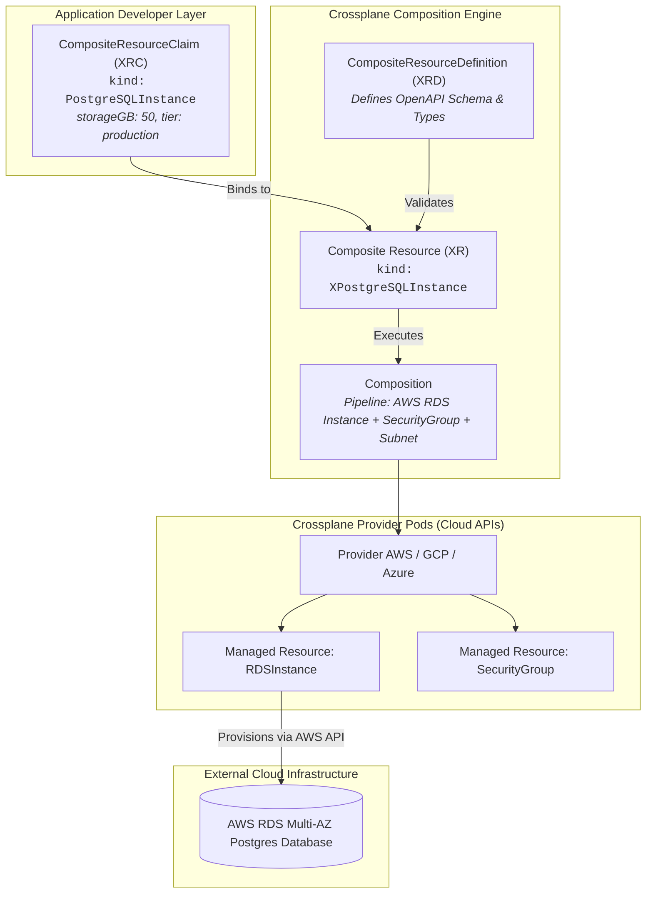

# Chapter 22: Infrastructure as Data with Crossplane

<div class="grid cards" markdown>

-   :material-school: **Topic Focus** &bull; CompositeResourceDefinitions (XRDs), Compositions, Managed Resources, and Developer Claims
-   :material-api: **Primary APIs** &bull; `apiextensions.crossplane.io/v1`, `pkg.crossplane.io/v1` &bull; `CompositeResourceDefinition`, `Composition`
-   :material-rocket-launch: [**Launch Playground in Wasm →**](../playground/index.html?chapter=22){ .md-button .md-button--primary }

</div>

!!! tip "⚡ Interactive Problems in this Chapter (Click to solve in Playground)"
    - [**`crossplane01`**: CompositeResourceDefinition (XRD) Schema →](../playground/index.html?exercise=crossplane01)
    - [**`crossplane02`**: Composition and Field Path Transforms →](../playground/index.html?exercise=crossplane02)
    - [**`crossplane03`**: ProviderConfig and Resource Deletion Policies →](../playground/index.html?exercise=crossplane03)
    - [**`crossplane04`**: Developer Self-Service Claims & Connection Secrets →](../playground/index.html?exercise=crossplane04)

---

## 1. Architectural Overview & Control Plane Mechanics

In Kubernetes, **Infrastructure as Data with Crossplane** is reconciled through declarative state loops managed by the control plane and node daemons:



### 1.1 Architectural Flow & Lifecycle Walkthrough

1. **Composite Resource Definition (XRD) Schema Registration**: A platform engineer defines a `CompositeResourceDefinition` (XRD) specifying an OpenAPI schema for an abstract, self-service infrastructure API (e.g., `kind: PostgreSQLInstance`).
2. **Composition Pipeline Declaration**: The platform engineer authors a `Composition` resource defining how the abstract XRD translates into concrete cloud resources (e.g., an AWS RDS Instance + Security Group + Subnet Group).
3. **Developer Self-Service Claim (XRC)**: An application developer creates a lightweight, namespace-scoped `CompositeResourceClaim` (XRC) requesting a database with high-level parameters (`storageGB: 50, tier: production`).
4. **Crossplane Composition Engine Reconciliation**: The Crossplane core engine binds the XRC to a cluster-scoped `Composite Resource` (XR). The composition engine renders the configured pipeline, instantiating individual `Managed Resources` (MRs) (e.g. `RDSInstance.rds.aws.upbound.io`).
5. **Provider Pod Cloud Actuation**: The provider pod (e.g., `provider-aws-rds`) detects the Managed Resource:
   - Assumes an authorized cloud IAM role via Workload Identity / IRSA.
   - Calls the cloud provider SDK (AWS Go SDK) to provision the real-world RDS database.
   - Streams live cloud status, endpoints, and generated credentials back into a Kubernetes Secret in the developer's application namespace.

### 1.2 Serialization, Protocols & Communication Pathways

- **Cloud Provider REST / JSON SDKs**: Crossplane provider daemons communicate with cloud endpoints (AWS, GCP, Azure APIs) using signed HTTPS JSON/REST calls.
- **OpenAPI v3 Schema Contracts**: XRDs validate composite claims against OpenAPI v3 structural schemas before composition pipelines execute.
- **Kubernetes Secret Payload Streaming**: Connection details (host, port, username, password) are encrypted and stored in `v1.Secret` payloads.

### 1.3 Deep-Dive Component Breakdown

- **CompositeResourceDefinition (XRD)**: Defines the custom API type and OpenAPI validation rules for platform abstractions.
- **Composition**: Reusable blueprint mapping composite resources to underlying cloud Managed Resources (MRs) with patch-and-transform or pipeline functions.
- **Crossplane Provider Pods**: Domain-specific controllers running in the cluster that reconcile Kubernetes MR objects against real cloud provider APIs.
- **Connection Secret Subsystem**: Crossplane mechanism for dynamically capturing generated cloud credentials and writing them to designated tenant namespaces.

### 1.4 Under-The-Hood Mechanics & Failure Modes

- **Cloud API Rate Limiting & Throttling**: Large-scale Crossplane deployments continuously reconciling hundreds of Managed Resources can exceed cloud provider API rate limits (e.g., AWS DescribeDBInstances throttling). Providers must be configured with exponential backoff and tuned polling intervals.
- **Orphan vs Delete Policy Misconfiguration**: Managed Resources default to `spec.deletionPolicy: Delete`. Deleting an MR or its parent claim permanently deletes the physical cloud resource (e.g. terminating the RDS database). Setting `deletionPolicy: Orphan` preserves cloud infrastructure upon Kubernetes object deletion.
- **Composition Patch Field Type Mismatches**: Type mismatches during Patch-and-Transform operations (e.g. attempting to patch an integer port into a string field) fail silently or produce reconciliation errors visible only in `kubectl describe composite`.

---

## 2. Annotated Production YAML Anatomy & Field Reference

Below is a production-grade declarative manifest demonstrating field definitions and operational patterns:

```yaml
apiVersion: apiextensions.crossplane.io/v1
kind: CompositeResourceDefinition
metadata:
  name: xpostgresqlinstances.database.example.org
spec:
  group: database.example.org
  names:
    kind: XPostgreSQLInstance
    plural: xpostgresqlinstances
  claimNames:
    kind: PostgreSQLInstance
    plural: postgresqlinstances
  versions:
  - name: v1alpha1
    served: true
    referenceable: true
    schema:
      openAPIV3Schema:
        type: object
        properties:
          spec:
            type: object
            required: ["storageGB"]
            properties:
              storageGB:
                type: integer
```

### Key Field Schema Reference

| Field | Type | Description |
| :--- | :--- | :--- |
| `CompositeResourceDefinition` (XRD) | `API Contract` | Defines the custom schema exposed to application developers. |
| `Composition` | `Infrastructure Template` | Binds the XRD to specific Managed Resources (e.g. AWS RDS, GCP CloudSQL). |
| `Managed Resource` (MR) | `Cloud Primitive` | Direct representation of cloud resources with continuous state reconciliation. |

---

## 3. Real-World Architectural Patterns

### Application Developer Claim (XRC)

```yaml
apiVersion: database.example.org/v1alpha1
kind: PostgreSQLInstance
metadata:
  name: app-database
  namespace: default
spec:
  storageGB: 20
```

### ProviderConfig IAM Configuration

```yaml
apiVersion: aws.upbound.io/v1beta1
kind: ProviderConfig
metadata:
  name: default
spec:
  credentials:
    source: IRSA
```


---

## 4. Production Hardening & Operational Governance

- Use IAM Roles for Service Accounts (IRSA / Workload Identity) rather than static long-lived cloud API keys.
- Lock Composition schemas with strict validation and automated drift detection.
- Protect critical databases from accidental deletion with `deletionPolicy: Orphan`.

---

## 5. Failure Modes & Diagnostic Triage Tree

??? failure "Managed Resource `Ready=False` / `Synced=False`"
    **Root Cause:** Cloud provider authentication failure or parameter validation error.

    **Diagnostic Triage Sequence:**
    1. Run `kubectl describe <managed-resource> <name>`
    2. Verify ProviderConfig status: `kubectl get providerconfigs`.


---

## 6. Interactive Practice Matrix

Practice concepts from this chapter directly in the interactive WebAssembly sandbox:

| Exercise ID | Challenge Description | Direct Link | Action |
| :--- | :--- | :--- | :--- |
| **`crossplane01`** | CompositeResourceDefinition (XRD) Schema | [`../playground/index.html?exercise=crossplane01`](../playground/index.html?exercise=crossplane01) | [**⚡ Solve `crossplane01` in Playground →**](../playground/index.html?exercise=crossplane01){ .md-button .md-button--primary } |
| **`crossplane02`** | Composition and Field Path Transforms | [`../playground/index.html?exercise=crossplane02`](../playground/index.html?exercise=crossplane02) | [**⚡ Solve `crossplane02` in Playground →**](../playground/index.html?exercise=crossplane02){ .md-button .md-button--primary } |
| **`crossplane03`** | ProviderConfig and Resource Deletion Policies | [`../playground/index.html?exercise=crossplane03`](../playground/index.html?exercise=crossplane03) | [**⚡ Solve `crossplane03` in Playground →**](../playground/index.html?exercise=crossplane03){ .md-button .md-button--primary } |
| **`crossplane04`** | Developer Self-Service Claims & Connection Secrets | [`../playground/index.html?exercise=crossplane04`](../playground/index.html?exercise=crossplane04) | [**⚡ Solve `crossplane04` in Playground →**](../playground/index.html?exercise=crossplane04){ .md-button .md-button--primary } |
