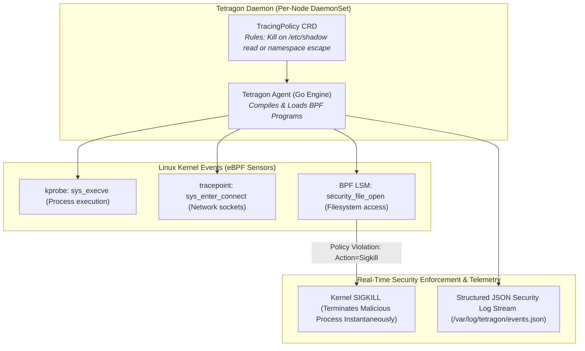

# Chapter 23: Kernel-Level Security & Observability with eBPF Tetragon

<div class="grid cards" markdown>

-   :material-school: **Topic Focus** &bull; Process Execution Auditing, Sensitive File Tracing, Kernel Sigkill Actions, and Socket Probes
-   :material-api: **Primary APIs** &bull; `cilium.io/v1alpha1` &bull; `TracingPolicy`, `TracingPolicyNamespaced`
-   :material-rocket-launch: [**Launch Playground in Wasm →**](../playground/index.html?chapter=23){ .md-button .md-button--primary }

</div>

!!! tip "⚡ Interactive Problems in this Chapter (Click to solve in Playground)"
    - [**`tetragon01`**: Process Execution Tracing with sys_execve →](../playground/index.html?exercise=tetragon01)
    - [**`tetragon02`**: Sensitive File & Credential Access Auditing →](../playground/index.html?exercise=tetragon02)
    - [**`tetragon03`**: Real-Time Kernel Sigkill Enforcement →](../playground/index.html?exercise=tetragon03)
    - [**`tetragon04`**: eBPF TCP Socket & Network Egress Observability →](../playground/index.html?exercise=tetragon04)

---

## 1. Architectural Overview & Control Plane Mechanics

In Kubernetes, **Kernel-Level Security & Observability with eBPF Tetragon** is reconciled through declarative state loops managed by the control plane and node daemons:



### 1.1 Architectural Flow & Lifecycle Walkthrough

1. **Tetragon Daemon Initialization**: The `tetragon` DaemonSet starts on every worker node, mounts the BPF virtual filesystem (`/sys/fs/bpf`), and loads its core eBPF sensor programs into the Linux kernel.
2. **TracingPolicy CRD Ingestion**: Security engineers apply a `TracingPolicy` Custom Resource defining security invariants (e.g., monitoring file access to `/etc/shadow` or blocking raw socket creation in container namespaces).
3. **In-Kernel eBPF Hook Attachment**: The Tetragon agent compiles the policy rules and attaches eBPF programs to targeted Linux kernel hook points:
   - **Kprobes / Kretprobes**: Dynamic kernel function entry and exit tracing (e.g., `sys_execve`, `sys_read`).
   - **Tracepoints**: Static, stable kernel execution points (e.g., `sys_enter_connect`).
   - **BPF LSM (Linux Security Modules)**: Kernel security hooks (`security_file_open`, `security_socket_create`) that possess native authority to block system calls before execution.
4. **Real-Time In-Kernel Enforcement (Synchronous SIGKILL)**: When a compromised process inside a container attempts an unauthorized action (e.g., reading `/etc/shadow`):
   - The BPF LSM hook intercepts the system call in kernel space before the file read executes.
   - If the policy specifies `action: Sigkill`, the eBPF program dispatches a kernel `SIGKILL` directly to the offending process PID, terminating it instantaneously with zero user-space latency.
5. **High-Throughput Security Telemetry Streaming**: Tetragon streams structured JSON security audit events (containing PID, binary path, container ID, namespace, and user ID) from in-kernel lockless ring buffers directly to `/var/log/tetragon/events.json` and SIEM forwarders.

### 1.2 Serialization, Protocols & Communication Pathways

- **eBPF Ring Buffer (`BPF_MAP_TYPE_RINGBUF`)**: Lockless, high-speed memory-mapped circular buffers streaming kernel events to user-space Go agents with sub-microsecond latency.
- **gRPC Event Stream (`tetragon.v1.FineGuidanceSensors`)**: Tetragon daemon streams real-time JSON/Protobuf security events to external SIEMs and `tetra` CLI clients over local Unix domain sockets.
- **ELF (Executable and Linkable Format) Bytecode**: eBPF programs compiled via LLVM into ELF binaries and validated by the Linux in-kernel eBPF verifier.

### 1.3 Deep-Dive Component Breakdown

- **Tetragon Agent**: User-space Go daemon managing BPF program lifecycles, compiling TracingPolicies, and streaming event telemetry.
- **BPF LSM Subsystem**: Linux Security Module framework integrated with eBPF in Linux kernels $\ge 5.7$, providing kernel-enforced preventive access control.
- **In-Kernel Verifier**: Linux kernel safety checker verifying that eBPF programs terminate, avoid out-of-bounds memory access, and do not cause kernel panics.
- **TracingPolicy CRD**: Declarative Kubernetes resource defining syscall hooks, filters, and enforcement actions.

### 1.4 Under-The-Hood Mechanics & Failure Modes

- **Kernel Version Dependency for BPF LSM**: Preventive enforcement (`action: Sigkill` via LSM hooks) requires Linux kernel 5.10+ with `CONFIG_BPF_LSM=y` enabled in kernel boot parameters. On older kernels, Tetragon operates in observation-only mode without kill capabilities.
- **High Syscall Volume Overhead**: Attaching tracing policies to extremely high-frequency syscalls (like `sys_read` or `sys_write` on busy database containers) without restrictive namespace filters can saturate CPU resources and fill kernel ring buffers.
- **Ring Buffer Event Drops**: If user-space log consumers cannot process security events as fast as the kernel emits them, the ring buffer overflows, resulting in dropped event logs indicated by `events_lost` counters.

---

## 2. Annotated Production YAML Anatomy & Field Reference

Below is a production-grade declarative manifest demonstrating field definitions and operational patterns:

```yaml
apiVersion: cilium.io/v1alpha1
kind: TracingPolicy
metadata:
  name: block-privilege-escalation-exec
spec:
  kprobes:
  - call: "sys_execve"
    syscall: true
    args:
    - index: 0
      type: "string"
    selectors:
    - matchArgs:
      - index: 0
        operator: "Prefix"
        values:
        - "/bin/nc"
        - "/usr/bin/ncat"
        - "/bin/netcat"
      matchActions:
      - action: Sigkill
```

### Key Field Schema Reference

| Field | Type | Description |
| :--- | :--- | :--- |
| `kprobes` | `Array` | Attaches eBPF probes to kernel symbols and system calls. |
| `selectors[*].matchArgs` | `Array` | Filters system call arguments (file paths, sockets, flags). |
| `selectors[*].matchActions` | `Array` | Action dispatched upon match (e.g. `Sigkill` terminates process immediately in kernel). |

---

## 3. Real-World Architectural Patterns

### Detect Sensitive File Access (/etc/shadow)

```yaml
apiVersion: cilium.io/v1alpha1
kind: TracingPolicy
metadata:
  name: detect-shadow-file-access
spec:
  kprobes:
  - call: "fd_install"
    syscall: false
    args:
    - index: 1
      type: "file"
    selectors:
    - matchArgs:
      - index: 1
        operator: "Prefix"
        values:
        - "/etc/shadow"
      matchActions:
      - action: Post
```

### Namespaced Tracing Policy for Production Workloads

```yaml
apiVersion: cilium.io/v1alpha1
kind: TracingPolicyNamespaced
metadata:
  name: restrict-shell-in-pod
  namespace: payment-apps
spec:
  kprobes:
  - call: "sys_execve"
    syscall: true
    args:
    - index: 0
      type: "string"
    selectors:
    - matchArgs:
      - index: 0
        operator: "Prefix"
        values: ["/bin/sh", "/bin/bash"]
      matchActions:
      - action: Sigkill
```


---

## 4. Production Hardening & Operational Governance

- Use `Sigkill` actions on reverse shell binaries (`nc`, `ncat`, `socat`) in production namespaces.
- Enforce Namespaced TracingPolicies so security rules follow application boundaries.
- Forward Tetragon JSON audit logs (`tetra getevents -o compact`) to SIEM systems for forensic audits.

---

## 5. Failure Modes & Diagnostic Triage Tree

??? failure "Process Terminated Unexpectedly with `SIGKILL`"
    **Root Cause:** Workload executed a binary blocked by an active TracingPolicy.

    **Diagnostic Triage Sequence:**
    1. Inspect Tetragon logs: `kubectl logs -n kube-system -l app.kubernetes.io/name=tetragon -c tetragon --tail=100`
    2. Stream live events: `tetra getevents --namespace <namespace>`


---

## 6. Interactive Practice Matrix

Practice concepts from this chapter directly in the interactive WebAssembly sandbox:

| Exercise ID | Challenge Description | Direct Link | Action |
| :--- | :--- | :--- | :--- |
| **`tetragon01`** | Process Execution Tracing with sys_execve | [`../playground/index.html?exercise=tetragon01`](../playground/index.html?exercise=tetragon01) | [**⚡ Solve `tetragon01` in Playground →**](../playground/index.html?exercise=tetragon01){ .md-button .md-button--primary } |
| **`tetragon02`** | Sensitive File & Credential Access Auditing | [`../playground/index.html?exercise=tetragon02`](../playground/index.html?exercise=tetragon02) | [**⚡ Solve `tetragon02` in Playground →**](../playground/index.html?exercise=tetragon02){ .md-button .md-button--primary } |
| **`tetragon03`** | Real-Time Kernel Sigkill Enforcement | [`../playground/index.html?exercise=tetragon03`](../playground/index.html?exercise=tetragon03) | [**⚡ Solve `tetragon03` in Playground →**](../playground/index.html?exercise=tetragon03){ .md-button .md-button--primary } |
| **`tetragon04`** | eBPF TCP Socket & Network Egress Observability | [`../playground/index.html?exercise=tetragon04`](../playground/index.html?exercise=tetragon04) | [**⚡ Solve `tetragon04` in Playground →**](../playground/index.html?exercise=tetragon04){ .md-button .md-button--primary } |
