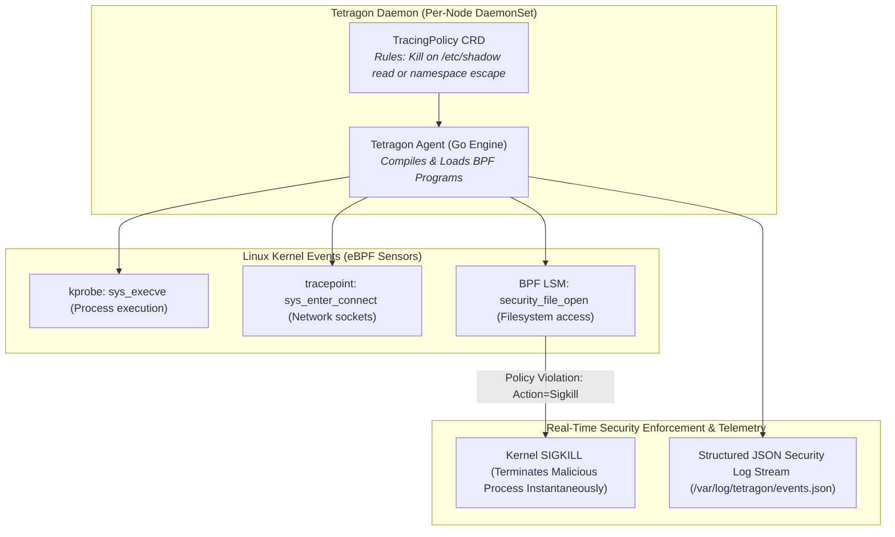

# Chapter 23: Kernel-Level Security & Observability with eBPF Tetragon

<div class="grid cards" markdown>

-   :material-school: **Topic Focus** &bull; Process Execution Auditing, Sensitive File Tracing, Kernel Sigkill Actions, and Socket Probes
-   :material-api: **Primary APIs** &bull; `cilium.io/v1alpha1` &bull; `TracingPolicy`, `TracingPolicyNamespaced`
-   :material-rocket-launch: [**Launch Playground in Wasm →**](../playground/index.html?chapter=23){ .md-button .md-button--primary }

</div>

!!! tip "⚡ Interactive Problems in this Chapter (Click to solve in Playground)"
    - [**`tetragon01`**: Process Execution Tracing with sys_execve →](../playground/index.html?exercise=tetragon01)
    - [**`tetragon02`**: Sensitive File & Credential Access Auditing →](../playground/index.html?exercise=tetragon02)
    - [**`tetragon03`**: Real-Time Kernel Sigkill Enforcement →](../playground/index.html?exercise=tetragon03)
    - [**`tetragon04`**: eBPF TCP Socket & Network Egress Observability →](../playground/index.html?exercise=tetragon04)

---

## 1. Architectural Overview & Control Plane Mechanics

In Kubernetes, **Kernel-Level Security & Observability with eBPF Tetragon** is reconciled through declarative state loops managed by the control plane:



When resources in this chapter are submitted, the `kube-apiserver` validates the OpenAPI v3 schema, stores state in `etcd`, and triggers the responsible controllers or node daemons to reconcile actual cluster state.

---

## 2. Annotated Production YAML Anatomy & Field Reference

Below is a production-grade declarative manifest demonstrating field definitions and operational patterns:

```yaml
apiVersion: cilium.io/v1alpha1
kind: TracingPolicy
metadata:
  name: block-privilege-escalation-exec
spec:
  kprobes:
  - call: "sys_execve"
    syscall: true
    args:
    - index: 0
      type: "string"
    selectors:
    - matchArgs:
      - index: 0
        operator: "Prefix"
        values:
        - "/bin/nc"
        - "/usr/bin/ncat"
        - "/bin/netcat"
      matchActions:
      - action: Sigkill
```

### Key Field Schema Reference

| Field | Type | Description |
| :--- | :--- | :--- |
| `kprobes` | `Array` | Attaches eBPF probes to kernel symbols and system calls. |
| `selectors[*].matchArgs` | `Array` | Filters system call arguments (file paths, sockets, flags). |
| `selectors[*].matchActions` | `Array` | Action dispatched upon match (e.g. `Sigkill` terminates process immediately in kernel). |

---

## 3. Real-World Architectural Patterns

### Detect Sensitive File Access (/etc/shadow)

```yaml
apiVersion: cilium.io/v1alpha1
kind: TracingPolicy
metadata:
  name: detect-shadow-file-access
spec:
  kprobes:
  - call: "fd_install"
    syscall: false
    args:
    - index: 1
      type: "file"
    selectors:
    - matchArgs:
      - index: 1
        operator: "Prefix"
        values:
        - "/etc/shadow"
      matchActions:
      - action: Post
```

### Namespaced Tracing Policy for Production Workloads

```yaml
apiVersion: cilium.io/v1alpha1
kind: TracingPolicyNamespaced
metadata:
  name: restrict-shell-in-pod
  namespace: payment-apps
spec:
  kprobes:
  - call: "sys_execve"
    syscall: true
    args:
    - index: 0
      type: "string"
    selectors:
    - matchArgs:
      - index: 0
        operator: "Prefix"
        values: ["/bin/sh", "/bin/bash"]
      matchActions:
      - action: Sigkill
```


---

## 4. Production Hardening & Operational Governance

- Use `Sigkill` actions on reverse shell binaries (`nc`, `ncat`, `socat`) in production namespaces.
- Enforce Namespaced TracingPolicies so security rules follow application boundaries.
- Forward Tetragon JSON audit logs (`tetra getevents -o compact`) to SIEM systems for forensic audits.

---

## 5. Failure Modes & Diagnostic Triage Tree

??? failure "Process Terminated Unexpectedly with `SIGKILL`"
    **Root Cause:** Workload executed a binary blocked by an active TracingPolicy.

    **Diagnostic Triage Sequence:**
    1. Inspect Tetragon logs: `kubectl logs -n kube-system -l app.kubernetes.io/name=tetragon -c tetragon --tail=100`
    2. Stream live events: `tetra getevents --namespace <namespace>`


---

## 6. Interactive Practice Matrix

Practice concepts from this chapter directly in the interactive WebAssembly sandbox:

| Exercise ID | Challenge Description | Direct Link | Action |
| :--- | :--- | :--- | :--- |
| **`tetragon01`** | Process Execution Tracing with sys_execve | [`../playground/index.html?exercise=tetragon01`](../playground/index.html?exercise=tetragon01) | [**⚡ Solve `tetragon01` in Playground →**](../playground/index.html?exercise=tetragon01){ .md-button .md-button--primary } |
| **`tetragon02`** | Sensitive File & Credential Access Auditing | [`../playground/index.html?exercise=tetragon02`](../playground/index.html?exercise=tetragon02) | [**⚡ Solve `tetragon02` in Playground →**](../playground/index.html?exercise=tetragon02){ .md-button .md-button--primary } |
| **`tetragon03`** | Real-Time Kernel Sigkill Enforcement | [`../playground/index.html?exercise=tetragon03`](../playground/index.html?exercise=tetragon03) | [**⚡ Solve `tetragon03` in Playground →**](../playground/index.html?exercise=tetragon03){ .md-button .md-button--primary } |
| **`tetragon04`** | eBPF TCP Socket & Network Egress Observability | [`../playground/index.html?exercise=tetragon04`](../playground/index.html?exercise=tetragon04) | [**⚡ Solve `tetragon04` in Playground →**](../playground/index.html?exercise=tetragon04){ .md-button .md-button--primary } |
