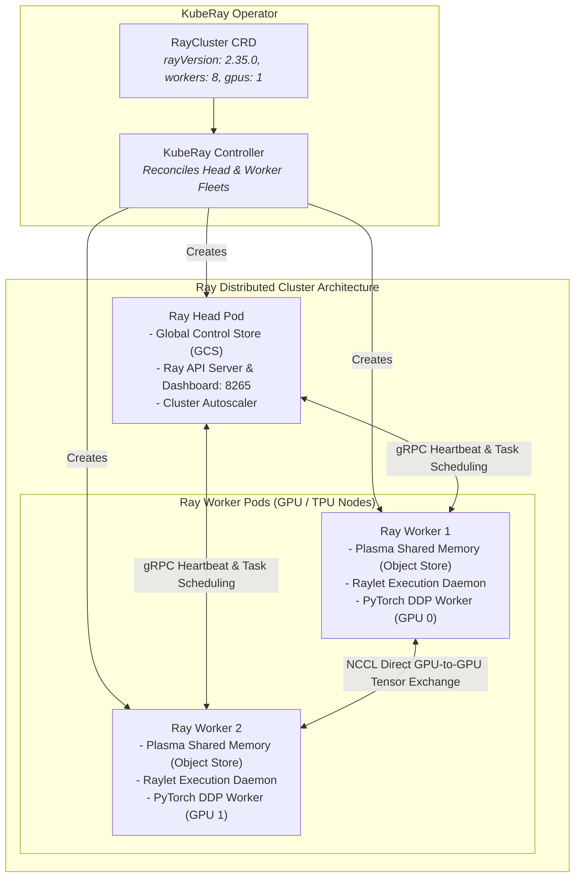

# Chapter 24: Distributed AI & ML Orchestration with KubeRay

<div class="grid cards" markdown>

-   :material-school: **Topic Focus** &bull; RayCluster Architectures, Heterogeneous Worker Pools, RayJob Batch Fine-Tuning, and RayService Serving
-   :material-api: **Primary APIs** &bull; `ray.io/v1` &bull; `RayCluster`, `RayJob`, `RayService`
-   :material-rocket-launch: [**Launch Playground in Wasm →**](../playground/index.html?chapter=24){ .md-button .md-button--primary }

</div>

!!! tip "⚡ Interactive Problems in this Chapter (Click to solve in Playground)"
    - [**`ray01`**: RayCluster Core Architecture & Head Node →](../playground/index.html?exercise=ray01)
    - [**`ray02`**: Heterogeneous Worker Pools & Autoscaling →](../playground/index.html?exercise=ray02)
    - [**`ray03`**: RayJob for Distributed Batch Fine-Tuning →](../playground/index.html?exercise=ray03)
    - [**`ray04`**: RayService for Production LLM Serving →](../playground/index.html?exercise=ray04)

---

## 1. Architectural Overview & Control Plane Mechanics

In Kubernetes, **Distributed AI & ML Orchestration with KubeRay** is reconciled through declarative state loops managed by the control plane and node daemons:



### 1.1 Architectural Flow & Lifecycle Walkthrough

1. **RayCluster CR Submission**: An ML platform engineer submits a `RayCluster` CR declaring head node configurations and dynamic worker node groups with GPU/TPU resource allocations.
2. **KubeRay Controller Reconciliation**: The `kuberay-operator` detects the CR:
   - Creates the **Ray Head Pod** hosting the Global Control Store (GCS), Ray API Server, Dashboard (port 8265), and Cluster Autoscaler.
   - Creates a Kubernetes `Service` providing stable DNS endpoints to the Ray Head.
   - Spawns the desired count of **Ray Worker Pods** across GPU-accelerated worker nodes.
3. **Raylet Daemon & Plasma Store Startup**: Inside each Worker Pod:
   - The `raylet` daemon starts and registers with the Ray Head's GCS via gRPC heartbeats over port 6379.
   - Allocates a dedicated Linux shared memory segment (`/dev/shm`) backing the **Plasma Object Store** for ultra-fast, zero-copy deserialization of distributed NumPy/PyTorch arrays.
4. **Distributed Task Scheduling & Execution**: A distributed training script connects to the Ray Head:
   - Ray Head schedules tasks and actors across available Worker Pods based on GPU availability and data locality.
   - Ray workers exchange intermediate tensor gradients directly using **NCCL (NVIDIA Collective Communications Library)** over high-speed RoCE/InfiniBand or VPC networks.
5. **Dynamic Ray Cluster Autoscaling**: The embedded Ray Autoscaler monitors queue length and pending actor requests, issuing API calls to `kuberay-operator` to dynamically scale worker replica counts up or down.

### 1.2 Serialization, Protocols & Communication Pathways

- **Apache Arrow Plasma Shared Memory**: Zero-copy in-memory object store utilizing Apache Arrow binary IPC format for direct tensor memory sharing between co-located worker processes.
- **gRPC over TCP / HTTP/2**: Inter-node control messaging between `raylet` daemons and Ray Head Global Control Store (GCS).
- **NCCL Direct Peer-to-Peer Protocol**: Low-latency GPU-to-GPU memory exchange bypassing host CPU and OS networking stack via NVIDIA NVLink or GPUDirect RDMA.

### 1.3 Deep-Dive Component Breakdown

- **kuberay-operator**: Kubernetes controller managing the complete lifecycle of Ray clusters, RayJobs, and RayServices.
- **Ray Head Pod**: Central coordinator running the Global Control Store (GCS metadata), task scheduler, autoscaler, and monitoring dashboard.
- **Ray Worker Pods**: Scalable execution fleet running user ML code, Python workers, and local Plasma shared memory stores.
- **NCCL / NVLink Mesh**: High-bandwidth inter-GPU interconnect topology enabling multi-node distributed training (PyTorch DDP, DeepSpeed, Megatron-LM).

### 1.4 Under-The-Hood Mechanics & Failure Modes

- **`/dev/shm` Size Starvation**: Docker and Kubernetes default `/dev/shm` to 64MB unless an `emptyDir` with `medium: Memory` is explicitly mounted. Plasma Object Store startup will crash with `Out of memory: Plasma store failed to allocate memory`.
- **NCCL Ring Communication Timeout**: If firewall rules or NetworkPolicies block high-port TCP/RDMA traffic between worker pods, distributed training hangs indefinitely during tensor synchronization before failing with `NCCL WARN: Call to connect returned Connection timed out`.
- **GCS Redis Heartbeat Loss**: Heavy CPU contention on the Ray Head node can delay heartbeat processing, prompting the head to falsely declare healthy worker nodes dead and terminating in-flight training jobs.

---

## 2. Annotated Production YAML Anatomy & Field Reference

Below is a production-grade declarative manifest demonstrating field definitions and operational patterns:

```yaml
apiVersion: ray.io/v1
kind: RayCluster
metadata:
  name: distributed-training-cluster
  namespace: ml-workloads
spec:
  rayVersion: "2.35.0"
  headGroupSpec:
    rayStartParams:
      dashboard-host: "0.0.0.0"
    template:
      spec:
        containers:
        - name: ray-head
          image: rayproject/ray:2.35.0-py310
          resources:
            limits:
              cpu: "2"
              memory: "8Gi"
            requests:
              cpu: "1"
              memory: "4Gi"
  workerGroupSpecs:
  - groupName: gpu-workers
    replicas: 2
    minReplicas: 1
    maxReplicas: 8
    rayStartParams: {}
    template:
      spec:
        containers:
        - name: ray-worker
          image: rayproject/ray:2.35.0-py310-gpu
          resources:
            limits:
              cpu: "4"
              memory: "16Gi"
            requests:
              cpu: "2"
              memory: "8Gi"
```

### Key Field Schema Reference

| Field | Type | Description |
| :--- | :--- | :--- |
| `headGroupSpec` | `Object` | Configuration for Ray Head node (Global Control Store, scheduler, web dashboard). |
| `workerGroupSpecs` | `Array` | Heterogeneous worker pools (CPU, GPU, high-memory) with independent autoscaling bounds. |
| `RayJob` / `RayService` | `CRD` | `RayJob` submits batch training tasks to completion; `RayService` provides zero-downtime serving with Ray Serve. |

---

## 3. Real-World Architectural Patterns

### RayJob Batch Submission Spec

```yaml
apiVersion: ray.io/v1
kind: RayJob
metadata:
  name: llm-finetuning-job
  namespace: ml-workloads
spec:
  entrypoint: "python train.py --epochs 10"
  shutdownAfterJobFinishes: true
  rayClusterSpec:
    rayVersion: "2.35.0"
    headGroupSpec:
      template:
        spec:
          containers:
          - name: ray-head
            image: rayproject/ray:2.35.0
```

### RayService for Multi-Model Inference

```yaml
apiVersion: ray.io/v1
kind: RayService
metadata:
  name: embedding-service
  namespace: ml-workloads
spec:
  serviceUnhealthyThreshold: 300
  rayClusterConfig:
    rayVersion: "2.35.0"
    headGroupSpec:
      template:
        spec:
          containers:
          - name: ray-head
            image: rayproject/ray:2.35.0
```


---

## 4. Production Hardening & Operational Governance

- Use `shutdownAfterJobFinishes: true` on `RayJob` resources to release expensive cloud GPU instances immediately after training.
- Deploy Ray clusters in isolated namespaces paired with ResourceQuotas.
- Expose the Ray Dashboard (port 8265) through secure Ingress with OAuth/OIDC authentication.

---

## 5. Failure Modes & Diagnostic Triage Tree

??? failure "Ray Worker Nodes Not Joining Cluster"
    **Root Cause:** GCS connection failure or mismatched `rayVersion`.

    **Diagnostic Triage Sequence:**
    1. Inspect Head logs: `kubectl logs <head-pod-name> -c ray-head`
    2. Inspect Worker logs: `kubectl logs <worker-pod-name> -c ray-worker`


---

## 6. Interactive Practice Matrix

Practice concepts from this chapter directly in the interactive WebAssembly sandbox:

| Exercise ID | Challenge Description | Direct Link | Action |
| :--- | :--- | :--- | :--- |
| **`ray01`** | RayCluster Core Architecture & Head Node | [`../playground/index.html?exercise=ray01`](../playground/index.html?exercise=ray01) | [**⚡ Solve `ray01` in Playground →**](../playground/index.html?exercise=ray01){ .md-button .md-button--primary } |
| **`ray02`** | Heterogeneous Worker Pools & Autoscaling | [`../playground/index.html?exercise=ray02`](../playground/index.html?exercise=ray02) | [**⚡ Solve `ray02` in Playground →**](../playground/index.html?exercise=ray02){ .md-button .md-button--primary } |
| **`ray03`** | RayJob for Distributed Batch Fine-Tuning | [`../playground/index.html?exercise=ray03`](../playground/index.html?exercise=ray03) | [**⚡ Solve `ray03` in Playground →**](../playground/index.html?exercise=ray03){ .md-button .md-button--primary } |
| **`ray04`** | RayService for Production LLM Serving | [`../playground/index.html?exercise=ray04`](../playground/index.html?exercise=ray04) | [**⚡ Solve `ray04` in Playground →**](../playground/index.html?exercise=ray04){ .md-button .md-button--primary } |
