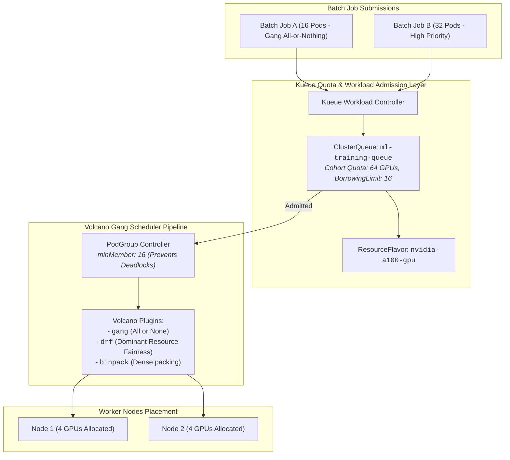

# Chapter 25: AI Batch Scheduling & Queuing with Kueue and Volcano

<div class="grid cards" markdown>

-   :material-school: **Topic Focus** &bull; Kueue Cohort Borrowing, Suspended Workloads, Volcano Gang Scheduling, and Fair-Share Queues
-   :material-api: **Primary APIs** &bull; `kueue.x-k8s.io/v1beta1`, `scheduling.volcano.sh/v1beta1` &bull; `ClusterQueue`, `LocalQueue`, `PodGroup`
-   :material-rocket-launch: [**Launch Playground in Wasm →**](../playground/index.html?chapter=25){ .md-button .md-button--primary }

</div>

!!! tip "⚡ Interactive Problems in this Chapter (Click to solve in Playground)"
    - [**`kueue01`**: Kueue ResourceFlavor & ClusterQueue Cohort Borrowing →](../playground/index.html?exercise=kueue01)
    - [**`kueue02`**: Kueue LocalQueue & Suspended Workload Gating →](../playground/index.html?exercise=kueue02)
    - [**`volcano01`**: Volcano Gang Scheduling & Deadlock Prevention →](../playground/index.html?exercise=volcano01)
    - [**`volcano02`**: Volcano Queue & Fair-Share Scheduling →](../playground/index.html?exercise=volcano02)

---

## 1. Architectural Overview & Control Plane Mechanics

In Kubernetes, **AI Batch Scheduling & Queuing with Kueue and Volcano** is reconciled through declarative state loops managed by the control plane and node daemons:



### 1.1 Architectural Flow & Lifecycle Walkthrough

1. **Batch Job Submission**: An ML engineer submits multi-pod batch workloads (e.g. PyTorch distributed jobs requiring 16 pods concurrently) referencing a `kueue.x-k8s.io/queue-name: ml-team-queue`.
2. **Kueue Admission & Quota Evaluation**: The `kueue-controller-manager` intercepts the Job:
   - Matches the job against the target `ClusterQueue` and its associated `ResourceFlavors` (e.g., `nvidia-a100-gpu`).
   - Evaluates real-time quota usage across multi-tenant cohorts, calculating nominal quotas and borrowing limits from idle shared quotas.
   - If quota is available, Kueue **admits** the workload, transitioning `Workload.status.conditions[Admitted] = True`. If quota is exhausted, the workload is queued in priority order without creating pending pods.
3. **Volcano Gang Scheduler Activation**: The admitted workload creates a `PodGroup` resource managed by the `volcano-scheduler`:
   - Declares `minMember: 16` (the minimum number of pods required for the job to function).
4. **Gang All-or-Nothing Scheduling Pipeline**:
   - Volcano evaluates cluster nodes in a single atomic scheduling transaction.
   - If all 16 pods can be placed simultaneously across eligible GPU nodes, Volcano binds all 16 pods in unison.
   - If only 12 nodes are available, Volcano places **zero** pods, preventing resource deadlock where two competing jobs hold partial allocations and neither can proceed.
5. **Node Placement & Plugin Execution**: Volcano executes scheduling plugins (Dominant Resource Fairness `drf`, `binpack`, and `gang`), packing pods densely onto worker nodes to minimize node fragmentation.

### 1.2 Serialization, Protocols & Communication Pathways

- **Kueue Workload CRD API**: Workload specifications, resource flavors, and cohort quota reservations serialized as JSON/Protobuf across Kubernetes API endpoints.
- **Volcano PodGroup Protocol**: Gang scheduling synchronization protocol tracking `minMember` admission barriers in-memory within the custom scheduler binary.
- **Prometheus Metric Telemetry**: Real-time export of queue depths, waiting times, and quota borrowing metrics.

### 1.3 Deep-Dive Component Breakdown

- **Kueue Controller**: Job-level admission controller managing multi-tenant queues, cohort resource borrowing, and preemption policies.
- **Volcano Custom Scheduler**: High-performance batch scheduler replacing `kube-scheduler` for gang scheduling, task topology awareness, and fair-share scheduling.
- **ClusterQueue & LocalQueue**: Hierarchical queue abstractions separating cluster-wide administrative quota allocations from namespace-scoped developer queues.
- **PodGroup CRD**: Logical grouping of co-dependent pods requiring all-or-nothing scheduling and coordinated failure handling.

### 1.4 Under-The-Hood Mechanics & Failure Modes

- **Deadlock from Non-Gang Schedulers**: Using standard `kube-scheduler` on multi-node distributed training jobs can lead to deadlocks where Job A claims 8 GPUs on Node 1 and Job B claims 8 GPUs on Node 2, leaving both jobs stuck in pending states indefinitely.
- **Kueue Workload Unmanaged Job Leaks**: If a batch job is deleted manually without deleting its corresponding Kueue `Workload` object, quota reservations may remain locked in the `ClusterQueue`, blocking subsequent jobs from admission.
- **Cohort Borrowing Preemption Storms**: When an idle cohort reclaims borrowed quota, aggressive preemption can abruptly terminate dozens of running batch jobs. Setting `reclaimWithinCohort: LowerPriority` ensures only lower-priority borrowed workloads are preempted.

---

## 2. Annotated Production YAML Anatomy & Field Reference

Below is a production-grade declarative manifest demonstrating field definitions and operational patterns:

```yaml
apiVersion: kueue.x-k8s.io/v1beta1
kind: ClusterQueue
metadata:
  name: research-cluster-queue
spec:
  namespaceSelector: {}
  cohort: engineering-cohort
  resourceGroups:
  - coveredResources: ["cpu", "memory", "nvidia.com/gpu"]
    flavors:
    - name: standard-flavor
      resources:
      - name: "cpu"
        nominalQuota: "32"
        borrowingLimit: "16"
      - name: "memory"
        nominalQuota: 128Gi
      - name: "nvidia.com/gpu"
        nominalQuota: "8"
---
apiVersion: kueue.x-k8s.io/v1beta1
kind: LocalQueue
metadata:
  name: research-team-queue
  namespace: research-ns
spec:
  clusterQueue: research-cluster-queue
```

### Key Field Schema Reference

| Field | Type | Description |
| :--- | :--- | :--- |
| `ClusterQueue` | `Cluster Resource` | Pools cluster-wide compute resources and establishes quotas, borrowing limits, and preemption policies. |
| `cohort` | `String` | Enables capacity sharing: queues in the same cohort can borrow unused quota from sister queues. |
| `LocalQueue` | `Namespace Resource` | Submission queue in a specific namespace pointing to an upstream ClusterQueue. |

---

## 3. Real-World Architectural Patterns

### Volcano Gang Scheduling PodGroup

```yaml
apiVersion: scheduling.volcano.sh/v1beta1
kind: PodGroup
metadata:
  name: distributed-training-pg
  namespace: default
spec:
  minMember: 4
  minResources:
    cpu: "8"
    memory: "32Gi"
```

### Kueue-Managed Batch Job Submission

```yaml
apiVersion: batch/v1
kind: Job
metadata:
  name: sample-batch-analysis
  namespace: research-ns
  labels:
    kueue.x-k8s.io/queue-name: research-team-queue
spec:
  parallelism: 4
  completions: 4
  template:
    spec:
      restartPolicy: Never
      containers:
      - name: worker
        image: python:3.12-slim
        command: ["python", "-c", "print('Batch step complete')"]
```


---

## 4. Production Hardening & Operational Governance

- Use Gang Scheduling (`minMember`) for distributed PyTorch/JAX training to avoid deadlock where half the workers occupy GPUs waiting forever for missing peers.
- Establish `borrowingLimit` bounds to prevent a single team from monopolizing cohort resources.
- Enable preemption rules to allow high-priority production jobs to reclaim borrowed capacity.

---

## 5. Failure Modes & Diagnostic Triage Tree

??? failure "Job Inactive / Workload Not Admitted by Kueue"
    **Root Cause:** ClusterQueue nominal quota and borrowing limits are exhausted.

    **Diagnostic Triage Sequence:**
    1. Inspect Kueue Workload: `kubectl get workloads -n <namespace>`
    2. Check ClusterQueue status: `kubectl describe clusterqueue <name>`


---

## 6. Interactive Practice Matrix

Practice concepts from this chapter directly in the interactive WebAssembly sandbox:

| Exercise ID | Challenge Description | Direct Link | Action |
| :--- | :--- | :--- | :--- |
| **`kueue01`** | Kueue ResourceFlavor & ClusterQueue Cohort Borrowing | [`../playground/index.html?exercise=kueue01`](../playground/index.html?exercise=kueue01) | [**⚡ Solve `kueue01` in Playground →**](../playground/index.html?exercise=kueue01){ .md-button .md-button--primary } |
| **`kueue02`** | Kueue LocalQueue & Suspended Workload Gating | [`../playground/index.html?exercise=kueue02`](../playground/index.html?exercise=kueue02) | [**⚡ Solve `kueue02` in Playground →**](../playground/index.html?exercise=kueue02){ .md-button .md-button--primary } |
| **`volcano01`** | Volcano Gang Scheduling & Deadlock Prevention | [`../playground/index.html?exercise=volcano01`](../playground/index.html?exercise=volcano01) | [**⚡ Solve `volcano01` in Playground →**](../playground/index.html?exercise=volcano01){ .md-button .md-button--primary } |
| **`volcano02`** | Volcano Queue & Fair-Share Scheduling | [`../playground/index.html?exercise=volcano02`](../playground/index.html?exercise=volcano02) | [**⚡ Solve `volcano02` in Playground →**](../playground/index.html?exercise=volcano02){ .md-button .md-button--primary } |
