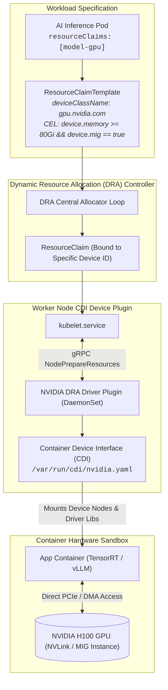

# Chapter 26: Hardware Acceleration: NVIDIA MIG, Apple Silicon GPU & DRA

<div class="grid cards" markdown>

-   :material-school: **Topic Focus** &bull; NVIDIA MIG Slicing, Apple Silicon GPU / MPS Acceleration, Dynamic Resource Allocation (DRA), and Production vLLM LLM Serving
-   :material-api: **Primary APIs** &bull; `resource.k8s.io/v1alpha3` &bull; `ResourceClaim`, `ResourceClaimTemplate`, `DeviceClass`
-   :material-rocket-launch: [**Launch Playground in Wasm →**](../playground/index.html?chapter=26){ .md-button .md-button--primary }

</div>

!!! tip "⚡ Interactive Problems in this Chapter (Click to solve in Playground)"
    - [**`accel01`**: NVIDIA MIG Slicing & Partitioning →](../playground/index.html?exercise=accel01)
    - [**`accel02`**: Apple Silicon GPU & Metal MPS Acceleration →](../playground/index.html?exercise=accel02)
    - [**`accel03`**: Dynamic Resource Allocation (DRA) Standard →](../playground/index.html?exercise=accel03)
    - [**`accel04`**: Production vLLM LLM Inference Server →](../playground/index.html?exercise=accel04)

---

## 1. Architectural Overview & Control Plane Mechanics

In Kubernetes, **Hardware Acceleration: NVIDIA MIG, Apple Silicon GPU & DRA** is reconciled through declarative state loops managed by the control plane and node daemons:



### 1.1 Architectural Flow & Lifecycle Walkthrough

1. **Workload Hardware Claim Specification**: An AI inference Pod declares a dynamic resource requirement via `spec.resourceClaims[*].resourceClaimTemplateName`, referencing a `ResourceClaimTemplate`.
2. **CEL Hardware Device Filtering**: The `ResourceClaimTemplate` specifies structured device matching rules evaluated via **Common Expression Language (CEL)** (e.g., `device.memory >= 80Gi && device.mig == true`).
3. **Dynamic Resource Allocation (DRA) Controller Binding**:
   - The centralized DRA driver controller evaluates available hardware devices reported by node driver plugins.
   - Matches the CEL constraints against candidate GPUs (e.g. NVIDIA H100 with NVLink).
   - Allocates the specific physical device ID and generates a bound `ResourceClaim` object in the API server.
4. **Node Preparation via CDI gRPC (`NodePrepareResources`)**:
   - When the Pod is scheduled to the selected node, `kubelet` calls the node's NVIDIA DRA Driver Plugin via gRPC `NodePrepareResources`.
   - The plugin provisions the hardware slice and writes a **Container Device Interface (CDI)** JSON/YAML specification to `/var/run/cdi/nvidia.yaml`.
5. **Container Runtime CDI Injection**:
   - The container runtime (`containerd` / `CRI-O`) reads the CDI specification.
   - Injects the designated device nodes (`/dev/nvidia0`, `/dev/nvidiactl`), Linux IPC capabilities, and driver libraries directly into the container's OCI runtime specification without requiring privileged mode.
6. **Direct Hardware Execution**: The containerized TensorRT / vLLM runtime executes directly against the physical GPU hardware via PCIe DMA and NVLink.

### 1.2 Serialization, Protocols & Communication Pathways

- **Container Device Interface (CDI v0.5.0+) Schema**: Standardized JSON/YAML device definition schema describing host device nodes, mount paths, environment variables, and Linux cgroup permissions.
- **DRA Driver gRPC Protocol (`kubelet.v1alpha1.DRAPlugin`)**: High-speed gRPC interface between `kubelet` and out-of-tree hardware vendor plugins over local Unix domain sockets.
- **Common Expression Language (CEL)**: In-process expression language compiling hardware selector queries with strict memory and execution bounds.

### 1.3 Deep-Dive Component Breakdown

- **Dynamic Resource Allocation (DRA) Controller**: Kubernetes resource scheduler subsystem replacing coarse integer device counting with fine-grained, stateful hardware parameter allocation.
- **Container Device Interface (CDI)**: Standardized specification allowing third-party device vendors to configure container runtimes without vendor-specific runtime plugins.
- **NVIDIA DRA Driver Plugin**: Node DaemonSet responsible for GPU discovery, MIG (Multi-Instance GPU) slicing, and CDI manifest generation.
- **ResourceClaim & ResourceClaimTemplate**: Kubernetes declarative APIs defining dynamic hardware requests and tracking allocated physical device bindings.

### 1.4 Under-The-Hood Mechanics & Failure Modes

- **CDI File Permission / Injection Failures**: If the CDI specification file in `/var/run/cdi/` is corrupted or has incorrect filesystem permissions, the container runtime fails container creation with `CDI device injection failed`.
- **MIG Partition Allocation Conflicts**: Requesting specific Multi-Instance GPU (MIG) slice profiles (e.g. `1g.10gb`) on a GPU already configured with conflicting slice geometries requires dynamic repartitioning, failing if active processes occupy other slices.
- **Driver Version Mismatch between Host and Container**: Utilizing CUDA libraries in the container image that require a higher NVIDIA kernel driver version than the host node's installed driver causes initialization to fail with `CUDA driver version is insufficient for CUDA runtime version`.

---

## 2. Annotated Production YAML Anatomy & Field Reference

Below is a production-grade declarative manifest demonstrating field definitions and operational patterns:

```yaml
apiVersion: resource.k8s.io/v1alpha3
kind: ResourceClaim
metadata:
  name: gpu-claim
  namespace: default
spec:
  devices:
    requests:
    - name: high-mem-gpu
      deviceClassName: gpu.nvidia.com
      selectors:
      - cel:
          expression: "device.attributes['gpu.nvidia.com'].memory >= 24 * 1024 * 1024 * 1024"
---
apiVersion: v1
kind: Pod
metadata:
  name: dra-accelerated-inference
  namespace: default
spec:
  resourceClaims:
  - name: gpu-resource
    resourceClaimName: gpu-claim
  containers:
  - name: inference-engine
    image: nvidia/cuda:12.4.1-runtime-ubuntu22.04
    command: ["nvidia-smi"]
    resources:
      claims:
      - name: gpu-resource
```

### Key Field Schema Reference

| Field | Type | Description |
| :--- | :--- | :--- |
| `DeviceClass` | `Cluster Resource` | Defines the hardware class and selecting driver (e.g. `gpu.nvidia.com`, `dra.intel.com`). |
| `ResourceClaim` | `Claim Resource` | Requests fine-grained device properties (memory, architecture, interconnects) using CEL expressions. |
| `spec.resourceClaims` | `Pod Spec` | Binds claims to container instances dynamically during scheduling. |

---

## 3. Real-World Architectural Patterns

### NVIDIA Multi-Instance GPU (MIG) Partitioning

```yaml
apiVersion: v1
kind: Pod
metadata:
  name: mig-partitioned-pod
spec:
  containers:
  - name: cuda-task
    image: nvidia/cuda:12.4.1-base-ubuntu22.04
    resources:
      limits:
        nvidia.com/mig-1g.10gb: 1
```

### ResourceClaimTemplate with Stateful Deployment

```yaml
apiVersion: resource.k8s.io/v1alpha3
kind: ResourceClaimTemplate
metadata:
  name: per-pod-gpu-template
spec:
  spec:
    devices:
      requests:
      - name: dedicated-gpu
        deviceClassName: gpu.nvidia.com
```


---

## 4. Production Hardening & Operational Governance

- Use Dynamic Resource Allocation (DRA) for complex hardware constraints rather than static integer extended resources (`nvidia.com/gpu: 1`).
- Leverage NVIDIA MIG to slice large A100/H100 GPUs into isolated compute instances for lightweight inference tasks.
- Enforce resource limits on GPU-enabled namespaces using dedicated quotas.

---

## 5. Failure Modes & Diagnostic Triage Tree

??? failure "`Failed to allocate device for claim`"
    **Root Cause:** No node in cluster has a hardware device satisfying the CEL selector expression.

    **Diagnostic Triage Sequence:**
    1. Inspect claim state: `kubectl describe resourceclaim <name>`
    2. Check DRA driver plugin daemonset: `kubectl get pods -n kube-system -l app=nvidia-dra-driver-kubelet-plugin`


---

## 6. Interactive Practice Matrix

Practice concepts from this chapter directly in the interactive WebAssembly sandbox:

| Exercise ID | Challenge Description | Direct Link | Action |
| :--- | :--- | :--- | :--- |
| **`accel01`** | NVIDIA MIG Slicing & Partitioning | [`../playground/index.html?exercise=accel01`](../playground/index.html?exercise=accel01) | [**⚡ Solve `accel01` in Playground →**](../playground/index.html?exercise=accel01){ .md-button .md-button--primary } |
| **`accel02`** | Apple Silicon GPU & Metal MPS Acceleration | [`../playground/index.html?exercise=accel02`](../playground/index.html?exercise=accel02) | [**⚡ Solve `accel02` in Playground →**](../playground/index.html?exercise=accel02){ .md-button .md-button--primary } |
| **`accel03`** | Dynamic Resource Allocation (DRA) Standard | [`../playground/index.html?exercise=accel03`](../playground/index.html?exercise=accel03) | [**⚡ Solve `accel03` in Playground →**](../playground/index.html?exercise=accel03){ .md-button .md-button--primary } |
| **`accel04`** | Production vLLM LLM Inference Server | [`../playground/index.html?exercise=accel04`](../playground/index.html?exercise=accel04) | [**⚡ Solve `accel04` in Playground →**](../playground/index.html?exercise=accel04){ .md-button .md-button--primary } |
