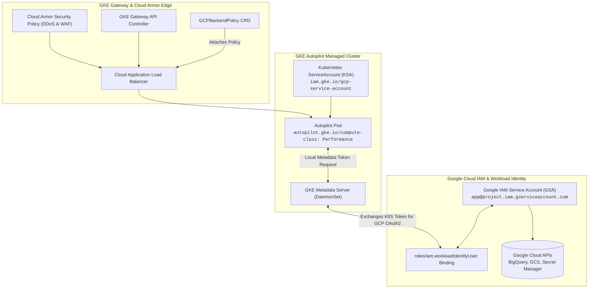

# Chapter 28: Google Cloud GKE & Ecosystem

<div class="grid cards" markdown>

-   :material-school: **Topic Focus** &bull; Workload Identity Federation, GKE Autopilot, GKE Gateway API, and Config Connector
-   :material-api: **Primary APIs** &bull; `storage.cnrm.cloud.google.com` &bull; `networking.gke.io/v1` &bull; `iam.gke.io` &bull; `autopilot.gke.io`
-   :material-rocket-launch: [**Launch Playground in Wasm →**](../playground/index.html?chapter=28){ .md-button .md-button--primary }

</div>

!!! tip "⚡ Interactive Problems in this Chapter (Click to solve in Playground)"
    - [**`gke01`**: GKE Workload Identity Federation →](../playground/index.html?exercise=gke01)
    - [**`gke02`**: GKE Autopilot Workload Sizing & Compute Classes →](../playground/index.html?exercise=gke02)
    - [**`gke03`**: GKE Gateway API & Cloud Armor Policies →](../playground/index.html?exercise=gke03)
    - [**`gke04`**: Google Config Connector Cloud Resources →](../playground/index.html?exercise=gke04)

---

## 1. Architectural Overview & Control Plane Mechanics

In Kubernetes, **Google Cloud GKE & Ecosystem** is reconciled through declarative state loops managed by the control plane:



When resources in this chapter are submitted, the `kube-apiserver` validates the OpenAPI v3 schema, stores state in `etcd`, and triggers the responsible controllers or node daemons to reconcile actual cluster state.

---

## 2. Annotated Production YAML Anatomy & Field Reference

Below is a production-grade declarative manifest demonstrating field definitions and operational patterns:

```yaml
apiVersion: v1
kind: ServiceAccount
metadata:
  name: bigquery-sa
  namespace: default
  annotations:
    iam.gke.io/gcp-service-account: bq-sync@my-gcp-project.iam.gserviceaccount.com
---
apiVersion: v1
kind: Pod
metadata:
  name: bq-loader-pod
  namespace: default
spec:
  serviceAccountName: bigquery-sa
  nodeSelector:
    iam.gke.io/gke-metadata-server-enabled: "true"
  containers:
    - name: loader
      image: google/cloud-sdk:slim
      command: ["bq", "ls"]
```

### Key Field Schema Reference

| Field | Type | Description |
| :--- | :--- | :--- |
| `iam.gke.io/gcp-service-account` | `Annotation` | Associates a Kubernetes ServiceAccount with a Google Cloud IAM Service Account via Workload Identity. |
| `autopilot.gke.io/compute-class` | `Annotation` | Requests specialized GKE Autopilot hardware tiers such as `Performance` or `Scale-Out`. |
| `GCPBackendPolicy` | `CRD (`networking.gke.io`)` | Attaches Google Cloud Armor security policies, backend timeouts, and CDN settings to Gateway API services. |
| `StorageBucket` | `CRD (`cnrm.cloud.google.com`)` | Declaratively provisions Google Cloud Storage buckets using Google Config Connector (KCC). |

---

## 3. Real-World Architectural Patterns

### GKE Gateway API with Cloud Armor BackendPolicy

```yaml
apiVersion: networking.gke.io/v1
kind: GCPBackendPolicy
metadata:
  name: cloud-armor-backend-policy
  namespace: default
spec:
  targetRef:
    group: ""
    kind: Service
    name: web-frontend-svc
  default:
    securityPolicy: edge-ddos-protection-policy
    logging:
      enable: true
      sampleRate: 1.0
```

### Config Connector Declarative StorageBucket

```yaml
apiVersion: storage.cnrm.cloud.google.com/v1beta1
kind: StorageBucket
metadata:
  name: prod-analytics-archive-bucket
  namespace: default
  annotations:
    cnrm.cloud.google.com/deletion-policy: abandon
spec:
  location: US-CENTRAL1
  storageClass: STANDARD
  uniformBucketLevelAccess: true
  versioning:
    enabled: true
```


---

## 4. Production Hardening & Operational Governance

- Enable GKE Workload Identity on all nodepools and namespaces; disable legacy node compute service account access.
- Use GKE Autopilot to enforce CIS Kubernetes benchmark defaults and eliminate unmanaged node operational burden.
- Attach Cloud Armor security policies to all public ingress gateways for edge DDoS and OWASP Top 10 mitigation.

---

## 5. Failure Modes & Diagnostic Triage Tree

??? failure "`Metadata server returned 403 Forbidden`"
    **Root Cause:** The KSA is missing IAM role binding `roles/iam.workloadIdentityUser` or GKE metadata server is not enabled on node.

    **Diagnostic Triage Sequence:**
    1. Verify IAM binding: `gcloud iam service-accounts get-iam-policy <GSA_EMAIL>`
    2. Check nodeSelector contains `iam.gke.io/gke-metadata-server-enabled: 'true'`.


---

## 6. Interactive Practice Matrix

Practice concepts from this chapter directly in the interactive WebAssembly sandbox:

| Exercise ID | Challenge Description | Direct Link | Action |
| :--- | :--- | :--- | :--- |
| **`gke01`** | GKE Workload Identity Federation | [`../playground/index.html?exercise=gke01`](../playground/index.html?exercise=gke01) | [**⚡ Solve `gke01` in Playground →**](../playground/index.html?exercise=gke01){ .md-button .md-button--primary } |
| **`gke02`** | GKE Autopilot Workload Sizing & Compute Classes | [`../playground/index.html?exercise=gke02`](../playground/index.html?exercise=gke02) | [**⚡ Solve `gke02` in Playground →**](../playground/index.html?exercise=gke02){ .md-button .md-button--primary } |
| **`gke03`** | GKE Gateway API & Cloud Armor Policies | [`../playground/index.html?exercise=gke03`](../playground/index.html?exercise=gke03) | [**⚡ Solve `gke03` in Playground →**](../playground/index.html?exercise=gke03){ .md-button .md-button--primary } |
| **`gke04`** | Google Config Connector Cloud Resources | [`../playground/index.html?exercise=gke04`](../playground/index.html?exercise=gke04) | [**⚡ Solve `gke04` in Playground →**](../playground/index.html?exercise=gke04){ .md-button .md-button--primary } |
