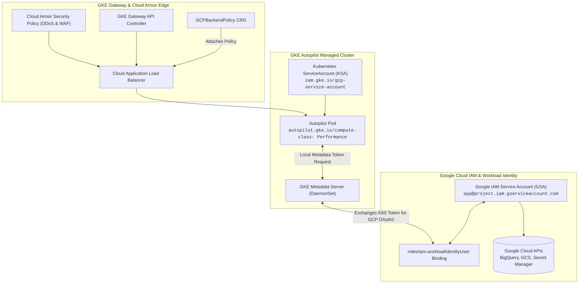

# Chapter 28: Google Cloud GKE & Ecosystem

<div class="grid cards" markdown>

-   :material-school: **Topic Focus** &bull; Workload Identity Federation, GKE Autopilot, GKE Gateway API, and Config Connector
-   :material-api: **Primary APIs** &bull; `storage.cnrm.cloud.google.com` &bull; `networking.gke.io/v1` &bull; `iam.gke.io` &bull; `autopilot.gke.io`
-   :material-rocket-launch: [**Launch Playground in Wasm →**](../playground/index.html?chapter=28){ .md-button .md-button--primary }

</div>

!!! tip "⚡ Interactive Problems in this Chapter (Click to solve in Playground)"
    - [**`gke01`**: GKE Workload Identity Federation →](../playground/index.html?exercise=gke01)
    - [**`gke02`**: GKE Autopilot Workload Sizing & Compute Classes →](../playground/index.html?exercise=gke02)
    - [**`gke03`**: GKE Gateway API & Cloud Armor Policies →](../playground/index.html?exercise=gke03)
    - [**`gke04`**: Google Config Connector Cloud Resources →](../playground/index.html?exercise=gke04)

---

## 1. Architectural Overview & Control Plane Mechanics

In Kubernetes, **Google Cloud GKE & Ecosystem** is reconciled through declarative state loops managed by the control plane and node daemons:



### 1.1 Architectural Flow & Lifecycle Walkthrough

1. **Workload Identity Binding**: A GCP administrator creates a Google Service Account (GSA) and binds it to a Kubernetes ServiceAccount (KSA) using IAM Role `roles/iam.workloadIdentityUser` with member `serviceAccount:PROJECT_ID.svc.id.goog[NAMESPACE/KSA_NAME]`.
2. **Metadata Server Token Interception**:
   - The application Pod runs inside GKE with `serviceAccountName: ksa-name`.
   - The application Google Cloud SDK makes an HTTP GET request to the local Metadata Server at `http://169.254.169.254/computeMetadata/v1/instance/service-accounts/default/token`.
   - The **GKE Metadata Server** (a DaemonSet intercepting `169.254.169.254`) intercepts the request, verifies the Pod's KSA identity, and contacts Google Cloud IAM to exchange the Kubernetes identity token for a short-lived GCP OAuth2 access token.
3. **GKE Autopilot Workload Right-Sizing**:
   - Workloads deployed to GKE Autopilot specify resource requests. Autopilot automatically adjusts CPU-to-memory ratios to conform to supported compute classes (`GeneralPurpose`, `Performance`, `Scale-Out`).
   - Autopilot provisions and manages underlying GCE compute, applying kernel hardening, automatic OS patch upgrades, and managed node pools.
4. **GKE Gateway API & Cloud Armor Edge Security**:
   - The GKE Gateway Controller provisions a Google Cloud Application Load Balancer in response to a `Gateway` resource.
   - A `GCPBackendPolicy` CR attaches **Google Cloud Armor** security policies to the backend service, enforcing Web Application Firewall (WAF) rules and DDoS protection at Google's global edge network before traffic enters the cluster.

### 1.2 Serialization, Protocols & Communication Pathways

- **Google Cloud REST / gRPC APIs**: Google SDKs communicate with GCP services (BigQuery, Cloud Storage, Secret Manager) using HTTP/2 Protobuf gRPC or TLS REST calls.
- **OAuth 2.0 Bearer Token Protocol (RFC 6750)**: GKE Metadata Server returns JSON OAuth2 tokens (`access_token`, `expires_in`, `token_type: Bearer`) passed in the HTTP `Authorization` header.
- **GCP Gateway Controller CRD APIs**: `GCPBackendPolicy` and `FrontendConfig` resources serialized as JSON/Protobuf objects configuring Google Cloud Serverless Network Endpoint Groups (NEGs).

### 1.3 Deep-Dive Component Breakdown

- **GKE Workload Identity**: Secure identity bridge linking Kubernetes ServiceAccounts to Google Cloud IAM without storing service account keys in cluster Secrets.
- **GKE Metadata Server**: Local node proxy intercepting metadata requests to dynamically synthesize GCP OAuth2 tokens.
- **GKE Autopilot Control Plane**: Fully managed GKE mode where Google provisions, scales, and manages nodes, billing per-Pod resource requests.
- **Google Cloud Armor**: Edge-level network security service providing DDoS mitigation, OWASP Top 10 WAF filtering, and geo-fencing.

### 1.4 Under-The-Hood Mechanics & Failure Modes

- **Metadata Server Pod Initialization Hangs**: If Workload Identity is enabled on the cluster but a Pod is deployed with `hostNetwork: true`, the Pod bypasses the GKE Metadata Server proxy and talks directly to the underlying GCE node VM's metadata, acquiring the node's default IAM identity instead of the intended workload identity.
- **Autopilot Resource Ratio Enforcement**: GKE Autopilot enforces strict CPU-to-memory ratios (e.g. 1 vCPU requires between 1GiB and 8GiB RAM). Deployments specifying invalid ratios (e.g. 1 vCPU with 32GiB RAM without selecting the `MemoryOptimized` compute class) are rejected by admission validation with `InvalidResourceRatio`.
- **Cloud Armor Policy Detachment on Service Recreation**: If a backend Kubernetes `Service` is deleted and recreated with a different name, the `GCPBackendPolicy` target reference breaks, leaving the new backend exposed without Cloud Armor WAF protection until the policy is updated.

---

## 2. Annotated Production YAML Anatomy & Field Reference

Below is a production-grade declarative manifest demonstrating field definitions and operational patterns:

```yaml
apiVersion: v1
kind: ServiceAccount
metadata:
  name: bigquery-sa
  namespace: default
  annotations:
    iam.gke.io/gcp-service-account: bq-sync@my-gcp-project.iam.gserviceaccount.com
---
apiVersion: v1
kind: Pod
metadata:
  name: bq-loader-pod
  namespace: default
spec:
  serviceAccountName: bigquery-sa
  nodeSelector:
    iam.gke.io/gke-metadata-server-enabled: "true"
  containers:
    - name: loader
      image: google/cloud-sdk:slim
      command: ["bq", "ls"]
```

### Key Field Schema Reference

| Field | Type | Description |
| :--- | :--- | :--- |
| `iam.gke.io/gcp-service-account` | `Annotation` | Associates a Kubernetes ServiceAccount with a Google Cloud IAM Service Account via Workload Identity. |
| `autopilot.gke.io/compute-class` | `Annotation` | Requests specialized GKE Autopilot hardware tiers such as `Performance` or `Scale-Out`. |
| `GCPBackendPolicy` | `CRD (`networking.gke.io`)` | Attaches Google Cloud Armor security policies, backend timeouts, and CDN settings to Gateway API services. |
| `StorageBucket` | `CRD (`cnrm.cloud.google.com`)` | Declaratively provisions Google Cloud Storage buckets using Google Config Connector (KCC). |

---

## 3. Real-World Architectural Patterns

### GKE Gateway API with Cloud Armor BackendPolicy

```yaml
apiVersion: networking.gke.io/v1
kind: GCPBackendPolicy
metadata:
  name: cloud-armor-backend-policy
  namespace: default
spec:
  targetRef:
    group: ""
    kind: Service
    name: web-frontend-svc
  default:
    securityPolicy: edge-ddos-protection-policy
    logging:
      enable: true
      sampleRate: 1.0
```

### Config Connector Declarative StorageBucket

```yaml
apiVersion: storage.cnrm.cloud.google.com/v1beta1
kind: StorageBucket
metadata:
  name: prod-analytics-archive-bucket
  namespace: default
  annotations:
    cnrm.cloud.google.com/deletion-policy: abandon
spec:
  location: US-CENTRAL1
  storageClass: STANDARD
  uniformBucketLevelAccess: true
  versioning:
    enabled: true
```


---

## 4. Production Hardening & Operational Governance

- Enable GKE Workload Identity on all nodepools and namespaces; disable legacy node compute service account access.
- Use GKE Autopilot to enforce CIS Kubernetes benchmark defaults and eliminate unmanaged node operational burden.
- Attach Cloud Armor security policies to all public ingress gateways for edge DDoS and OWASP Top 10 mitigation.

---

## 5. Failure Modes & Diagnostic Triage Tree

??? failure "`Metadata server returned 403 Forbidden`"
    **Root Cause:** The KSA is missing IAM role binding `roles/iam.workloadIdentityUser` or GKE metadata server is not enabled on node.

    **Diagnostic Triage Sequence:**
    1. Verify IAM binding: `gcloud iam service-accounts get-iam-policy <GSA_EMAIL>`
    2. Check nodeSelector contains `iam.gke.io/gke-metadata-server-enabled: 'true'`.


---

## 6. Interactive Practice Matrix

Practice concepts from this chapter directly in the interactive WebAssembly sandbox:

| Exercise ID | Challenge Description | Direct Link | Action |
| :--- | :--- | :--- | :--- |
| **`gke01`** | GKE Workload Identity Federation | [`../playground/index.html?exercise=gke01`](../playground/index.html?exercise=gke01) | [**⚡ Solve `gke01` in Playground →**](../playground/index.html?exercise=gke01){ .md-button .md-button--primary } |
| **`gke02`** | GKE Autopilot Workload Sizing & Compute Classes | [`../playground/index.html?exercise=gke02`](../playground/index.html?exercise=gke02) | [**⚡ Solve `gke02` in Playground →**](../playground/index.html?exercise=gke02){ .md-button .md-button--primary } |
| **`gke03`** | GKE Gateway API & Cloud Armor Policies | [`../playground/index.html?exercise=gke03`](../playground/index.html?exercise=gke03) | [**⚡ Solve `gke03` in Playground →**](../playground/index.html?exercise=gke03){ .md-button .md-button--primary } |
| **`gke04`** | Google Config Connector Cloud Resources | [`../playground/index.html?exercise=gke04`](../playground/index.html?exercise=gke04) | [**⚡ Solve `gke04` in Playground →**](../playground/index.html?exercise=gke04){ .md-button .md-button--primary } |
