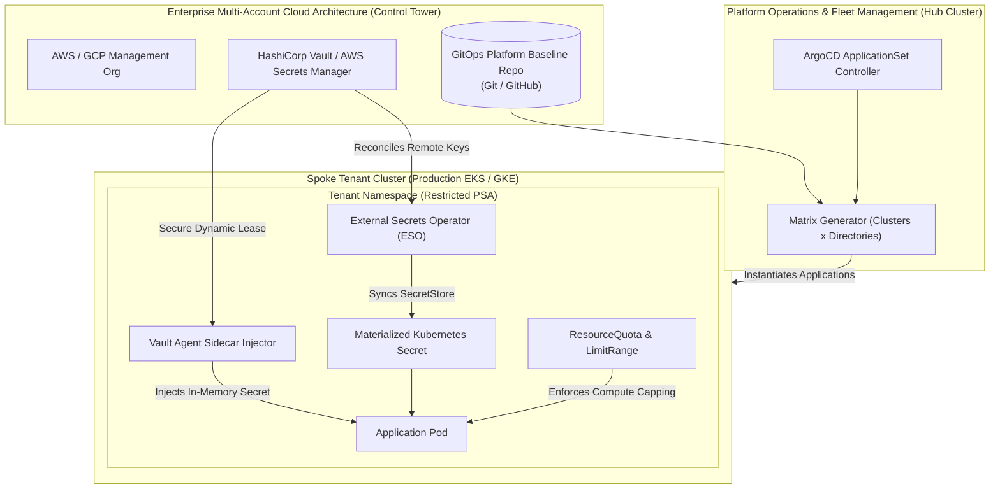

# Chapter 29: Enterprise Multi-Account Governance & Secrets

<div class="grid cards" markdown>

-   :material-school: **Topic Focus** &bull; AWS Control Tower, External Secrets Operator, HashiCorp Vault, and ArgoCD ApplicationSets
-   :material-api: **Primary APIs** &bull; `external-secrets.io/v1beta1` &bull; `argoproj.io/v1alpha1` &bull; `vault.hashicorp.com` &bull; `ResourceQuota`
-   :material-rocket-launch: [**Launch Playground in Wasm →**](../playground/index.html?chapter=29){ .md-button .md-button--primary }

</div>

!!! tip "⚡ Interactive Problems in this Chapter (Click to solve in Playground)"
    - [**`eso01`**: External Secrets Operator SecretStore & ExternalSecret →](../playground/index.html?exercise=eso01)
    - [**`vault01`**: HashiCorp Vault Agent Sidecar Injector →](../playground/index.html?exercise=vault01)
    - [**`gov01`**: ArgoCD ApplicationSet Multi-Cluster Matrix Generator →](../playground/index.html?exercise=gov01)
    - [**`gov02`**: Multi-Tenant Namespace Quotas & Security Policies →](../playground/index.html?exercise=gov02)

---

## 1. Architectural Overview & Control Plane Mechanics

In Kubernetes, **Enterprise Multi-Account Governance & Secrets** is reconciled through declarative state loops managed by the control plane and node daemons:



### 1.1 Architectural Flow & Lifecycle Walkthrough

1. **Enterprise Multi-Account Landing Zone Architecture**: An enterprise cloud organization (AWS Control Tower or GCP Organization) deploys isolated AWS/GCP accounts for production, staging, identity, and shared platform tooling.
2. **Fleet Baseline Synchronization via ArgoCD ApplicationSets**:
   - A central Platform Operations Hub Cluster runs an ArgoCD `ApplicationSet` controller.
   - The `ApplicationSet` utilizes a **Matrix Generator**, combining a list of registered spoke clusters (filtered by labels: `tier: production`) with Git repository directories.
   - The generator automatically instantiates and synchronizes standardized baseline applications (monitoring, security agents, ingress controllers, RBAC policies) across all spoke clusters.
3. **External Secrets Operator (ESO) Secret Synchronization**:
   - The **External Secrets Operator** runs inside the tenant cluster.
   - A `SecretStore` resource defines credentials for accessing centralized secret vaults (AWS Secrets Manager, Azure Key Vault, or HashiCorp Vault).
   - An `ExternalSecret` resource specifies which keys to fetch. ESO queries the external cloud secret API, decrypts the secret value, and materializes a native Kubernetes `v1/Secret` inside the tenant namespace, automatically reconciling secret rotations on a 1-hour interval.
4. **HashiCorp Vault Agent Sidecar Injection**:
   - For applications requiring in-memory dynamic credentials without writing persistent Kubernetes Secrets to `etcd`, the Pod is annotated with `vault.hashicorp.com/agent-inject: "true"`.
   - The Vault Mutating Webhook injects a lightweight `vault-agent` sidecar container.
   - The Vault Agent authenticates via the Kubernetes ServiceAccount token, acquires a dynamic database lease from Vault, and writes the plain secret payload to a shared in-memory `tmpfs` volume (`/vault/secrets/config.json`).
5. **Multi-Tenant Governance & Resource Boundaries**:
   - Spoke tenant namespaces are governed by `ResourceQuota` (capping aggregate CPU, memory, and storage) and `LimitRange` (enforcing default container requests/limits).
   - Pod Security Admission labels enforce `pod-security.kubernetes.io/enforce: restricted`, blocking root containers and host namespace sharing.

### 1.2 Serialization, Protocols & Communication Pathways

- **Vault HTTP/2 REST API with mTLS**: Vault Agent communicates with HashiCorp Vault clusters over TLS 1.3 using JSON payloads and Kubernetes ServiceAccount token authentication (`/v1/auth/kubernetes/login`).
- **AWS Secrets Manager & GCP Secret Manager REST SDKs**: External Secrets Operator queries cloud provider secret manager APIs using SigV4 / OAuth2 authentication.
- **ArgoCD ApplicationSet Generator JSON Schema**: Matrix generators parse cluster secret metadata and Git tree directory paths, rendering parameterized Application CR manifests.

### 1.3 Deep-Dive Component Breakdown

- **ArgoCD ApplicationSet Controller**: Multi-cluster GitOps engine automating the generation and deployment of ArgoCD Applications across dynamic cluster fleets.
- **External Secrets Operator (ESO)**: Kubernetes operator synchronizing secrets from external enterprise secret management systems into native Kubernetes Secrets.
- **HashiCorp Vault Agent Injector**: Mutating webhook and sidecar daemon delivering dynamic, short-lived, leased credentials directly into container memory.
- **ResourceQuota & LimitRange Enforcers**: In-tree Kubernetes admission controllers preventing multi-tenant resource starvation and noisy neighbor contention.

### 1.4 Under-The-Hood Mechanics & Failure Modes

- **Vault Token Renewal Expiration**: If an application holds a dynamic database connection open longer than Vault's max lease TTL and fails to renew its token lease, Vault revokes the database credentials, causing subsequent application queries to fail with database authentication errors.
- **External Secrets API Rate Limit Exhaustion**: Setting `refreshInterval: 10s` on hundreds of `ExternalSecret` resources causes ESO to hammer cloud secret APIs, exhausting cloud account API rate limits and triggering exponential backoff throttling across all cluster services. Refresh intervals should be tuned to $\ge 1\text{h}$ with webhook triggers for instant updates.
- **ResourceQuota Deadlock during Rolling Updates**: If a namespace `ResourceQuota` is configured with `requests.cpu: "4"` and a Deployment with `replicas: 4` (each requesting 1 CPU) attempts a rolling update with `maxSurge: 25%`, the Deployment requires 5 CPUs during the transition. The rolling update deadlocks in `Pending` because the surge pod exceeds the quota ceiling.

---

## 2. Annotated Production YAML Anatomy & Field Reference

Below is a production-grade declarative manifest demonstrating field definitions and operational patterns:

```yaml
apiVersion: external-secrets.io/v1beta1
kind: SecretStore
metadata:
  name: aws-secrets-store
  namespace: default
spec:
  provider:
    aws:
      service: SecretsManager
      region: us-east-1
---
apiVersion: external-secrets.io/v1beta1
kind: ExternalSecret
metadata:
  name: app-db-credentials
  namespace: default
spec:
  refreshInterval: 1h
  secretStoreRef:
    name: aws-secrets-store
    kind: SecretStore
  target:
    name: db-credentials-secret
    creationPolicy: Owner
  data:
    - secretKey: password
      remoteRef:
        key: prod/rds/app-password
```

### Key Field Schema Reference

| Field | Type | Description |
| :--- | :--- | :--- |
| `SecretStore` & `ExternalSecret` | `CRD (`external-secrets.io`)` | Synchronizes secrets from external cloud key-vaults (AWS Secrets Manager, GCP Secret Manager) into Kubernetes Secrets. |
| `vault.hashicorp.com/agent-inject` | `Annotation` | Enables Vault sidecar injection to deliver secrets to containers via ephemeral in-memory volumes. |
| `ApplicationSet` | `CRD (`argoproj.io`)` | Automates multi-cluster and multi-tenant GitOps deployments using matrix/cluster generators across cloud fleets. |
| `ResourceQuota` & `LimitRange` | `Core APIs` | Enforces strict boundaries on aggregate compute usage and container sizing across multi-tenant namespaces. |

---

## 3. Real-World Architectural Patterns

### HashiCorp Vault Agent Sidecar Pod Injection

```yaml
apiVersion: v1
kind: Pod
metadata:
  name: secure-billing-service
  namespace: default
  annotations:
    vault.hashicorp.com/agent-inject: "true"
    vault.hashicorp.com/role: "billing-app-role"
    vault.hashicorp.com/agent-inject-secret-database-config: "secret/data/billing/db"
spec:
  serviceAccountName: billing-service-sa
  containers:
    - name: billing-api
      image: billing/app:v2.4
      command: ["/app/server"]
```

### ArgoCD ApplicationSet Multi-Cluster Matrix Generator

```yaml
apiVersion: argoproj.io/v1alpha1
kind: ApplicationSet
metadata:
  name: fleet-baseline-monitoring
  namespace: argocd
spec:
  generators:
    - matrix:
        generators:
          - clusters:
              selector:
                matchLabels:
                  tier: production
          - git:
              repoURL: https://github.com/enterprise/k8s-platform-baseline.git
              revision: HEAD
              directories:
                - path: monitoring/*
  template:
    metadata:
      name: "{{name}}-{{path.basename}}"
    spec:
      project: default
      source:
        repoURL: https://github.com/enterprise/k8s-platform-baseline.git
        targetRevision: HEAD
        path: "{{path}}"
      destination:
        server: "{{server}}"
        namespace: monitoring
      syncPolicy:
        automated:
          prune: true
          selfHeal: true
```


---

## 4. Production Hardening & Operational Governance

- Never store plaintext or base64 secrets in Git; sync through External Secrets Operator or HashiCorp Vault.
- Standardize fleet-wide deployment using ArgoCD ApplicationSets to eliminate configuration drift across AWS/GCP accounts.
- Enforce strict Pod Security Admission (PSA restricted) and ResourceQuotas in all tenant namespaces.

---

## 5. Failure Modes & Diagnostic Triage Tree

??? failure "`ExternalSecret SecretUpdateError`"
    **Root Cause:** The target cloud secret does not exist or the IAM role lacks `secretsmanager:GetSecretValue` permission.

    **Diagnostic Triage Sequence:**
    1. Describe ExternalSecret status: `kubectl describe externalsecret <name>`
    2. Verify provider IAM role permissions and cloud secret name path.


---

## 6. Interactive Practice Matrix

Practice concepts from this chapter directly in the interactive WebAssembly sandbox:

| Exercise ID | Challenge Description | Direct Link | Action |
| :--- | :--- | :--- | :--- |
| **`eso01`** | External Secrets Operator SecretStore & ExternalSecret | [`../playground/index.html?exercise=eso01`](../playground/index.html?exercise=eso01) | [**⚡ Solve `eso01` in Playground →**](../playground/index.html?exercise=eso01){ .md-button .md-button--primary } |
| **`vault01`** | HashiCorp Vault Agent Sidecar Injector | [`../playground/index.html?exercise=vault01`](../playground/index.html?exercise=vault01) | [**⚡ Solve `vault01` in Playground →**](../playground/index.html?exercise=vault01){ .md-button .md-button--primary } |
| **`gov01`** | ArgoCD ApplicationSet Multi-Cluster Matrix Generator | [`../playground/index.html?exercise=gov01`](../playground/index.html?exercise=gov01) | [**⚡ Solve `gov01` in Playground →**](../playground/index.html?exercise=gov01){ .md-button .md-button--primary } |
| **`gov02`** | Multi-Tenant Namespace Quotas & Security Policies | [`../playground/index.html?exercise=gov02`](../playground/index.html?exercise=gov02) | [**⚡ Solve `gov02` in Playground →**](../playground/index.html?exercise=gov02){ .md-button .md-button--primary } |
