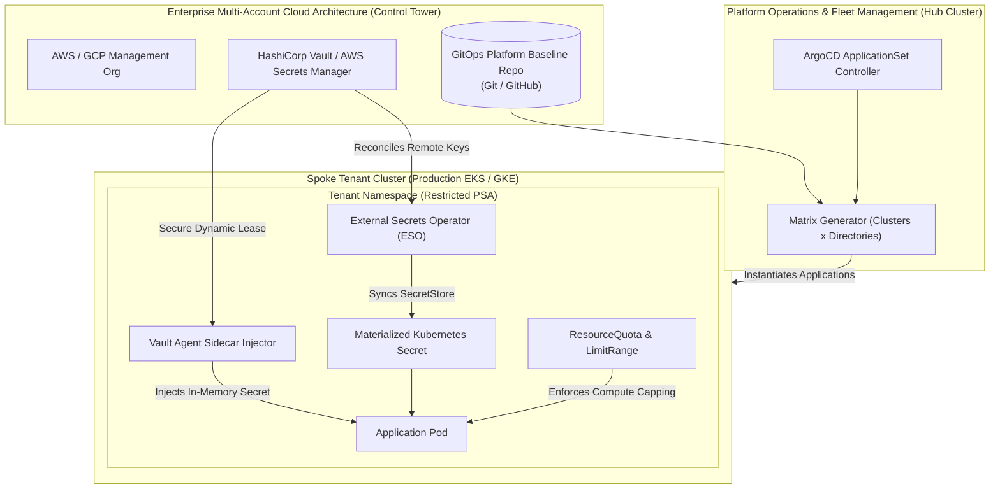

# Chapter 29: Enterprise Multi-Account Governance & Secrets

<div class="grid cards" markdown>

-   :material-school: **Topic Focus** &bull; AWS Control Tower, External Secrets Operator, HashiCorp Vault, and ArgoCD ApplicationSets
-   :material-api: **Primary APIs** &bull; `external-secrets.io/v1beta1` &bull; `argoproj.io/v1alpha1` &bull; `vault.hashicorp.com` &bull; `ResourceQuota`
-   :material-rocket-launch: [**Launch Playground in Wasm →**](../playground/index.html?chapter=29){ .md-button .md-button--primary }

</div>

!!! tip "⚡ Interactive Problems in this Chapter (Click to solve in Playground)"
    - [**`eso01`**: External Secrets Operator SecretStore & ExternalSecret →](../playground/index.html?exercise=eso01)
    - [**`vault01`**: HashiCorp Vault Agent Sidecar Injector →](../playground/index.html?exercise=vault01)
    - [**`gov01`**: ArgoCD ApplicationSet Multi-Cluster Matrix Generator →](../playground/index.html?exercise=gov01)
    - [**`gov02`**: Multi-Tenant Namespace Quotas & Security Policies →](../playground/index.html?exercise=gov02)

---

## 1. Architectural Overview & Control Plane Mechanics

In Kubernetes, **Enterprise Multi-Account Governance & Secrets** is reconciled through declarative state loops managed by the control plane:



When resources in this chapter are submitted, the `kube-apiserver` validates the OpenAPI v3 schema, stores state in `etcd`, and triggers the responsible controllers or node daemons to reconcile actual cluster state.

---

## 2. Annotated Production YAML Anatomy & Field Reference

Below is a production-grade declarative manifest demonstrating field definitions and operational patterns:

```yaml
apiVersion: external-secrets.io/v1beta1
kind: SecretStore
metadata:
  name: aws-secrets-store
  namespace: default
spec:
  provider:
    aws:
      service: SecretsManager
      region: us-east-1
---
apiVersion: external-secrets.io/v1beta1
kind: ExternalSecret
metadata:
  name: app-db-credentials
  namespace: default
spec:
  refreshInterval: 1h
  secretStoreRef:
    name: aws-secrets-store
    kind: SecretStore
  target:
    name: db-credentials-secret
    creationPolicy: Owner
  data:
    - secretKey: password
      remoteRef:
        key: prod/rds/app-password
```

### Key Field Schema Reference

| Field | Type | Description |
| :--- | :--- | :--- |
| `SecretStore` & `ExternalSecret` | `CRD (`external-secrets.io`)` | Synchronizes secrets from external cloud key-vaults (AWS Secrets Manager, GCP Secret Manager) into Kubernetes Secrets. |
| `vault.hashicorp.com/agent-inject` | `Annotation` | Enables Vault sidecar injection to deliver secrets to containers via ephemeral in-memory volumes. |
| `ApplicationSet` | `CRD (`argoproj.io`)` | Automates multi-cluster and multi-tenant GitOps deployments using matrix/cluster generators across cloud fleets. |
| `ResourceQuota` & `LimitRange` | `Core APIs` | Enforces strict boundaries on aggregate compute usage and container sizing across multi-tenant namespaces. |

---

## 3. Real-World Architectural Patterns

### HashiCorp Vault Agent Sidecar Pod Injection

```yaml
apiVersion: v1
kind: Pod
metadata:
  name: secure-billing-service
  namespace: default
  annotations:
    vault.hashicorp.com/agent-inject: "true"
    vault.hashicorp.com/role: "billing-app-role"
    vault.hashicorp.com/agent-inject-secret-database-config: "secret/data/billing/db"
spec:
  serviceAccountName: billing-service-sa
  containers:
    - name: billing-api
      image: billing/app:v2.4
      command: ["/app/server"]
```

### ArgoCD ApplicationSet Multi-Cluster Matrix Generator

```yaml
apiVersion: argoproj.io/v1alpha1
kind: ApplicationSet
metadata:
  name: fleet-baseline-monitoring
  namespace: argocd
spec:
  generators:
    - matrix:
        generators:
          - clusters:
              selector:
                matchLabels:
                  tier: production
          - git:
              repoURL: https://github.com/enterprise/k8s-platform-baseline.git
              revision: HEAD
              directories:
                - path: monitoring/*
  template:
    metadata:
      name: "{{name}}-{{path.basename}}"
    spec:
      project: default
      source:
        repoURL: https://github.com/enterprise/k8s-platform-baseline.git
        targetRevision: HEAD
        path: "{{path}}"
      destination:
        server: "{{server}}"
        namespace: monitoring
      syncPolicy:
        automated:
          prune: true
          selfHeal: true
```


---

## 4. Production Hardening & Operational Governance

- Never store plaintext or base64 secrets in Git; sync through External Secrets Operator or HashiCorp Vault.
- Standardize fleet-wide deployment using ArgoCD ApplicationSets to eliminate configuration drift across AWS/GCP accounts.
- Enforce strict Pod Security Admission (PSA restricted) and ResourceQuotas in all tenant namespaces.

---

## 5. Failure Modes & Diagnostic Triage Tree

??? failure "`ExternalSecret SecretUpdateError`"
    **Root Cause:** The target cloud secret does not exist or the IAM role lacks `secretsmanager:GetSecretValue` permission.

    **Diagnostic Triage Sequence:**
    1. Describe ExternalSecret status: `kubectl describe externalsecret <name>`
    2. Verify provider IAM role permissions and cloud secret name path.


---

## 6. Interactive Practice Matrix

Practice concepts from this chapter directly in the interactive WebAssembly sandbox:

| Exercise ID | Challenge Description | Direct Link | Action |
| :--- | :--- | :--- | :--- |
| **`eso01`** | External Secrets Operator SecretStore & ExternalSecret | [`../playground/index.html?exercise=eso01`](../playground/index.html?exercise=eso01) | [**⚡ Solve `eso01` in Playground →**](../playground/index.html?exercise=eso01){ .md-button .md-button--primary } |
| **`vault01`** | HashiCorp Vault Agent Sidecar Injector | [`../playground/index.html?exercise=vault01`](../playground/index.html?exercise=vault01) | [**⚡ Solve `vault01` in Playground →**](../playground/index.html?exercise=vault01){ .md-button .md-button--primary } |
| **`gov01`** | ArgoCD ApplicationSet Multi-Cluster Matrix Generator | [`../playground/index.html?exercise=gov01`](../playground/index.html?exercise=gov01) | [**⚡ Solve `gov01` in Playground →**](../playground/index.html?exercise=gov01){ .md-button .md-button--primary } |
| **`gov02`** | Multi-Tenant Namespace Quotas & Security Policies | [`../playground/index.html?exercise=gov02`](../playground/index.html?exercise=gov02) | [**⚡ Solve `gov02` in Playground →**](../playground/index.html?exercise=gov02){ .md-button .md-button--primary } |
