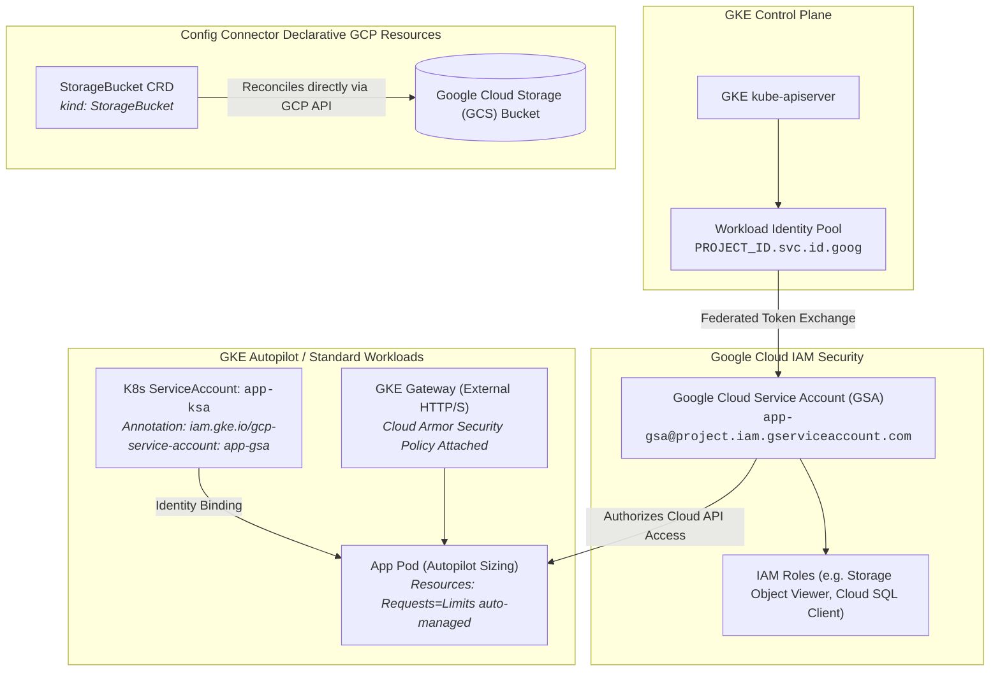
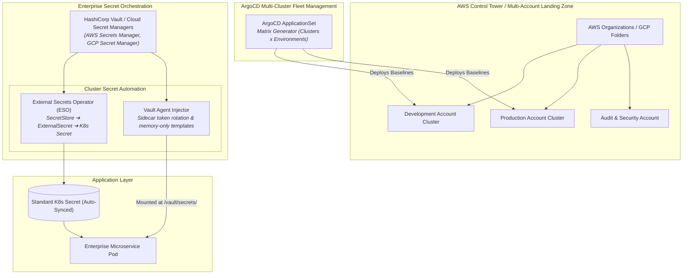

# Cloud-Native Hyperscalers & Enterprise Governance Curriculum Expansion Spec (Chapters 27, 28 & 29)

## 1. Overview & Objective

This specification expands the Kubelings learning curriculum from 26 chapters (114 exercises) to **29 chapters (126 exercises)**, adding dedicated production tracks for:
1. **AWS Elastic Kubernetes Service (EKS)** & AWS cloud-native integrations.
2. **Google Kubernetes Engine (GKE)** & Google Cloud ecosystem.
3. **Enterprise Governance, Multi-Account Landing Zones & Secret Management** (AWS Control Tower, External Secrets Operator, HashiCorp Vault, ArgoCD ApplicationSets).

Each new chapter includes:
- 4 interactive WebAssembly-compatible exercises with validation criteria, hint systems, and real Kubernetes CRDs/APIs.
- Comprehensive Reference Manual chapters in Material for MkDocs with responsive Mermaid.js diagrams, annotated YAML field references, architectural patterns, production hardening checklists, failure mode triage trees, and bidirectional playground links.

---

## 2. Chapter Specifications & Exercise Breakdown

### Chapter 27: AWS EKS & Cloud Architecture (`27-aws-eks.md`)
- **API Groups & Domains**: `eks.amazonaws.com`, `karpenter.sh/v1`, `networking.k8s.io`, `vpcresources.k8s.aws/v1alpha1`.
- **Primary Concepts**:
  - IAM Roles for Service Accounts (IRSA) vs. EKS Pod Identity.
  - AWS Load Balancer Controller: Application Load Balancer (ALB) and Network Load Balancer (NLB) with `TargetGroupBinding`.
  - AWS VPC CNI: Secondary ENI IP allocation, custom networking, and Security Groups for Pods (`SecurityGroupPolicy`).
  - Karpenter: Just-in-time NodePool provisioning with AWS EC2 instance family selectors, spot interruption handling, and consolidation.
- **Interactive Exercises**:
  1. `eks01`: **EKS Pod Identity & IRSA** — Configure a ServiceAccount with AWS IAM role annotations (`eks.amazonaws.com/role-arn`) and configure a Pod to consume AWS STS web identity token projection.
  2. `eks02`: **AWS Load Balancer Controller Ingress** — Configure an Ingress with `alb.ingress.kubernetes.io/scheme: internet-facing`, target-type `ip`, and SSL certificate ARN annotations.
  3. `eks03`: **VPC CNI Security Groups per Pod** — Create a `SecurityGroupPolicy` resource matching pod labels to bind dedicated AWS security groups directly to pod network interfaces.
  4. `eks04`: **Karpenter AWS NodePool** — Author a Karpenter `NodePool` and `EC2NodeClass` declaring instance families (`c6i`, `c7i`, `m6i`), spot capacity type, and amiFamily `AL2023`.

---

### Chapter 28: Google Cloud GKE & Cloud-Native Ecosystem (`28-gcp-gke.md`)
- **API Groups & Domains**: `gateway.networking.k8s.io`, `networking.gke.io/v1`, `core.cnrm.cloud.google.com/v1beta1`, `storage.cnrm.cloud.google.com/v1beta1`.
- **Primary Concepts**:
  - GKE Workload Identity Federation: Mapping Kubernetes ServiceAccounts to Google Cloud IAM ServiceAccounts (`iam.gke.io/gcp-service-account`).
  - GKE Autopilot: Workload resource management, compute classes (`Performance`, `Scale-Out`), and burst allocations.
  - GKE Gateway API & Cloud Armor: Deploying multi-cluster Gateways with `GCPBackendPolicy` attaching Cloud Armor security policies and SSL certificates.
  - Google Config Connector & Anthos Config Sync: Managing Google Cloud infrastructure (e.g. Cloud Storage Buckets, Cloud SQL) declaratively via Kubernetes CRDs.
- **Interactive Exercises**:
  1. `gke01`: **GKE Workload Identity Federation** — Configure a Kubernetes ServiceAccount annotated with `iam.gke.io/gcp-service-account: app-sa@project.iam.gserviceaccount.com` and verify pod nodeSelector/identity binding.
  2. `gke02`: **GKE Autopilot Workload Sizing** — Configure a deployment for GKE Autopilot specifying exact CPU/memory request boundaries and compute class annotations (`autopilot.gke.io/compute-class: Performance`).
  3. `gke03`: **GKE Gateway with Cloud Armor Policy** — Define a `GCPBackendPolicy` CRD linking a Cloud Armor Edge Security Policy to a Gateway API `HTTPRoute` backend.
  4. `gke04`: **Config Connector Cloud Resource** — Declare a Google Cloud `StorageBucket` CRD with storageClass `STANDARD`, uniformBucketLevelAccess, and deletionPolicy `Abandon`.

---

### Chapter 29: Enterprise Governance, Multi-Account Landing Zones & Secret Management (`29-enterprise-governance.md`)
- **API Groups & Domains**: `external-secrets.io/v1beta1`, `argoproj.io/v1alpha1`, `vault.hashicorp.com`.
- **Primary Concepts**:
  - AWS Control Tower & Multi-Account Landing Zones: Managing fleet clusters across development, staging, and audit accounts with Account Factory for Terraform (AFT).
  - External Secrets Operator (ESO): Decoupling Kubernetes secrets from cluster storage by pulling directly from AWS Secrets Manager, GCP Secret Manager, or HashiCorp Vault via `SecretStore` and `ExternalSecret`.
  - HashiCorp Vault Agent Injector: Sidecar-based mutual TLS credential injection (`vault.hashicorp.com/agent-inject: "true"`, `vault.hashicorp.com/role`) with automatic lease renewal.
  - ArgoCD ApplicationSets: Multi-cluster continuous deployment using Cluster Matrix Generators to deploy consistent governance policies (Kyverno/OPA, Falco, ESO) across an entire organizational fleet.
- **Interactive Exercises**:
  1. `eso01`: **External Secrets Operator Integration** — Create a `SecretStore` referencing AWS Secrets Manager / GCP Secret Manager and an `ExternalSecret` that materializes a Kubernetes `Secret`.
  2. `vault01`: **HashiCorp Vault Agent Sidecar Injection** — Configure Pod template annotations for the Vault Agent Injector to render dynamic database credentials to `/vault/secrets/db-creds`.
  3. `gov01`: **ArgoCD ApplicationSet Cluster Matrix** — Author an `ApplicationSet` with a `matrix` generator targeting all clusters labeled `env: production` to deploy standard baseline monitoring.
  4. `gov02`: **Multi-Account Governance & Policy Enforcement** — Define strict namespace resource quotas and security constraints preventing cross-account privilege escalation.

---

## 3. Visual Architectural Mermaid.js Specifications

### Chapter 27 (AWS EKS):
```mermaid
flowchart TD
    subgraph EKSControlPlane["AWS EKS Control Plane"]
        API["kube-apiserver"]
        OIDC["EKS OpenID Connect (OIDC) Provider<br/><code>oidc.eks.us-east-1.amazonaws.com/id/...</code>"]
        API --> OIDC
    end

    subgraph AWSIAM["AWS IAM Security Layer"]
        ROLE["IAM Role: <code>AppExecutionRole</code><br/><i>Trust: oidc.eks:sub: system:serviceaccount:prod:app-sa</i>"]
        POLICY["IAM Policy: <code>S3ReadOnlyAccess</code>"]
        OIDC -->|STS AssumeRoleWithWebIdentity| ROLE
        ROLE --> POLICY
    end

    subgraph WorkerFleet["EKS Worker Node & Pod Datapath"]
        POD["Pod: <code>api-server</code><br/><i>SA: app-sa</i>"]
        VPC_CNI["AWS VPC CNI Plugin<br/><i>Assigns secondary private IPv4 from Subnet ENI</i>"]
        SGP["SecurityGroupPolicy<br/><i>Attaches AWS Security Group to Pod ENI</i>"]
        ALB_CTRL["AWS Load Balancer Controller<br/><i>TargetGroupBinding ➔ AWS ALB/NLB</i>"]
        
        ROLE -->|STS Projected Token (AWS_WEB_IDENTITY_TOKEN_FILE)| POD
        POD <--> VPC_CNI
        VPC_CNI <--> SGP
        POD <--> ALB_CTRL
    end

    subgraph NodeProvisioner["Karpenter Node Autoscaling"]
        NODEPOOL["Karpenter NodePool<br/><i>EC2 Instance Families: c6i, c7i, m6i</i>"]
        EC2["AWS EC2 Spot/On-Demand Fleet"]
        NODEPOOL -->|Provisions in &lt;60s| EC2
    end
```

### Chapter 28 (GCP GKE):


### Chapter 29 (Enterprise Governance & Secrets):


---

## 4. Verification & Quality Gates

1. **Manifest Integrity**:
   - `build_manifest()` produces 29 chapters and 126 exercises.
   - All 126 exercises have corresponding directories in `exercises/` with valid YAML/test definitions.
2. **Pytest Test Suite**:
   - `tests/test_manifest.py` verifies all 126 exercises exist and are valid.
   - `tests/test_reference_guides.py` asserts all 29 guides exist, have valid Mermaid blocks, valid YAML manifests, and deep links.
3. **Strict MkDocs Build**:
   - `uv run mkdocs build --strict` builds the full 29-chapter documentation site with 0 errors.
4. **GitOps & Deployment**:
   - Automated CI builds, test passes, and GitHub Actions `Deploy Documentation` deploys live to GitHub Pages.
